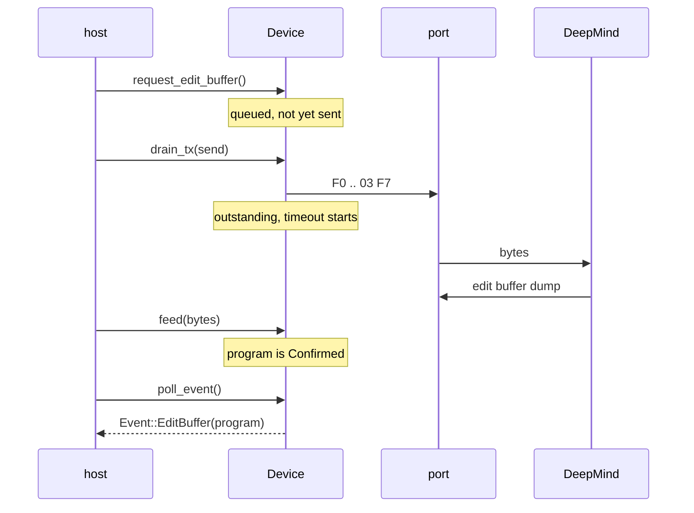
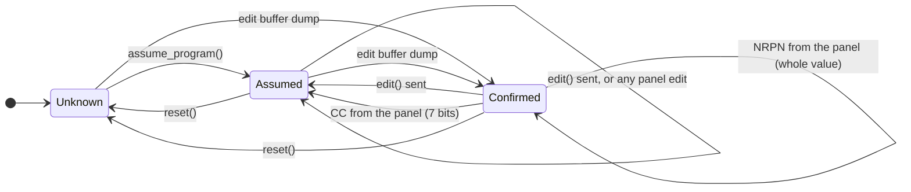

# Architecture

## Goal

The host program owns the MIDI connection. This library owns everything else:
framing, parameter semantics, device state, preset files.

```
DeepMind <--MIDI--> host program <--bytes--> deepmind-midi
                    (midir, alsa, coremidi,
                     a file, a test harness)
```

## The API a host uses

A host never looks up an offset or a controller number. One object holds the
synthesizer; changing it is changing the synthesizer.

```rust
let mut device: Device = Device::new(DeviceId::Unit(0));

// Read. Named as the synthesizer's display names it, with provenance.
if let Some(program) = device.program().value() {
    println!("{}", program.name());         // Bass Sweep
    let shape = program.lfo1_shape();       // Some(LfoShape::Triangle)
}

// Write. Mutate; the library works out which messages that implies.
device.edit(|p| {
    p.set_vcf_frequency(200);
    p.set_lfo1_shape(LfoShape::Triangle);
    p.set_mod1_source(ModSource::Lfo2);
})?;
```

`edit` diffs the program against what the synthesizer is believed to hold and
queues one NRPN message per changed offset. `Program::changes` is the diff and
`drain_tx` hands the messages to the port. Two edits to one parameter in one
closure send one message; an edit that restores the old value sends none.

A parameter with a value table reads as its table, and a switch as a `bool`:

```rust
program.get(ParamId::Lfo1Shape)   // 1, the byte in the dump
program.lfo1_shape()              // Some(LfoShape::Triangle)
program.lfo1_key_sync()           // false
```

There is no conversion from a raw value to the number the synthesizer displays.
`program.vcf_frequency()` is a byte, not a frequency, until the curve behind
that byte has been measured. See [Raw values stay raw](#raw-values-stay-raw).

The accessors and the value types are generated from `spec/`, so the offset map
exists in one place.

## A program is its bytes

A `Program` holds the dump as it arrived: 242 bytes, or 245 under comms
protocol version 7. Reading a parameter is a lookup and writing one is a byte,
so a dump that goes in comes out byte for byte.

A struct of 242 decoded fields would lose three things:

- A value no table lists could not be held, and hardware may send one.
- The reserved bytes of a version 7 dump would need carrying separately.
- Three value tables were renumbered by firmware, and nothing in a stored
  program says which firmware wrote it, so a decoded field would have to guess.

So decoding is a view over the bytes. A typed accessor returns `None` when the
byte is not one its table names; `Program::get` still returns the byte, and
`Program::invalid` lists the parameters holding values they do not accept.

## Which value tables become a type

A value table becomes a Rust enum when its entries are a closed set of names:
`LfoShape::Triangle`, `ModSource::Lfo2`, `FxType::RotarySpkr`. 22 of the 27
tables are.

The other five stay raw bytes with a label:

- The three clock divider tables list `1/2`, `3/8`, `1/16`. Those are numbers,
  and `Div1Over2` says less than `1/2`.
- `LFO Mono Mode` and `Arpeggiator Pattern` list only the first of a run
  (`SPREAD-1` stands for `SPREAD-1` through `SPREAD-254`), so an enum of what is
  listed would return `None` for almost every value the synthesizer sends.

The generator reads which kind a table is off the table itself. `spec/`
describes the synthesizer; how that lands in Rust is the generator's decision.

For the three tables firmware renumbered, a variant is what the value means
and `raw_for` is the byte it travels as on a given firmware.
`ModSource::Expression` is 6 on firmware 1.1 and absent on 1.0;
`ModSource::Lfo1` is 7 on 1.1 and 6 on 1.0. The two firmware tables are joined
by entry name, which is why `NoteOff Vel` and `Note Off Vel` are one variant.

## Sans-IO

No IO, no threads, no blocking, no clock. The host drives a state machine:

```rust
device.feed(&bytes_from_port);                    // inbound, any chunking
device.tick(now_ms);                              // caller supplies the clock
device.drain_tx(|bytes| port.send(bytes))?;       // outbound
while let Some(event) = device.poll_event() { }   // results
```



Why:

- **Testable.** A fake clock and a byte vector reproduce any timing bug.
- **Portable.** No `std::time`, no executor. Works under `no_std`, in a JACK
  callback, in a tokio task, in WASM.
- **Honest.** MIDI transports differ in latency and chunking. An async facade
  would hide that rather than solve it.

`drain_tx` takes a closure, so `Device` is not generic over its IO. For hosts
that would rather not write the loop, the `transport` feature adds two traits
and the loop between them:

```rust
pub trait Port {
    type Error;
    fn send(&mut self, bytes: &[u8]) -> Result<(), Self::Error>;
    fn receive(&mut self, into: &mut [u8]) -> Result<usize, Self::Error>;
}

pub trait Clock {
    fn now_ms(&mut self) -> u64;
    fn sleep_ms(&mut self, milliseconds: u64);
}

let mut synth: Transport<_, _> = Transport::new(device, port, StdClock::new());
let program = synth.edit_buffer()?;                       // ask, and wait
synth.edit(|program| program.set_lfo1_rate(64))?;         // change, and send
```

An async host writes its own loop against the core in about thirty lines and
keeps control of cancellation and backpressure. See [The transport is a
policy](#the-transport-is-a-policy).

## Layers

```
ids       addressing: DeviceId, Model, Bank, ProgramNumber
error     one error type; every rejection carries the offending value

wire      MIDI bytes: message decode, running status, SysEx reassembly
sysex     DeepMind framing, packed MS-bit codec, typed Message enum
param     the parameter table: IDs, NRPN numbers, ranges, enums, formatting
effect    the effect panels: what an engine's twelve bytes are, per algorithm
program   Program: the dump's bytes, typed accessors, names, value types
device    the sans-IO state machine: requests, timeouts, known state, events
syx       .syx files and preset packs
transport the blocking adapter: the port and clock traits, and the loop
sim       the other end: a synthesizer to drive a host against
```

Each layer depends only on those above it. `wire` does not know what a DeepMind
is; `param` does not know what a message is.

## One table, three consumers

A parameter's NRPN number is its byte offset in a program dump. That one fact
lets NRPN edits, dump parsing and dump building share a single table.

| File | Contents |
|---|---|
| `spec/parameters.toml` | 242 program parameters |
| `spec/enums.toml` | 27 value tables (30 with the firmware 1.0 variants), the largest being the modulation destinations: 133 entries on firmware 1.1, 130 on 1.0, each counting Off |
| `spec/controllers.toml` | 112 MIDI controllers, 90 mapped to a parameter |
| `spec/messages.toml` | 22 SysEx messages |
| `spec/globals.toml` | 25 device-wide settings |
| `spec/effects.toml` | 371 effect parameters across 35 algorithms |
| `spec/panels.toml` | how those 371 slots present themselves |
| `spec/layout.toml` | where each slot sits on the FX page, and the panel colours |
| `spec/front.toml` | which parameters the instrument's own front panel puts a control under |
| `spec/mapping.toml` | how an address and a value become bytes |
| `spec/routing.toml` | how the four FX engines can be wired together |
| `spec/measurements.toml` | 29 raw values with what the synthesizer displayed |
| `spec/firmware.toml` | firmware versions that change the protocol |

Two commands generate from these files:

| Command | Output |
|---|---|
| `cargo xtask docs` | The tables in [`midi-spec.md`](midi-spec.md), the algorithms in [`effects.md`](effects.md), and everything under `docs/diagrams/`: the Mermaid sources, the envelope figure and a panel drawing per effect |
| `cargo xtask codegen` | `deepmind-midi/src/param/generated.rs`, the 242 parameters as an enum whose discriminant is the NRPN number, with their groups, ranges, value tables per firmware, the parameters each modulation destination moves, what a raw value means beyond its range, the manual's own prose, and the controller map; `deepmind-midi/src/program/generated.rs`, one Rust type per value table and a getter and setter for each of the 225 parameters that are not the program's name; `deepmind-midi/src/effect/generated.rs`, the 35 algorithms, what each of their slots is, the grid and colours each panel is drawn from, and the ten routings; and `deepmind-midi/src/front/generated.rs`, the instrument's own front panel |

The library is compiled for targets with no filesystem and no allocator, so
the specification is compiled in rather than parsed at runtime.

Only data is generated. The types it fills and the code that acts on them are
hand-written, so a specification change arrives in review as a changed table,
not changed logic.

### Keeping generated output current

- `generated_documentation_is_current` and `generated_code_is_current` compare
  the checked-in files against a fresh render, so a stale checkout fails
  `cargo test`.
- `cargo xtask docs --check` and `cargo xtask codegen --check` do the same
  without writing and name the command to run. CI runs both.

CI does not regenerate and commit. A failure that says what to run is better
than auto-commits to contributor branches.

### Validation

`Spec::load` checks the files before rendering anything: offsets must cover
0..=241 exactly, every referenced value table must exist, an enumerated
parameter's maximum must match its table, no controller number may repeat, no
two controllers may claim the same parameter, every value table id must
resolve to exactly one table per firmware version, every parameter a value
table entry names must exist and must be the same one in both firmware
versions of that table, every value table's entries must ascend by value,
every routing graph must be connected and its feedback flag must match the
graph, the engine offsets `effects.toml` declares must be where
`parameters.toml` puts the slots, the slot count measured off each FX page must
match `effects.toml`, a bipolar parameter's centre must be inside its range and
not at either end, and every control the front panel names must be a parameter
of the group its plate claims, carried once.

Two of those checks exist to let the library stop searching. The value tables
ascend so that a label is a binary search over as many as 133 entries rather
than a scan, and no two controllers claim the same parameter so that the way
from a parameter to its controller is one byte indexed by offset.

These checks have caught real errors: the parameter table carrying firmware
1.0 ranges against firmware 1.1 value tables, and a twelfth slot on
`MoodFilter` that the text extraction had merged into the eleventh row.

The parameter table was also checked against a MIDI Designer layout that had
no part in building it. All 35 of its named NRPN controls agree, including the
three offsets where this specification departs from the manual's printed names.

## Decoding borrows, it does not copy

A bank program names dump is 2354 bytes on the wire. Handing a host an owned
copy would put an allocator on the path of every message, which a `no_std`
library cannot do.

The decoder owns one buffer and reassembles frames into it. `Event::SysEx`
borrows that buffer until the next byte is fed in. `Frame::parse` borrows
again: a `Message` carries its bulk payload as a `&[u8]`, still packed.
Unpacking is a separate call into a buffer the caller owns.

The buffer size is a const parameter defaulting to the longest documented
frame. A host that only sends NRPN edits and reads the edit buffer can use
`Decoder<300>` and save two kilobytes of stack. A frame that does not fit is
dropped with one error rather than truncated into something that would parse.

The decoder reports what arrived rather than tidying it. A note-on with
velocity zero stays a note-on. Running status, real-time bytes inside a
`SysEx` frame and a status byte that ends a frame early are all handled,
because MIDI ports deliver all of them.

## A file is a run of frames

A `.syx` file has no header, index or trailer. A preset pack is 128 program
dumps end to end; a single patch is one dump. `syx` walks the frames.

It walks the bytes directly rather than through `Decoder`, so a program is
borrowed from the file rather than copied into a buffer first. A payload is
seven-bit data, so an `F0` and the next `F7` delimit a frame exactly.

Files in the wild are padded, concatenated and appended to, so bytes outside a
frame are skipped. A frame that does not parse is yielded as its error and the
walk goes on, since one bad frame is no reason to lose the other 127. That is
why the iterators yield a `Result` per item.

Writing does not promise to reproduce a file byte for byte. The manual prints
278 packed bytes for a 242-byte program, where padding gives 280 and
truncating gives 277; this library pads. A file packed the other way reads
back to identical programs and rewrites to a different length. The golden test
checks the programs always and the bytes where the two agree.

## Firmware is a lookup key

Firmware 1.1 renumbered three value tables rather than only appending to them.
17 of the 23 entries in the 1.0 modulation source table and 120 of the 130 in
its destination table changed meaning, so a 1.0 program read with 1.1 tables
is mislabelled almost everywhere. Only the FX type list is close to a pure extension.

```rust
spec.table_for("mod_source", "1.0")    // 23 entries
spec.table_for("mod_source", "1.1")    // 25 entries
```

A table declares the versions it covers: `"1.0"` for that one, `"1.1+"` for
that one and later, nothing for a table that has never changed. The newest
version is the default. Loading fails unless every table id resolves to
exactly one table for every listed version.

A dump carries the comms protocol version, not the firmware version, so
nothing in a `.syx` file says which firmware wrote it. The older tables are
only reachable when the host knows the version another way, in practice by
asking the device.

Comms protocol version is a separate axis: it decides how many bytes a dump
carries, not what a value means.

## Presentation is separate from protocol

Three files, because three questions have three sources.

- `spec/effects.toml`: what a parameter is. Name as the manual writes it,
  range, unit, whether the engine acts on modulation reaching it.
- `spec/panels.toml`: what kind of control it is (continuous, switch,
  selector), its full name, and which slots belong together. Derived from
  `effects.toml` by this project.
- `spec/layout.toml`: where the control goes, what it looks like, what colour
  it is. Measured from the manual's figures.

The grid came from the 35 FX-page screenshots in section 9.3: six columns at a
20-pixel pitch, two rows, filled in slot order. The control and the colours
came from the effect's own editor panel printed beside each screenshot: 29 are
knobs, five are vertical faders, one is a set of numeric displays. Four
colours per panel are sampled by position: case, surface, the moving part, and
the one saturated colour a label or LED uses.

The two figures disagree about shape. The FX page draws every slot as a circle
because a 128x64 display has room for one shape; the panel draws what the
effect actually is. A host that wants to look like the synthesizer reads
`grid.shape`; one that wants to look like the effect reads `control`. Both
are in the file, labelled with their source.

All of it reaches a host as data rather than as the drawing: `effect::grid()`
is the grid, `FxSlot::position` is where a slot lands on it, and
`Algorithm::panel` is the control shape and the four colours. The SVGs under
`docs/diagrams/fx/` are the right output for a document and the wrong input for
an editor — a host cannot theme, rescale or hit-test a picture it did not lay
out, and a desktop window and a plugin window want the same panel at two sizes.
The colours are three components rather than `#5d6379`, because three
components are what a host wants and every host writing the same six-character
parse is the transcription this split exists to prevent.

Derived and measured stay in separate files because a derived field can be
argued with and a measured one can only be re-measured.

The manual publishes no geometry beyond the grid: no sizes except the circles,
no fonts. `layout.toml` carries none either.

## Routing is a graph

Ten fixed wirings of the four FX engines, chosen by one parameter. The manual
names them, and a name is not enough to act on: `Level` is defined as the
output level of effects "configured in parallel, or any effects which are the
last effect before reaching the output stage", so a host cannot label that
control without knowing where the routing puts the slot.

`spec/routing.toml` carries all ten as edge lists, transcribed from the
diagrams in section 7.2.2. Loading checks each graph: every slot must be
reachable from the input and reach the output, and a declared feedback flag
must match whether the graph contains a loop.

`effect::Routing` is that graph in the crate, with `Source::Input` standing for
the file's `0` so that no host has to remember which engine number means "not
an engine". `Routing::output` is what decides whether an engine's output gain
reaches the output at all. `effect::Mode` is the same question one level up:
`Bypass` takes the DSP out of circuit rather than muting it, which is a fact
about the instrument and not something to be recovered by matching on the
value table's name.

## The front panel is a fact, not a layout

`spec/front.toml` says which of the 242 parameters the instrument puts a
physical control under, what is silkscreened over each one, and which of the
panel's two rows its plate is in. It is the one part of this specification that
is not in the MIDI appendix at all — a person can read it off a photograph, and
no host can derive it.

Three things make it belong here rather than in each editor. The legend is not
the parameter's name: a silkscreen has room for `KYBD` where the table says
`VCF Keyboard Tracking`, and every host inventing that abbreviation invents a
different one. The shape is not derivable: `Arp On/Off` is a button and `Arp
Rate (tempo)` is a fader, and to the parameter table they are a switch and a
sweep, which says how a byte is read rather than what a hand touches. And a
renamed parameter should be a failed build rather than a wrong legend, which is
what naming them rather than numbering them buys.

It is held to the rest of the specification rather than to the manual, since
there is no manual table to check it against: every parameter it names has to
exist, may carry one control and not two, and has to be in the group its plate
claims. That last check is what would catch a parameter moved between groups by
a later reading.

Three controls of the instrument are deliberately missing, because none of them
addresses a program byte: the `DATA ENTRY` fader, which edits whatever the
display is showing; the encoder that selects programs; and the row of twelve
lamps over `POLY`, which counts sounding voices. The buttons that open a
section on the display are missing for the same reason. A table that carried
them would be describing a workflow rather than a sound.

What it does not carry is pixels. Which row, which order within a plate, and
what is printed over each control are facts off the instrument; how wide a lane
is and how long a fader runs are the host's, exactly as `layout.toml` splits the
grid from the drawing.

One instrument is described, a DeepMind 12. The 6 has the same 242 parameters
and its own front, and a variant gets its own table when somebody has one in
front of them — the way a value table gets its own firmware range. One
documented panel is worth more than three inferred ones.

## Strings are reachable by key

Every user-visible string in `spec/` is addressed by a stable path: a parameter
by offset, an effect slot by type and slot number, a value table entry by table
and value. Nothing addresses a string by the string.

That is all a translation would need: an overlay file keyed the same way,
merged at load. None exists yet, and adding one later is not a refactor.
Ranges are stored as two ends and a unit rather than as `"0.1 to 6.0 s"` for
the same reason.

The manual's own prose about a parameter — its note, its displayed range, the
reason a row departs from what the manual prints — reaches a host through
`ParamId::note`, `display` and `correction`. Each is a function over its own
strings and nothing else refers to them, so the 11 kB between them is dropped
by any linker collecting unreachable sections: a host that never asks carries
none of it. That is the whole reason they are three accessors rather than three
fields on `Parameter`, which every caller of `info()` would carry.

What a control has to *act* on is typed instead, because prose a host
pattern-matched would go stale silently the next time somebody reworded it:
`shape()` is the point a bipolar value is read about, `inactive()` the value
that means "not set" rather than the smallest one, and `bounded_by()` the
parameter saying how much of a run is played.

## Raw values stay raw

A parameter is one byte on the wire. The manual gives the displayed value at
each end of its range and almost never the curve between. The curve cannot be
inferred: 201 of the 329 effect ranges start at or cross zero, which rules out
a logarithmic fit, and the manual documents a fader that starts at zero and is
explicitly non-linear.

The manual's PROG screenshots print a raw MIDI value next to the displayed
value, which makes each one a measurement. `spec/measurements.toml` holds the
29 the manual contains; [the specification](midi-spec.md#scaling-raw-values-to-displayed-values)
works through them. Most faders are linear. The three frequency parameters are
exponential: VCF Frequency reads 500.0 Hz where an exponential sweep predicts
500.0005 and a straight line predicts 7717. Two faders match neither.

None of that is wired into a conversion, and none of it covers the 329 effect
ranges, for which the manual prints no screenshot. A single interior reading
fixes a curve only when the family is already known, and two faders show what
assuming the family costs.

So `Frequency::hz()` will exist only for parameters whose curve has been
measured; `raw()` always works. A plausible wrong number in front of a
musician is worse than an honest raw one.

The two ends are a different matter: they are printed in the manual and are not
invented, so `ParamId::display` hands them over as the sentence the manual
prints — 26 parameters have one — and `FxSlot::min` and `max` do the same for
an effect slot. A panel can say what the ends of a control mean while its
reading stays raw. One string rather than a parsed range, because not all 26
are ranges: one has a discrete value before a range in it, and another is a
sentence about two different behaviours.

## State is a set of claims

The synthesizer answers no per-parameter reads. Dumps can be requested; edits
can be sent and presumed to have landed. Every tracked value records which:

```rust
pub enum Known<T> {
    Unknown,
    Assumed { value: T, at: u64 },        // sent, not confirmed
    Confirmed { value: T, at: u64 },      // came back in a dump
}
```



The host decides whether to trust an assumed value or request the edit buffer
first. The library never polls on its own.

Inbound traffic makes the same distinction. An NRPN carries the parameter's
whole value, so applying one leaves the tracked program confirmed. A control
change carries seven bits of a value that usually has eight, so applying one
leaves it assumed. A host that redraws a fader from an assumed value and one
that writes it back to the synthesizer are doing different things with the
same number.

## The device tracks the sound, and reports the rest

`Device` holds two things: the edit buffer and what a device inquiry answered.
Everything else a frame can carry is reported by command and not decoded.

The globals, patterns and chord memories cannot be decoded: the manual gives
those dumps a length and no offsets (see [Not yet
possible](#not-yet-possible-the-globals-and-the-sequencer)). A bank of program
names can be decoded but is two kilobytes, more than an allocator-free event
queue should carry for hosts that never ask for one.

A stored program is neither. It decodes, but it is not the sound the
synthesizer is making, so it arrives as an event and leaves the tracked
program alone. That is also why a program-bearing event carries the program by
value: a bank transfer overwrites the tracked copy 128 times, and an event
that said "look at the current one" would be stale before anyone looked.

Real-time bytes are dropped rather than queued. A running MIDI clock is
twenty-four messages a beat, none of which says anything about what the
synthesizer holds. A host that wants everything on the port drives `Decoder`
itself.

### Queuing is not sending

`request_edit_buffer` and its neighbours put an item in the outbound queue and
return. The bytes exist when `drain_tx` hands them to the host, and that is
when the request becomes outstanding and its timeout starts. A host that never
drains never times out.

The queue holds items rather than bytes, so a request costs a few bytes and a
whole-program edit costs 242 rather than the 2,904 bytes they encode to. Both
queues and the decoder's frame buffer are const parameters with defaults,
because the right sizes differ by two orders of magnitude between a desktop
host and a microcontroller. An event that does not fit is dropped and counted,
and the count arrives as `Event::Lost` once the queue has room again.

## The transport is a policy

Everything above describes a synthesizer. Blocking does not: it is a decision
about what a host does while it waits, and hosts disagree. So the adapter that
blocks is one module behind one feature flag, and the only part of the library
that knows what IO is.

It knows as little as two traits can say. `Port` sends bytes and reads what
has arrived without blocking; `Clock` tells the time and waits. Port
enumeration, virtual ports, connection state and reconnection stay on the
host's side. Neither trait needs `std` or an allocator; `StdClock` is the only
thing in the module that wants `std`.

The loop is read, feed, tick, send. `pump` is one pass of it, and a host that
wants its own loop uses that and nothing else in the module.

**Waiting ends three ways.** The answer arrives; the device raises the timeout
for the request; or nothing has arrived for longer than the timeout allows,
which is the backstop for a request the device is not timing. The last two are
both a timeout error. Nothing is retried: a bank half-read is not a thing to
ask for again, and only the host knows whether anything else is.

**Progress is an event, not traffic.** A bank is one request and 128 answers,
and each answer is progress, so a transfer that takes a minute never times out
while it is still arriving. A port streaming clock bytes at a silent
synthesizer is not progress.

**Events a wait was not waiting for are kept.** A blocking call has to look at
every event to find the one it wants. The others go into a queue of the
transport's own and come back out of `poll_event` in order, so turning a knob
while a host reads a bank does not lose the knob. That second queue is the
adapter's one cost: `EV` more events held inline, with overflow counted as
`Event::Lost` the same as in the layer below.

## The other end of the conversation

`device` is the host's end. `sim`, behind a feature of that name, is the
synthesizer's: `Synth` answers requests, applies the edits it is sent, and
reports what it heard. It writes the same four-call loop `Device` does and has
no clock, because the test owns one. Not draining a `Synth` is a synthesizer
that has not replied yet, which is how a host's timeout path is exercised
without a real port.

**It cannot find out that the manual is wrong.** Both ends are generated from
the same `spec/`, so a round trip through it proves that this library agrees
with itself. See [What is left is hardware](#what-is-left-is-hardware).

What it does reach is the seam between the layers, which no single-layer test
sees: an answer that resolves the wrong outstanding request, a dump that lands
in the wrong place, a bank run that stops one short, a timeout that fires when
the answer did arrive. It reaches the same seam in somebody else's host, which
is why it is a feature of the published crate rather than a test helper.

A `Synth` holds its edit buffer and nothing else. Stored programs come from a
`Library`, which `syx::File` implements, so a preset pack is the contents of a
simulated unit:

```rust
let pack = syx::File::new(&bytes);
let mut synth: Synth<syx::File<'_>> =
    Synth::with_library(DeviceId::Unit(0), edit_buffer, pack);
```

Eight banks are two hundred kilobytes, too much to hold inline on the target
this crate is `no_std` for. A slot the library does not hold goes unanswered
rather than invented. A real unit always has something in every slot, but an
unanswered request is the more useful thing to be able to test.

It answers every request `Device` can send. The globals, patterns, chord
memories and calibration data are heard and not answered, because the manual
never says what those payloads contain. `Heard::Request` carries whether an
answer was queued, so a test can tell the two apart.

## Two kinds of version

**Comms protocol version**, stamped into every dump. Version 6 (documented)
and version 7 (shipping firmware) carry 242 and 245 bytes of program data.
Offsets 0-241 are identical; 242-244 are reserved and preserved on round-trip.

**Firmware version**, read via device inquiry. Firmware 1.1 added modulation
sources and destinations and an FX algorithm, renumbering three value tables.

The library reads firmware versions. It does not write firmware: updates are a
vendor SysEx file streamed over an undocumented bootloader protocol, and
blind-relaying that bricks synthesizers.

## Crate layout

```
spec/            the machine-readable specification
deepmind-midi/   the library
xtask/           generates the documentation and the generated sources from spec/
fuzz/            the fuzz targets, a workspace of their own
```

One library crate. A workspace split would buy version churn and nothing else
at this size. Features: `std` (default), `alloc`, `serde`, `transport`, `sim`.

Its modules are layered: `wire` under `sysex` under `param`, `effect`, `front`,
`program`, `syx` and `device`. The three that describe the instrument rather
than the protocol — `effect`'s panels, `front`, and the prose accessors on
`param` — are reached only by the host that asks for them, so a firmware
loader that speaks NRPN and nothing else does not carry them.

`fuzz/` is outside the workspace because `cargo fuzz` builds it on nightly
with sanitizer instrumentation, and the library's own build must not inherit
that.

**There is no host program here, and there will not be one.** A command-line
tool would need a MIDI backend, and a MIDI backend is the one thing this
library refuses to have an opinion about: which crate, which platform, how
ports are enumerated, what happens on disconnect. Adding one would put that
opinion into the lockfile, the CI runners and the minimum toolchain, for a
binary that needs a synthesizer on the other end to do anything. A host
belongs in the host's repository. What this one owes it is the wiring:
[Sans-IO](#sans-io) and [The transport is a
policy](#the-transport-is-a-policy).

## Testing

A MIDI port is untrusted input, and the library's central claim is that it
never panics on one. A claim about all inputs cannot be checked by enumerating
some, so there are five kinds of test:

- **Unit tests** beside the code, for the cases somebody reasoned about.
- **Randomised invariant tests** in `tests/props.rs`, run on every commit. Two
  thousand cases per property from a seeded xorshift, so a run is the same
  run on every machine. The invariants: round-trip on every codec, chunking
  invariance in the decoder, termination in both file walks.
- **Fuzzing** in `fuzz/`, five targets: the decoder, the `SysEx` frame parser,
  the `.syx` reader, the program decoder, and the device state machine driven
  against a simulated synthesizer. Each asserts more than the absence of a
  panic: a frame that parses must re-encode to the bytes it came from, since
  a parser that accepted a frame and reported a payload nobody sent would
  survive a panic-freedom check and still hand a host the wrong program.
- **Golden tests** against the factory preset packs.
- **Conversation tests** in `tests/conversation.rs`, which drive `Device` and
  `Transport` against a `sim::Synth`. They are the only tests that cross the
  seam between layers.

**A generator that stops reaching the parser is a test that stopped testing.**
Random bytes are rejected at the manufacturer ID and never reach the code that
decides what a payload means, so the randomised tests mutate frames this
library wrote and assert that enough mutants still parse. `fuzz/deepmind.dict`
does the same job for the fuzzer by giving it the header as a token: without
it the `frame` target reaches 42 coverage points in twenty seconds, with it
434.

The commands are in the README. CI runs each target for a minute as a
regression check. A real campaign is
hours against a kept corpus, and the corpus is not committed: it is derived,
grows without bound, and regenerating it is one command.

The factory packs are not committed either. Redistribution rights on Behringer
sound banks are unclear. The tests that read them are ignored by default and
run with `--include-ignored` once `DEEPMIND_PACKS` names a directory of them,
so a run that skipped them says so; the repository holds a small synthetic
fixture and its checksum. The fixture is what this library writes, frozen: a change in the
encoder arrives in review as a changed fixture. `UPDATE_FIXTURES=1` rewrites
it and prints the checksum to paste in.

## Versioning and releases

`Cargo.toml` holds the version and nothing else does. The scheme is
`YY.RELEASE.PATCH`: `26.1.0` is the first release of 2026, `26.1.1` its first
patch, `26.2.0` the second release of the year.

Cargo reads that as semver, where the year is the major version and a
release is a minor one: a host depending on `"26"` follows every release of
the year. So a release within a year must not break the public API, and a
breaking change is a new year. CI checks the claim with `cargo-semver-checks`
against the newest release tag, once there is one.

`26.3.0` breaks that rule once, deliberately, and this is the record of it.
`Seq Step Value 9` and `11` carried `kind = "switch"` in the manual's table
while accepting 0 to 255, so `26.2.0` published `Program::seq_step_value9() ->
bool` for a parameter that is a 256-value sweep. Correcting the specification
changes those two getters and their setters to `u8`. `cargo-semver-checks`
passes it, but only because it does not yet lint an inherent method's return
type, so the tool agreeing is not the claim being true. The break was taken
rather than deferred to 2027 because the accessors it removes could not be used
correctly: a `bool` over a bipolar step reads every value but zero as `true`.
Two days of a crate with no known caller of those four methods is the whole
exposure, and the alternative was shipping a knowingly wrong reading for a
year.

A human edits that one line. CI fails when the version is not ahead of the
newest release tag, so the first pull request merged after a release has to
move it. That check is eight lines of shell in the workflow.

Having the release workflow bump and commit instead would make the version in
the tree wrong between releases and would need write access to the default
branch. This way the tree always states what it will release next and the
release job only reads.

Releasing is one click. The workflow verifies the build and a `cargo publish
--dry-run`, reads the version, refuses if that tag exists, then tags, releases
and publishes. Notes come from GitHub's generator, categorised by label through
`.github/release.yml`. An earlier version opened them with a paragraph written
by a small model on GitHub Models; that service is being retired and answers
the request with a 410, so the step is gone.

crates.io is reached through trusted publishing: GitHub mints an OIDC token
for the run and crates.io exchanges it for a short-lived publish token, so no
long-lived credential lives in the repository. The trusted publisher is
configured on the crate's settings page at crates.io and names this repository
and `release.yml`; the workflow header records the exact fields.

crates.io only offers this for a crate that already exists, so the first two
releases, `26.1.0` and `26.1.1`, went out on a `CARGO_REGISTRY_TOKEN` secret
while the trusted-publishing step logged an error annotation on an otherwise
green run and fell through to it. The crate exists now, the fallback is gone
and the secret can be deleted. Authentication runs before the tag is pushed,
so a failed exchange leaves nothing tagged or released.

Once published, `docs.rs` builds the API reference with every feature on, as
`[package.metadata.docs.rs]` asks. The README on crates.io uses absolute links
because its renderer resolves relative ones against the package directory,
`deepmind-midi/`, not the repository root.

## Status

Every layer the manual documents is written: `wire`, `sysex`, `param`,
`program`, `syx`, `device`, `transport` and `sim`, with the randomised tests
and fuzz targets behind the no-panic claim.

### What is left is hardware

Nothing here has been run against a synthesizer. The specification is
reverse-engineered from a manual that is wrong in at least one printed figure
(the packed length of a program dump), and a round-trip test proves only that
this library agrees with itself. "Verified" in this repository means verified
against the document, not the instrument. That needs a DeepMind, a MIDI cable
and an afternoon.

One absence is deliberate, not an oversight. Every dump in
`spec/messages.toml` is `from_device`. The manual describes no message that
writes a program into a synthesizer, so there is no way to send a preset pack
back to the instrument, and this library does not invent one. Most
synthesizers accept their own dump format back; whether this one does is a
question for a cable.

### Not yet possible: the globals and the sequencer

`Global`, `Pattern` and the chord memories stay opaque payloads. The manual
lists the 25 device-wide settings but never says where in the 45-byte dump
each one sits, and it gives the pattern and chord dumps a length and nothing
else. Naming those bytes needs hardware. `spec/globals.toml` records what is
known and marks the offsets as unknown.

The one dump besides the program that is documented well enough to decode is
the bank program names: 128 names of sixteen bytes, which is where `BankNames`
comes from.
