# Effects

Generated from [`spec/`](../spec) by `cargo xtask docs`. Prose here is written by
hand; everything between the generated markers comes from the specification.

The DeepMind has four FX engines. Each holds twelve raw parameter bytes, at
offsets 167-178, 180-191, 193-204 and 206-217, and what those bytes mean depends
on which of the 35 algorithms the engine is running. `FX 1 Param 3` is Size on a
room reverb and Acceleration on a rotary speaker. This document is the table that
makes those 48 bytes readable, one algorithm at a time.

For the protocol around them (how to address a parameter, how the four engines
are wired to each other, what `FX Type` and `FX Routing` hold) see
[the MIDI specification](midi-spec.md).

## Contents

- [Ranges](#ranges)
- [Which parameters respond to modulation](#which-parameters-respond-to-modulation)
- [Reading a panel](#reading-a-panel)
- [Algorithms](#algorithms)
- [Corrections to the manual](#corrections-to-the-manual)

## Ranges

Ranges are what the synthesizer displays, not raw values. Every parameter is
still one byte on the wire; the manual gives no mapping between the two, so only
the two ends are recorded here and the curve between them is unknown. See
[Scaling](midi-spec.md#scaling-raw-values-to-displayed-values) for what can and
cannot be said about that curve.

## Which parameters respond to modulation

All 48 slots are addressable from the modulation matrix as `Fx 1 Param 1`
through `Fx 4 Param 12`, whatever algorithm is loaded, so a blank in the `Mod`
column does not mean unreachable. It means the manual does not mark the
parameter as responding. The pattern is consistent: parameters that select
between options rather than sweep a range are almost all blank, as are
structural ones such as reverb size and pre-delay.

## Reading a panel

Each algorithm is drawn from two figures the manual prints side by side in
section 9.3: the synthesizer's own FX page, which gives the positions, and the
effect's editor panel, which gives the control and the colours.

The positions are a grid, measured from all 35 screenshots, which agree on it:
six controls to a row, in slot order, wrapping onto a second row, left aligned.
The controls are what the panel beside each screenshot uses: 29 effects are
knobs, five are vertical faders on a cream surface, and the Vintage Room Reverb
is numeric displays. The colours are sampled from the same picture. All of it
lives in [`spec/layout.toml`](../spec/layout.toml), which records how each was
taken.

Each drawing is filed and linked under the `FX Type` value and the manual's full
name, so `31-moog-type-filter` is the Mood Filter. The number is needed: the
manual gives types 32 and 33 the same full name, Dual Pitch Shifter, and only
their short names, `DualPitch` and `Vintage Pitch`, tell them apart.

The drawings say what is on the page, not what a patch sounds like:

| Mark | Meaning |
|---|---|
| Arc behind a knob, ladder beside a fader | The control's full travel |
| No marks | Continuous: the whole travel is in range |
| Two marks | A switch, one mark per state |
| Several marks | A selector, one mark per option |
| Dot above right | The engine acts on modulation reaching this slot |
| Text above | The short name, exactly as the synthesizer's display shows it |
| Text below | The same parameter written out, expanded by this project |

Every handle sits at the middle of its travel, which carries no information.
The specification holds no default value for an effect parameter, so there is
no position to draw, and the middle is the same for every slot on every page.
Leaving the handle off was tried first and read badly: a fader without a cap is
a line with ticks beside it.

<!-- generated:grid -->

| Property | Value |
|---|---|
| Columns | 6 |
| Rows | 2 |
| Fill order | slot |
| Alignment of a row that is not full | left |
| Shape the FX page draws for every slot | circle |
| Display measured on | 128 x 64 pixels |
| First control centre | 13.5, 14.4 |
| Column pitch | 20.0 |
| Row pitch | 18.6 |
| Control diameter | 11.9 |

The drawings below space their rows further apart than 18.6 pixels, because the synthesizer has room for a three-letter label and these have room for the parameter's name. Everything across a row is as measured. The shape at each position is not: the FX page draws every slot as a circle, and the drawings use what the effect's own panel uses instead. Every handle is drawn at the middle of travel, which carries no meaning.

<!-- /generated:grid -->

<!-- generated:effect-index -->

### Reverb

| `FX Type` | Effect | Name | Slots | Page | Panel |
|---|---|---|---|---|---|
| 0 | [TC-DeepVRB](#00-tc-deep-reverb) | TC Deep Reverb | 5 | one row of 5 | knob |
| 1 | [AmbVerb](#01-ambient-reverb) | Ambient Reverb | 10 | rows of 6 and 4 | fader |
| 2 | [RoomRev](#02-room-reverb) | Room Reverb | 12 | rows of 6 and 6 | fader |
| 3 | [VintageRev](#03-vintage-room-reverb) | Vintage Room Reverb | 12 | rows of 6 and 6 | display |
| 4 | [HallRev](#04-hall-reverb) | Hall Reverb | 12 | rows of 6 and 6 | fader |
| 5 | [ChamberRev](#05-chamber-reverb) | Chamber Reverb | 12 | rows of 6 and 6 | fader |
| 6 | [PlateRev](#06-plate-reverb) | Plate Reverb | 12 | rows of 6 and 6 | knob |
| 7 | [RichPltRev](#07-rich-plate-reverb) | Rich Plate Reverb | 12 | rows of 6 and 6 | fader |
| 8 | [GatedRev](#08-gated-reverb) | Gated Reverb | 10 | rows of 6 and 4 | knob |
| 9 | [Reverse](#09-reverse-reverb) | Reverse Reverb | 9 | rows of 6 and 3 | knob |
| 10 | [ChorusVerb](#10-chorus-and-reverb) | Chorus and Reverb | 12 | rows of 6 and 6 | knob |
| 11 | [DelayVerb](#11-delay-and-reverb) | Delay and Reverb | 12 | rows of 6 and 6 | knob |
| 12 | [FlangVerb](#12-flanger-and-reverb) | Flanger and Reverb | 12 | rows of 6 and 6 | knob |

### Processing

| `FX Type` | Effect | Name | Slots | Page | Panel |
|---|---|---|---|---|---|
| 13 | [MidasEQ](#13-midas-equaliser) | Midas Equaliser | 11 | rows of 6 and 5 | knob |
| 14 | [Enhancer](#14-enhancing-eq) | Enhancing EQ | 9 | rows of 6 and 3 | knob |
| 15 | [FairComp](#15-compressor) | Compressor | 12 | rows of 6 and 6 | knob |
| 16 | [MulBndDist](#16-multiband-distortion) | Multiband Distortion | 12 | rows of 6 and 6 | knob |
| 17 | [RackAmp](#17-rack-amplifier) | Rack Amplifier | 9 | rows of 6 and 3 | knob |
| 18 | [EdisonEX1](#18-stereo-imaging) | Stereo Imaging | 8 | rows of 6 and 2 | knob |
| 19 | [Auto Pan](#19-auto-panning) | Auto Panning | 9 | rows of 6 and 3 | knob |
| 20 | [NoiseGate](#20-noise-gate) | Noise Gate | 8 | rows of 6 and 2 | knob |

### Delay

| `FX Type` | Effect | Name | Slots | Page | Panel |
|---|---|---|---|---|---|
| 21 | [Delay](#21-stereo-delay) | Stereo Delay | 12 | rows of 6 and 6 | knob |
| 22 | [3TapDelay](#22-3-tap-delay) | 3-Tap Delay | 12 | rows of 6 and 6 | knob |
| 23 | [4TapDelay](#23-4-tap-delay) | 4-Tap Delay | 12 | rows of 6 and 6 | knob |
| 24 | [T-RayDelay](#24-tel-ray-delay) | Tel-Ray Delay | 5 | one row of 5 | knob |
| 25 | [DecimDelay](#25-decimator-delay) | Decimator Delay | 12 | rows of 6 and 6 | knob |
| 26 | [ModDlyRev](#26-modulation-delay-and-reverb) | Modulation, Delay and Reverb | 12 | rows of 6 and 6 | knob |

### Creative

| `FX Type` | Effect | Name | Slots | Page | Panel |
|---|---|---|---|---|---|
| 27 | [Chorus](#27-stereo-chorus) | Stereo Chorus | 11 | rows of 6 and 5 | knob |
| 28 | [Chorus-D](#28-dimensional-chorus) | Dimensional Chorus | 7 | rows of 6 and 1 | knob |
| 29 | [Flanger](#29-stereo-flanger) | Stereo Flanger | 12 | rows of 6 and 6 | knob |
| 30 | [Phaser](#30-stereo-phaser) | Stereo Phaser | 12 | rows of 6 and 6 | knob |
| 31 | [MoodFilter](#31-moog-type-filter) | Moog-Type Filter | 12 | rows of 6 and 6 | knob |
| 32 | [DualPitch](#32-dual-pitch-shifter) | Dual Pitch Shifter | 12 | rows of 6 and 6 | knob |
| 33 | [Vintage Pitch](#33-dual-pitch-shifter) | Dual Pitch Shifter | 12 | rows of 6 and 6 | knob |
| 34 | [RotarySpkr](#34-rotary-speaker) | Rotary Speaker | 8 | rows of 6 and 2 | knob |

<!-- /generated:effect-index -->

## Algorithms

<!-- generated:effects -->

### TC Deep Reverb (TC-DeepVRB)

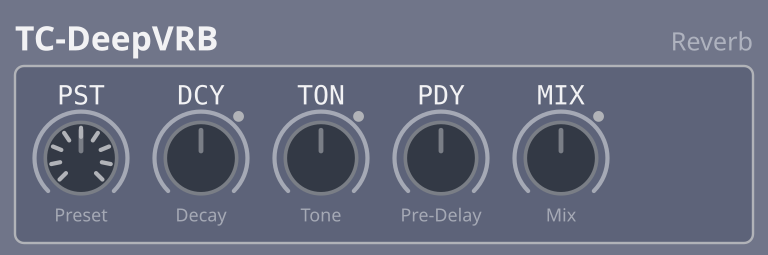

`FX Type` 0, reverb. 5 slots, drawn as knobs.

| Slot | Ref | Parameter | Reads as | Control | Group | Range | Mod | Description |
|---|---|---|---|---|---|---|---|---|
| 1 | `PST` | Preset | Preset | selector |  | Ambience, Church, Gate, Hall, Lo Fi, Modulated, Plate, Room, Spring, Tile, Default |  |  |
| 2 | `DCY` | Decay | Decay | continuous |  | 0.1 to 6.0 s | yes | Controls the amount of time it takes for the reverb to dissipate (range is preset dependant). |
| 3 | `TON` | Tone | Tone | continuous |  | -50.0 to 50.0 % | yes | Enhances high frequencies/low frequencies for positive/negative settings respectivly. |
| 4 | `PDY` | PreDelay | Pre-Delay | continuous |  | 0.0 to 200.0 ms |  | Controls the amount of time before the reverb is heard following the source signal. |
| 5 | `MIX` | Mix | Mix | continuous |  | 0.0 to 100 % | yes | Controls the mix (or ratio) of wet (processed) and dry (unprocessed) signals. |

### Ambient Reverb (AmbVerb)

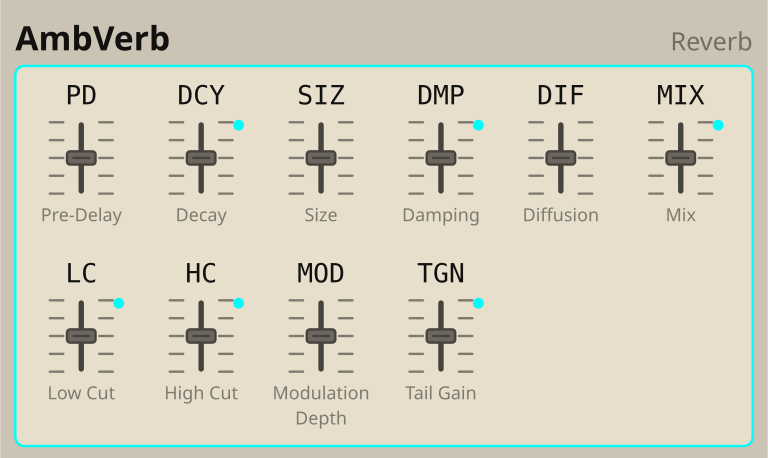

`FX Type` 1, reverb. 10 slots, drawn as faders.

| Slot | Ref | Parameter | Reads as | Control | Group | Range | Mod | Description |
|---|---|---|---|---|---|---|---|---|
| 1 | `PD` | PreDelay | Pre-Delay | continuous |  | 0.0 to 200.0 ms |  | Controls the amount of time before the reverb is heard following the source signal. |
| 2 | `DCY` | Decay | Decay | continuous |  | 0.2 to 7.3 s | yes | Controls the amount of time it takes for the reverb to dissipate. |
| 3 | `SIZ` | Size | Size | continuous |  | 2.0 to 100.0 |  | Controls the perceived size of the space being created by the reverb. |
| 4 | `DMP` | Damping | Damping | continuous |  | 1000 to 20000 Hz | yes | Adjusts the decay of the high frequencies within the reverb tail. |
| 5 | `DIF` | Diffusion | Diffusion | continuous |  | 1.0 to 30.0 |  | Controls the initial reflection density. |
| 6 | `MIX` | Mix | Mix | continuous |  | 0.0 to 100 % | yes | Controls the mix (or ratio) of wet (processed) and dry (unprocessed) signals. |
| 7 | `LC` | LoCut | Low Cut | continuous |  | 10.0 to 500.0 Hz | yes | Allows the low frequencies affected by the reverb to be reduced. |
| 8 | `HC` | Hi Cut | High Cut | continuous |  | 200.0 to 20000.0 Hz | yes | Allows the high frequencies affected by the reverb to be reduced. |
| 9 | `MOD` | Mod | Modulation Depth | continuous |  | 0.0 to 100 % |  | Controls the reverb tail modulation depth. |
| 10 | `TGN` | TailGain | Tail Gain | continuous |  | 0.0 to 100 % | yes | Adjusts the volume of the reverb tail. |

### Room Reverb (RoomRev)

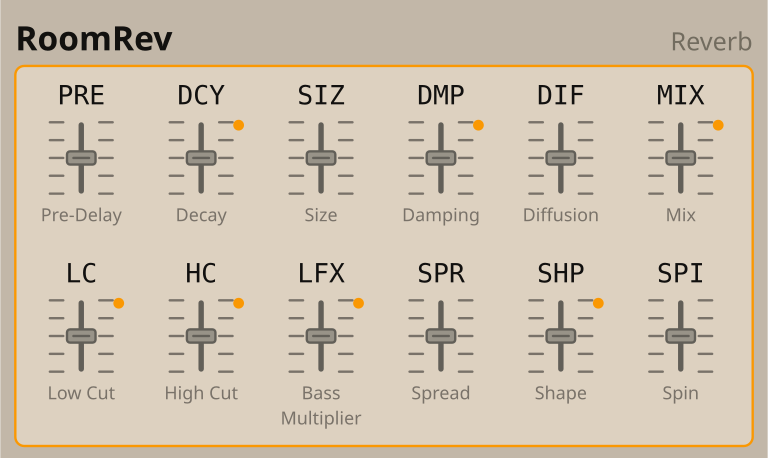

`FX Type` 2, reverb. 12 slots, drawn as faders.

| Slot | Ref | Parameter | Reads as | Control | Group | Range | Mod | Description |
|---|---|---|---|---|---|---|---|---|
| 1 | `PRE` | PreDelay | Pre-Delay | continuous |  | 0.0 to 200.0 ms |  | Controls the amount of time before the reverb is heard following the source signal. |
| 2 | `DCY` | Decay | Decay | continuous |  | 0.3 to 28.9 s | yes | Controls the amount of time it takes for the reverb to dissipate. |
| 3 | `SIZ` | Size | Size | continuous |  | 4.0 to 76.0 m |  | Controls the perceived size of the space being created by the reverb. |
| 4 | `DMP` | Damping | Damping | continuous |  | 1000 to 20000 Hz | yes | Adjusts the decay of the high frequencies within the reverb tail. |
| 5 | `DIF` | Diffusion | Diffusion | continuous |  | 0.0 to 100 % |  | Controls the initial reflection density. |
| 6 | `MIX` | Mix | Mix | continuous |  | 0.0 to 100 % | yes | Controls the mix (or ratio) of wet (processed) and dry (unprocessed) signals. |
| 7 | `LC` | LoCut | Low Cut | continuous |  | 10.0 to 500.0 Hz | yes | Allows the low frequencies affected by the reverb to be reduced. |
| 8 | `HC` | Hi Cut | High Cut | continuous |  | 200.0 to 20000.0 Hz | yes | Allows the high frequencies affected by the reverb to be reduced. |
| 9 | `LFX` | BassMult | Bass Multiplier | continuous |  | 0.2 to 4.0 | yes | Controls the low frequency build-up. |
| 10 | `SPR` | Spread | Spread | continuous |  | 0.0 to 50.0 |  | Emphasizes the stereo effect of the reverb. |
| 11 | `SHP` | Shape | Shape | continuous |  | 0.0 to 250.0 | yes | Adjusts the contour of the reverberation envelope. |
| 12 | `SPI` | Spin | Spin | continuous |  | 0.0 to 100 % |  | Controls randomization / modulation effects within the reverb. |

### Vintage Room Reverb (VintageRev)

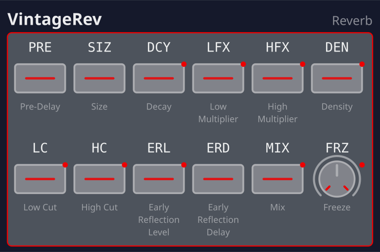

`FX Type` 3, reverb. 12 slots, drawn as displays.

| Slot | Ref | Parameter | Reads as | Control | Group | Range | Mod | Description |
|---|---|---|---|---|---|---|---|---|
| 1 | `PRE` | PreDelay | Pre-Delay | continuous |  | 0.0 to 200.0 ms |  | Controls the amount of time before the reverb is heard following the source signal. |
| 2 | `SIZ` | Size | Size | continuous |  | 1.0 to 100 % |  | Controls the perceived size of the space being created by the reverb. Affects DECAY range. |
| 3 | `DCY` | Decay | Decay | continuous |  | 0.1 to 20.7 s | yes | Controls the amount of time it takes for the reverb to dissipate. Range dependant on SIZE. |
| 4 | `LFX` | Lo Mult | Low Multiplier | continuous |  | 0.1 to 10.0 | yes | Controls the low frequency build-up. |
| 5 | `HFX` | Hi Mult | High Multiplier | continuous |  | 0.1 to 10.0 | yes | Controls the high frequency build-up. |
| 6 | `DEN` | Density | Density | continuous |  | 0.0 to 100 % | yes | Manipulates the reflection density in the simulated room. |
| 7 | `LC` | LoCut | Low Cut | continuous |  | 10.0 to 500.0 Hz | yes | Allows the low frequencies affected by the reverb to be reduced. |
| 8 | `HC` | Hi Cut | High Cut | continuous |  | 200.0 to 20000.0 Hz | yes | Allows the high frequencies affected by the reverb to be reduced. |
| 9 | `ERL` | ER Level | Early Reflection Level | continuous |  | 0.0 to 100 % | yes | Set the early reflection times. |
| 10 | `ERD` | ER Delay | Early Reflection Delay | continuous |  | 0.0 to 200.0 ms |  | Sets the loudness of the early reflection level. |
| 11 | `MIX` | Mix | Mix | continuous |  | 0.0 to 100 % | yes | Controls the mix (or ratio) of wet (processed) and dry (unprocessed) signals. |
| 12 | `FRZ` | Freeze | Freeze | switch |  | OFF to ON | yes | Applies freeze mode and blends signals into a continuous response. |

### Hall Reverb (HallRev)

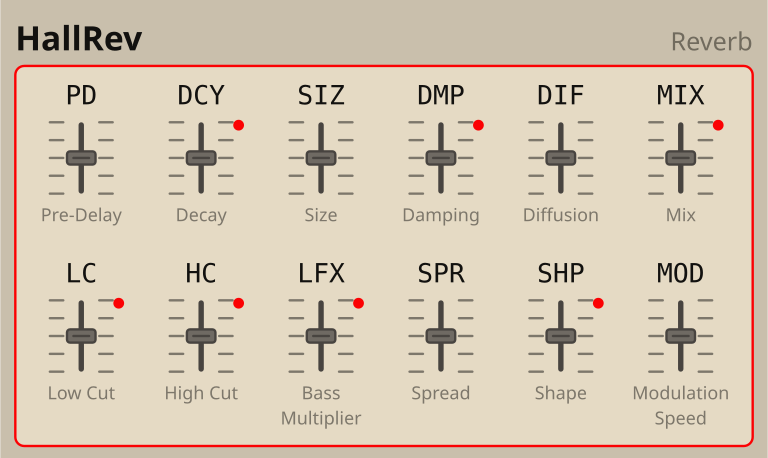

`FX Type` 4, reverb. 12 slots, drawn as faders.

| Slot | Ref | Parameter | Reads as | Control | Group | Range | Mod | Description |
|---|---|---|---|---|---|---|---|---|
| 1 | `PD` | PreDelay | Pre-Delay | continuous |  | 0.0 to 200.0 ms |  | Controls the amount of time before the reverb is heard following the source signal. |
| 2 | `DCY` | Decay | Decay | continuous |  | 0.2 to 4.9 s | yes | Controls the amount of time it takes for the reverb to dissipate. |
| 3 | `SIZ` | Size | Size | continuous |  | 2.0 to 200.0 |  | Controls the perceived size of the space being created by the reverb. |
| 4 | `DMP` | Damping | Damping | continuous |  | 1000 to 20000 Hz | yes | Adjusts the decay of the high frequencies within the reverb tail. |
| 5 | `DIF` | Diffusion | Diffusion | continuous |  | 1.0 to 30.0 |  | Controls the initial reflection density. |
| 6 | `MIX` | Mix | Mix | continuous |  | 0.0 to 100 % | yes | Controls the mix (or ratio) of wet (processed) and dry (unprocessed) signals. |
| 7 | `LC` | LoCut | Low Cut | continuous |  | 10.0 to 500.0 Hz | yes | Allows the low frequencies affected by the reverb to be reduced. |
| 8 | `HC` | Hi Cut | High Cut | continuous |  | 200.0 to 20000.0 Hz | yes | Allows the high frequencies affected by the reverb to be reduced. |
| 9 | `LFX` | BassMult | Bass Multiplier | continuous |  | 0.5 to 2.0 | yes | Controls the low frequency build-up. |
| 10 | `SPR` | Spread | Spread | continuous |  | 0.0 to 50.0 |  | Emphasizes the stereo effect of the reverb. |
| 11 | `SHP` | Shape | Shape | continuous |  | 0.0 to 250.0 | yes | Adjusts the contour of the reverberation envelope. |
| 12 | `MOD` | ModSpeed | Modulation Speed | continuous |  | 0.0 to 100.0 |  | Controls the reverb tail modulation rate . |

### Chamber Reverb (ChamberRev)

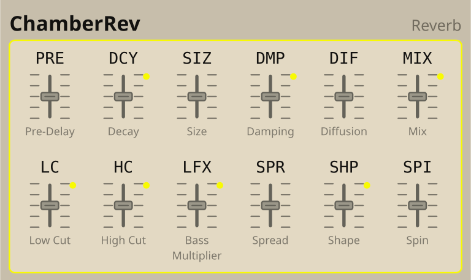

`FX Type` 5, reverb. 12 slots, drawn as faders.

| Slot | Ref | Parameter | Reads as | Control | Group | Range | Mod | Description |
|---|---|---|---|---|---|---|---|---|
| 1 | `PRE` | PreDelay | Pre-Delay | continuous |  | 0.0 to 200.0 ms |  | Controls the amount of time before the reverb is heard following the source signal. |
| 2 | `DCY` | Decay | Decay | continuous |  | 0.3 to 28.9 s | yes | Controls the amount of time it takes for the reverb to dissipate. |
| 3 | `SIZ` | Size | Size | continuous |  | 4.0 to 76.0 m |  | Controls the perceived size of the space being created by the reverb. |
| 4 | `DMP` | Damping | Damping | continuous |  | 1000 to 20000 Hz | yes | Adjusts the decay of the high frequencies within the reverb tail. |
| 5 | `DIF` | Diffusion | Diffusion | continuous |  | 0.0 to 100 % |  | Controls the initial reflection density. |
| 6 | `MIX` | Mix | Mix | continuous |  | 0.0 to 100 % | yes | Controls the mix (or ratio) of wet (processed) and dry (unprocessed) signals. |
| 7 | `LC` | LoCut | Low Cut | continuous |  | 10.0 to 500.0 Hz | yes | Allows the low frequencies affected by the reverb to be reduced. |
| 8 | `HC` | Hi Cut | High Cut | continuous |  | 200.0 to 20000.0 Hz | yes | Allows the high frequencies affected by the reverb to be reduced. |
| 9 | `LFX` | BassMult | Bass Multiplier | continuous |  | 0.2 to 4.0 | yes | Controls the low frequency build-up. |
| 10 | `SPR` | Spread | Spread | continuous |  | 0.0 to 50.0 |  | Emphasizes the stereo effect of the reverb. |
| 11 | `SHP` | Shape | Shape | continuous |  | 0.0 to 250.0 | yes | Adjusts the contour of the reverberation envelope. |
| 12 | `SPI` | Spin | Spin | continuous |  | 0.0 to 100 % |  | Controls randomization / modulation effects within the reverb. |

### Plate Reverb (PlateRev)

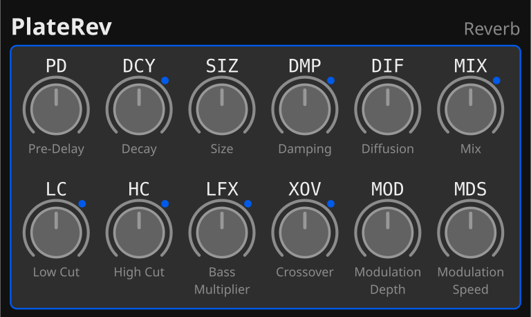

`FX Type` 6, reverb. 12 slots, drawn as knobs.

| Slot | Ref | Parameter | Reads as | Control | Group | Range | Mod | Description |
|---|---|---|---|---|---|---|---|---|
| 1 | `PD` | PreDelay | Pre-Delay | continuous |  | 0.0 to 200.0 ms |  | Controls the amount of time before the reverb is heard following the source signal. |
| 2 | `DCY` | Decay | Decay | continuous |  | 0.5 to 10.0 s | yes | Controls the amount of time it takes for the reverb to dissipate. |
| 3 | `SIZ` | Size | Size | continuous |  | 2.0 to 200.0 |  | Controls the perceived size of the space being created by the reverb. |
| 4 | `DMP` | Damping | Damping | continuous |  | 1000 to 20000 Hz | yes | Adjusts the decay of the high frequencies within the reverb tail. |
| 5 | `DIF` | Diffusion | Diffusion | continuous |  | 1.0 to 30.0 |  | Controls the initial reflection density. |
| 6 | `MIX` | Mix | Mix | continuous |  | 0.0 to 100 % | yes | Controls the mix (or ratio) of wet (processed) and dry (unprocessed) signals. |
| 7 | `LC` | LoCut | Low Cut | continuous |  | 10.0 to 500.0 Hz | yes | Allows the low frequencies affected by the reverb to be reduced. |
| 8 | `HC` | Hi Cut | High Cut | continuous |  | 200.0 to 20000.0 Hz | yes | Allows the high frequencies affected by the reverb to be reduced. |
| 9 | `LFX` | BassMult | Bass Multiplier | continuous |  | 0.5 to 2.0 | yes | Controls the low frequency build-up. |
| 10 | `XOV` | Xover | Crossover | continuous |  | 10.0 to 500.0 Hz | yes | Controls the crossover point for bass multiplier. |
| 11 | `MOD` | ModDepth | Modulation Depth | continuous |  | 1.0 to 50.0 |  | Controls the reverb tail modulation depth. |
| 12 | `MDS` | ModSpeed | Modulation Speed | continuous |  | 0.0 to 100.0 |  | Controls the reverb tail modulation rate. |

### Rich Plate Reverb (RichPltRev)

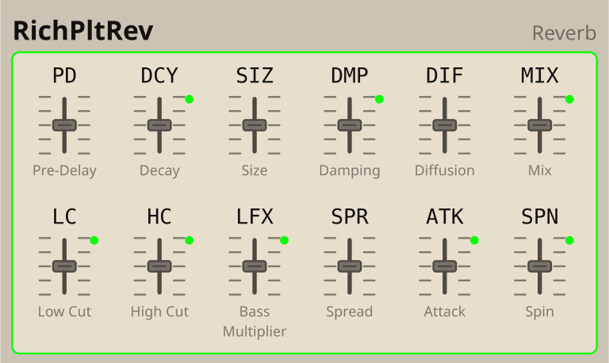

`FX Type` 7, reverb. 12 slots, drawn as faders.

| Slot | Ref | Parameter | Reads as | Control | Group | Range | Mod | Description |
|---|---|---|---|---|---|---|---|---|
| 1 | `PD` | PreDelay | Pre-Delay | continuous |  | 0.0 to 200.0 ms |  | Controls the amount of time before the reverb is heard following the source signal. |
| 2 | `DCY` | Decay | Decay | continuous |  | 0.3 to 28.9 s | yes | Controls the amount of time it takes for the reverb to dissipate. |
| 3 | `SIZ` | Size | Size | continuous |  | 4.0 to 39.0 m |  | Controls the perceived size of the space being created by the reverb. |
| 4 | `DMP` | Damping | Damping | continuous |  | 1000 to 20000 Hz | yes | Adjusts the decay of the high frequencies within the reverb tail. |
| 5 | `DIF` | Diffusion | Diffusion | continuous |  | 0.0 to 100 % |  | Controls the initial reflection density. |
| 6 | `MIX` | Mix | Mix | continuous |  | 0.0 to 100 % | yes | Controls the mix (or ratio) of wet (processed) and dry (unprocessed) signals. |
| 7 | `LC` | LoCut | Low Cut | continuous |  | 10.0 to 500.0 Hz | yes | Allows the low frequencies affected by the reverb to be reduced. |
| 8 | `HC` | Hi Cut | High Cut | continuous |  | 200.0 to 20000.0 Hz | yes | Allows the high frequencies affected by the reverb to be reduced. |
| 9 | `LFX` | BassMult | Bass Multiplier | continuous |  | 0.2 to 4.0 | yes | Controls the low frequency build-up. |
| 10 | `SPR` | Spread | Spread | continuous |  | 0.0 to 50.0 |  | Emphasizes the stereo effect of the reverb. |
| 11 | `ATK` | Attack | Attack | continuous |  | 0.0 to 100.0 | yes | Adjusts the contour of the reverberation envelope. |
| 12 | `SPN` | Spin | Spin | continuous |  | 0.0 to 100 % | yes | Controls randomization / modulation effects within the reverb. |

### Gated Reverb (GatedRev)

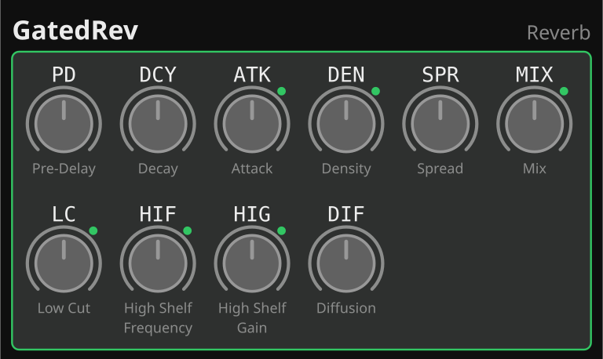

`FX Type` 8, reverb. 10 slots, drawn as knobs.

| Slot | Ref | Parameter | Reads as | Control | Group | Range | Mod | Description |
|---|---|---|---|---|---|---|---|---|
| 1 | `PD` | PreDelay | Pre-Delay | continuous |  | 0.0 to 200.0 ms |  | Controls the amount of time before the reverb is heard following the source signal. |
| 2 | `DCY` | Decay | Decay | continuous |  | 140.0 to 1000.0 ms |  | Controls the amount of time it takes for the reverb to dissipate. |
| 3 | `ATK` | Attack | Attack | continuous |  | 0.0 to 30.0 | yes | Adjusts the contour of the reverberation envelope . |
| 4 | `DEN` | Density | Density | continuous |  | 1.0 to 50.0 | yes | Manipulates the reflection density in the simulated room. |
| 5 | `SPR` | Spread | Spread | continuous |  | 0.0 to 100.0 |  | Emphasizes the stereo effect of the reverb. |
| 6 | `MIX` | Mix | Mix | continuous |  | 0.0 to 100 % | yes | Controls the mix (or ratio) of wet (processed) and dry (unprocessed) signals. |
| 7 | `LC` | LoCut | Low Cut | continuous |  | 10.0 to 500.0 Hz | yes | Allows the low frequencies affected by the reverb to be reduced. |
| 8 | `HIF` | HiSvFreq | High Shelf Frequency | continuous |  | 200.0 to 20000.0 Hz | yes | Adjusts the frequency of a Hi-Shelving filter at the input of the reverb effect. |
| 9 | `HIG` | HiSvGain | High Shelf Gain | continuous |  | -30.0 to 0.0 dB | yes | Adjusts the gain of a Hi-Shelving filter at the input of the reverb effect. |
| 10 | `DIF` | Diffusion | Diffusion | continuous |  | 0.0 to 100 % |  | Controls the initial reflection density . |

### Reverse Reverb (Reverse)

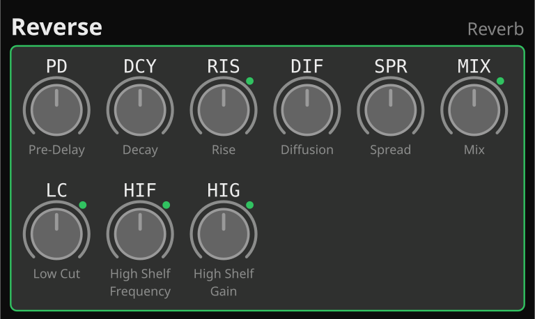

`FX Type` 9, reverb. 9 slots, drawn as knobs.

| Slot | Ref | Parameter | Reads as | Control | Group | Range | Mod | Description |
|---|---|---|---|---|---|---|---|---|
| 1 | `PD` | PreDelay | Pre-Delay | continuous |  | 0.0 to 200.0 ms |  | Controls the amount of time before the reverb is heard following the source signal. |
| 2 | `DCY` | Decay | Decay | continuous |  | 140.0 to 1000.0 ms |  | Controls the amount of time it takes for the reverb to dissipate. |
| 3 | `RIS` | Rise | Rise | continuous |  | 0.0 to 50.0 | yes | Controls how quickly the effect builds up. |
| 4 | `DIF` | Diffusion | Diffusion | continuous |  | 1.0 to 30.0 |  | Controls the initial reflection density. |
| 5 | `SPR` | Spread | Spread | continuous |  | 0.0 to 100.0 |  | Controls how the reflection is distributed through the envelope of the reverb. |
| 6 | `MIX` | Mix | Mix | continuous |  | 0.0 to 100 % | yes | Controls the mix (or ratio) of wet (processed) and dry (unprocessed) signals. |
| 7 | `LC` | LoCut | Low Cut | continuous |  | 10.0 to 500.0 Hz | yes | Allows the low frequencies affected by the reverb to be reduced. |
| 8 | `HIF` | HiSvFreq | High Shelf Frequency | continuous |  | 200.0 to 20000.0 Hz | yes | Adjusts the frequency of a Hi-Shelving filter at the input of the reverb effect. |
| 9 | `HIG` | HiSvGain | High Shelf Gain | continuous |  | -30.0 to 0.0 dB | yes | Adjusts the gain of a Hi-Shelving filter at the input of the reverb effect. |

### Chorus and Reverb (ChorusVerb)

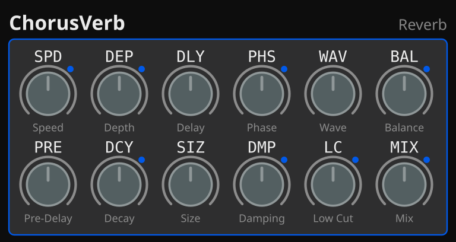

`FX Type` 10, reverb. 12 slots, drawn as knobs.

| Slot | Ref | Parameter | Reads as | Control | Group | Range | Mod | Description |
|---|---|---|---|---|---|---|---|---|
| 1 | `SPD` | Speed | Speed | continuous |  | 0.0 to 4.0 Hz | yes | Adjusts the rate of the chorus. Time synchronised options from 4 to 1/64 bars. |
| 2 | `DEP` | Depth | Depth | continuous |  | 0.0 to 100 % | yes | Adjusts the modulation depth of the chorus. |
| 3 | `DLY` | Delay | Delay | continuous |  | 0.5 to 50.0 ms |  | Adjusts the delay of the chorus. |
| 4 | `PHS` | Phase | Phase | continuous |  | 0.0 to 180.0 | yes | Offsets the phase between the left and right channels. |
| 5 | `WAV` | Wave | Wave | continuous |  | 0.0 to 100 % |  | Adjusts the LFO waveform from a sine wave to triangular wave. |
| 6 | `BAL` | Balance | Balance | continuous |  | -100.0 to 100.0 | yes | Adjusts the balance between chorus and reverb. |
| 7 | `PRE` | PreDelay | Pre-Delay | continuous |  | 0.0 to 200.0 ms |  | Controls the amount of time before the reverb is heard following the source signal. |
| 8 | `DCY` | Decay | Decay | continuous |  | 0.1 to 5.0 s | yes | Controls the amount of time it takes for the reverb to dissipate. |
| 9 | `SIZ` | Size | Size | continuous |  | 2.0 to 200.0 |  | Controls how large or small the simulated space is. |
| 10 | `DMP` | Damping | Damping | continuous |  | 1000 to 20000 Hz | yes | Determines the decay of high frequencies within the reverb tail. |
| 11 | `LC` | LoCut | Low Cut | continuous |  | 10.0 to 500.0 Hz | yes | Excludes low frequencies below the value . |
| 12 | `MIX` | Mix | Mix | continuous |  | 0.0 to 100 % | yes | Controls the mix (or ratio) of wet (processed) and dry (unprocessed) signals. |

### Delay and Reverb (DelayVerb)

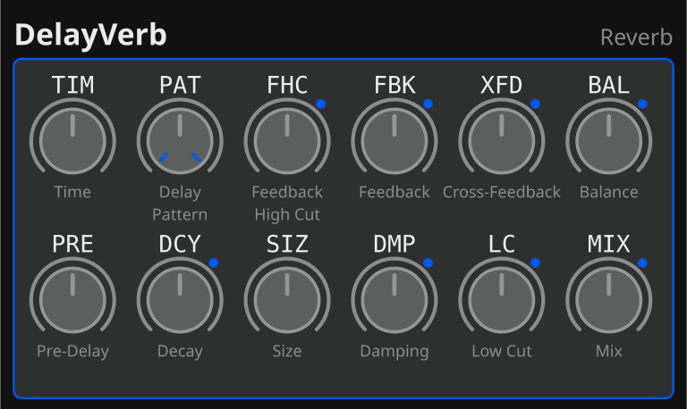

`FX Type` 11, reverb. 12 slots, drawn as knobs.

| Slot | Ref | Parameter | Reads as | Control | Group | Range | Mod | Description |
|---|---|---|---|---|---|---|---|---|
| 1 | `TIM` | Time | Time | continuous |  | 1.0 to 1500.0 ms |  | Adjusts the delay time for the left channel delay. Time sync options from 4 to 1/64 bars. |
| 2 | `PAT` | Pattern | Delay Pattern | selector |  | 1/4, 1X |  | Sets the delay ratio for the right channel delay. |
| 3 | `FHC` | FeedHC | Feedback High Cut | continuous |  | 200.0 to 20000.0 Hz | yes | Trims high frequencies from the feedback. |
| 4 | `FBK` | Feedback | Feedback | continuous |  | 0.0 to 100 % | yes | Controls the percentage of feedback. |
| 5 | `XFD` | X-Feed | Cross-Feedback | continuous |  | 0.0 to 100 % | yes | Control the amount of delay sound sent to the reverb effect. |
| 6 | `BAL` | Balance | Balance | continuous |  | -100.0 to 100.0 | yes | Adjusts the ratio between delay and reverb. |
| 7 | `PRE` | PreDelay | Pre-Delay | continuous |  | 0.0 to 200.0 ms |  | Controls the amount of time before the reverb is heard following the source signal. |
| 8 | `DCY` | Decay | Decay | continuous |  | 0.1 to 5.0 s | yes | Controls the amount of time it takes for the reverb to dissipate. |
| 9 | `SIZ` | Size | Size | continuous |  | 2.0 to 200.0 |  | Controls how large or small the simulated space is. |
| 10 | `DMP` | Damping | Damping | continuous |  | 1000 to 20000 Hz | yes | Determines the decay of high frequencies within the reverb tail. |
| 11 | `LC` | LoCut | Low Cut | continuous |  | 10.0 to 500.0 Hz | yes | Excludes low frequencies below the value . |
| 12 | `MIX` | Mix | Mix | continuous |  | 0.0 to 100 % | yes | Controls the mix (or ratio) of wet (processed) and dry (unprocessed) signals. |

### Flanger and Reverb (FlangVerb)

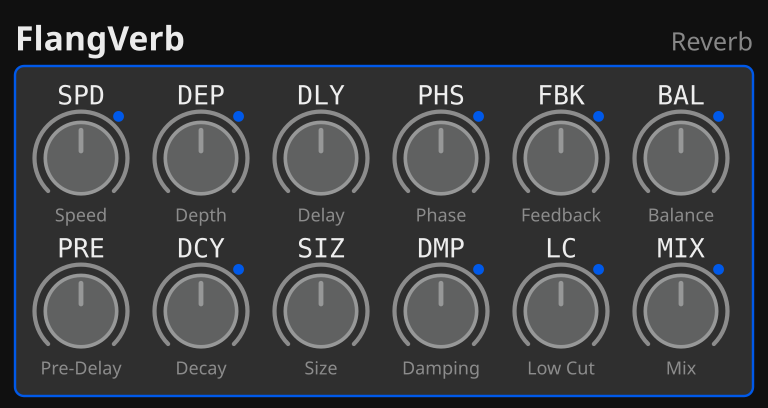

`FX Type` 12, reverb. 12 slots, drawn as knobs.

| Slot | Ref | Parameter | Reads as | Control | Group | Range | Mod | Description |
|---|---|---|---|---|---|---|---|---|
| 1 | `SPD` | Speed | Speed | continuous |  | 0.0 to 4.0 Hz | yes | Adjusts the rate of the flanger. Time synchronised options from 4 to 1/64 bars. |
| 2 | `DEP` | Depth | Depth | continuous |  | 0.0 to 100 % | yes | Adjusts the modulation depth of the flanger. |
| 3 | `DLY` | Delay | Delay | continuous |  | 0.5 to 20.0 ms |  | Adjusts the delay of the flanger. |
| 4 | `PHS` | Phase | Phase | continuous |  | 0.0 to 180.0 | yes | Offsets the phase between the left and right channels. |
| 5 | `FBK` | Feed | Feedback | continuous |  | -90.0 to 90.0 % | yes | Controls the percentage of positive or negative feedback. |
| 6 | `BAL` | Balance | Balance | continuous |  | -100.0 to 100.0 | yes | Adjusts the balance between flanger and reverb. |
| 7 | `PRE` | PreDelay | Pre-Delay | continuous |  | 0.0 to 200.0 ms |  | Controls the amount of time before the reverb is heard following the source signal. |
| 8 | `DCY` | Decay | Decay | continuous |  | 0.1 to 5.0 s | yes | Controls the amount of time it takes for the reverb to dissipate. |
| 9 | `SIZ` | Size | Size | continuous |  | 2.0 to 200.0 |  | Controls how large or small the simulated space is. |
| 10 | `DMP` | Damping | Damping | continuous |  | 1000 to 20000 Hz | yes | Determines the decay of high frequencies within the reverb tail. |
| 11 | `LC` | LoCut | Low Cut | continuous |  | 10.0 to 500.0 Hz | yes | Excludes low frequencies below the value . |
| 12 | `MIX` | Mix | Mix | continuous |  | 0.0 to 100 % | yes | Controls the mix (or ratio) of wet (processed) and dry (unprocessed) signals. |

### Midas Equaliser (MidasEQ)

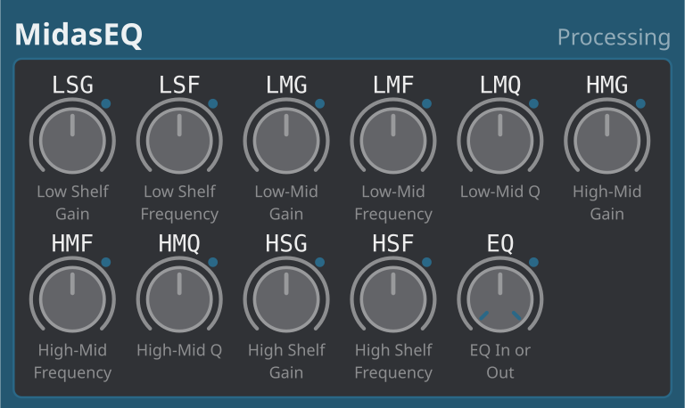

`FX Type` 13, processing. 11 slots, drawn as knobs.

| Slot | Ref | Parameter | Reads as | Control | Group | Range | Mod | Description |
|---|---|---|---|---|---|---|---|---|
| 1 | `LSG` | LoShelfGain | Low Shelf Gain | continuous | low | -12.0 to 12.0 dB | yes | Adjusts the gain of the low band. |
| 2 | `LSF` | LoShelfFreq | Low Shelf Frequency | continuous | low | 30.0 to 20000.0 Hz | yes | Adjusts the frequency of the low band. |
| 3 | `LMG` | LoMidGain | Low-Mid Gain | continuous | low-mid | -12.0 to 12.0 dB | yes | Adjusts the gain of the low-mid band. |
| 4 | `LMF` | LoMidFreq | Low-Mid Frequency | continuous | low-mid | 30.0 to 20000.0 Hz | yes | Adjusts the frequency of the low-mid band. |
| 5 | `LMQ` | LoMidQ | Low-Mid Q | continuous | low-mid | 0.3 to 5.0 | yes | Adjusts the Q-factor of the low-mid band. |
| 6 | `HMG` | HiMidGain | High-Mid Gain | continuous | high-mid | -12.0 to 12.0 dB | yes | Adjusts the gain of the high-mid band. |
| 7 | `HMF` | HiMidFreq | High-Mid Frequency | continuous | high-mid | 30.0 to 20000.0 Hz | yes | Adjusts the frequency of the high- mid band. |
| 8 | `HMQ` | HiMidQ | High-Mid Q | continuous | high-mid | 0.3 to 5.0 | yes | Adjusts the Q-factor of the high-mid band. |
| 9 | `HSG` | HiShelfGain | High Shelf Gain | continuous | high | -12.0 to 12.0 dB | yes | Adjusts the gain of the high band. |
| 10 | `HSF` | HiShelfFreq | High Shelf Frequency | continuous | high | 30.0 to 20000.0 Hz | yes | Adjusts the frequency of the high band. |
| 11 | `EQ` | EQ | EQ In or Out | switch |  | IN, OUT | yes | INOUTAdjusts the frequency of the high band. |

### Enhancing EQ (Enhancer)

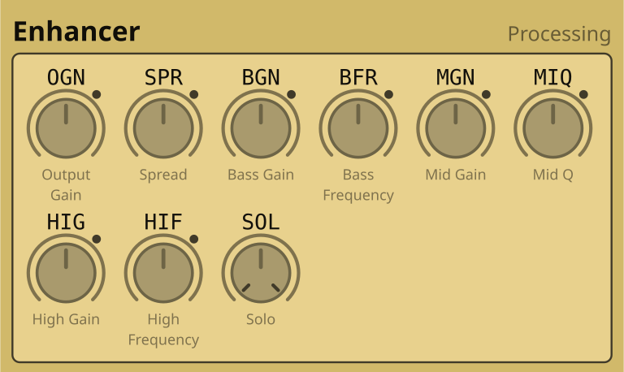

`FX Type` 14, processing. 9 slots, drawn as knobs.

| Slot | Ref | Parameter | Reads as | Control | Group | Range | Mod | Description |
|---|---|---|---|---|---|---|---|---|
| 1 | `OGN` | OutGain | Output Gain | continuous |  | -12.0 to 12.0 dB | yes | Compensates for changes in level resulting from the effect. |
| 2 | `SPR` | Spread | Spread | continuous |  | 0.0 to 100 % | yes | Emphasizes the stereo content for a wider mix . |
| 3 | `BGN` | BassGain | Bass Gain | continuous | low | 0.0 to 100 % | yes | Adjusts the gain of the bass band. |
| 4 | `BFR` | BassFreq | Bass Frequency | continuous | low | 1.0 to 50.0 | yes | Adjusts the frequency of the bass band. |
| 5 | `MGN` | MidGain | Mid Gain | continuous | mid | 0.0 to 100 % | yes | Adjusts the gain of the mid band. |
| 6 | `MIQ` | MidQ | Mid Q | continuous | mid | 1.0 to 50.0 | yes | Adjusts the Q-factor of the mid band. |
| 7 | `HIG` | HiGain | High Gain | continuous | high | 0.0 to 100 % | yes | Adjusts the gain of the high band. |
| 8 | `HIF` | HiFreq | High Frequency | continuous | high | 1.0 to 50.0 | yes | Adjusts the frequency of the high band. |
| 9 | `SOL` | Solo | Solo | switch |  | OFF, ON |  | Solo mode - used to isolate only the audio resulting from the effect. |

### Compressor (FairComp)

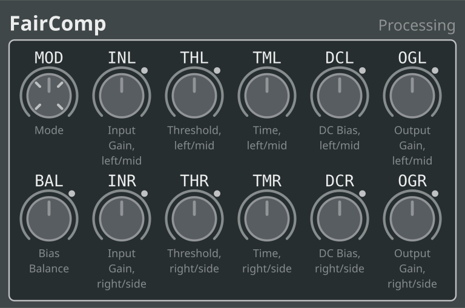

`FX Type` 15, processing. 12 slots, drawn as knobs.

| Slot | Ref | Parameter | Reads as | Control | Group | Range | Mod | Description |
|---|---|---|---|---|---|---|---|---|
| 1 | `MOD` | Mode | Mode | selector |  | Off, Stereo, Dual, M/S |  | Mode of operation: Off, Stereo, Dual, M/S (Mid/Side). |
| 2 | `INL` | InGain L/M | Input Gain, left/mid | continuous | left-mid | -20.0 to 0.0 | yes | Controls the input gain for the Left/Mid signal. |
| 3 | `THL` | Thresh L/M | Threshold, left/mid | continuous | left-mid | 0.0 to 10.0 | yes | Controls the threshold for the Left/Mid signal. |
| 4 | `TML` | Time L/M | Time, left/mid | continuous | left-mid | 1.0 to 6.0 |  | Controls the attack and release time for the Left/Mid channel. |
| 5 | `DCL` | DC Bias L/M | DC Bias, left/mid | continuous | left-mid | 0.0 to 100 % | yes | Adjust the ratio and knee of the compression curve for the Left/Mid signal. |
| 6 | `OGL` | OutGain L/M | Output Gain, left/mid | continuous | left-mid | -18.0 to 6.0 dB | yes | Controls the output gain for the Left/Mid signal. |
| 7 | `BAL` | Bias Bal | Bias Balance | continuous |  | -100.0 to 100 % | yes | Adjust the bias current, creating accentuation of attacks |
| 8 | `INR` | InGain R/S | Input Gain, right/side | continuous | right-side | -20.0 to 0.0 | yes | Controls the input gain for the Right/Side signal. |
| 9 | `THR` | Thresh R/S | Threshold, right/side | continuous | right-side | 0.0 to 10.0 | yes | Controls the threshold for the Right/Side signal. |
| 10 | `TMR` | Time R/S | Time, right/side | continuous | right-side | 1.0 to 6.0 |  | Controls the attack and release time for the Right/Side channel. |
| 11 | `DCR` | DC Bias R/S | DC Bias, right/side | continuous | right-side | 0.0 to 100 % | yes | Adjust the ratio and knee of the compression curve for the Right/Side signal. |
| 12 | `OGR` | OutGain R/S | Output Gain, right/side | continuous | right-side | -18.0 to 6.0 dB | yes | Controls the output gain for the Right/Side signal. |

### Multiband Distortion (MulBndDist)

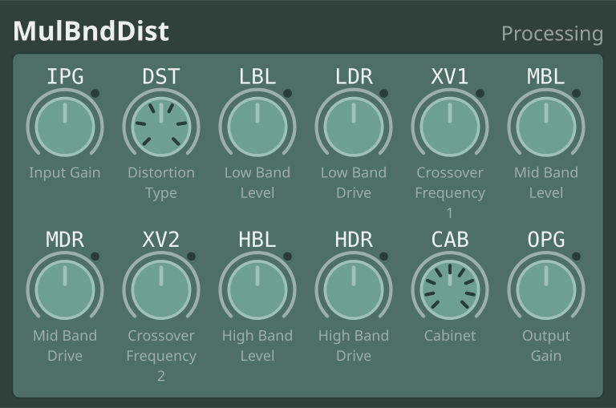

`FX Type` 16, processing. 12 slots, drawn as knobs.

| Slot | Ref | Parameter | Reads as | Control | Group | Range | Mod | Description |
|---|---|---|---|---|---|---|---|---|
| 1 | `IPG` | InputGain | Input Gain | continuous |  | -24.0 to 24.0 dB | yes | Controls the amount of input gain applied to the signal. |
| 2 | `DST` | Dist Types | Distortion Type | selector |  | VAL, SAT, TUB, PFV, PFS, PFT |  | Distortion Type: VAL(Valve), SAT(Saturation), TUB (Tube), & Post Filter variants (PFV/PFS/PFT). |
| 3 | `LBL` | Low Level | Low Band Level | continuous | low | -12.0 to 12.0 dB | yes | Controls the level of the frequencies below XoverFreq 1. |
| 4 | `LDR` | Low Drive | Low Band Drive | continuous | low | 0.0 to 100 % | yes | Controls the percentage of distortion introduced below XoverFreq 1. |
| 5 | `XV1` | Xover Freq 1 | Crossover Frequency 1 | continuous |  | 30.0 to 9000.0 Hz | yes | Sets the lower cross over frequency. |
| 6 | `MBL` | Mid Level | Mid Band Level | continuous | mid | -12.0 to 12.0 dB | yes | Controls the level of the frequencies between Xover1 Freq and Xover2 Freq. |
| 7 | `MDR` | Mid Drive | Mid Band Drive | continuous | mid | 0.0 to 100 % | yes | Controls the percentage of distortion introduced between Xover1 Freq and Xover2 Freq. |
| 8 | `XV2` | Xover Freq 2 | Crossover Frequency 2 | continuous |  | 30.0 to 9000.0 Hz | yes | Sets the upper cross over frequency. |
| 9 | `HBL` | High Level | High Band Level | continuous | high | -12.0 to 12.0 dB | yes | Controls the level of the frequencies below XoverFreq 2. |
| 10 | `HDR` | High Drive | High Band Drive | continuous | high | 0.0 to 100 % | yes | Controls the percentage of distortion introduced above XoverFreq 2. |
| 11 | `CAB` | Cabinet | Cabinet | selector |  | OFF, VTw, VBs, A10, Mid, BFC, B60, V30, S78, Oax, Ac1, Ac2 |  | Cabinet Type: OFF, VTw, VBs, A10, Mid, BFC, B60, V30, S78, Oax, A12, Rck. (See Table Above). |
| 12 | `OPG` | OutputGain | Output Gain | continuous |  | -12.0 to 12.0 dB | yes | Controls the amount of output gain applied to the signal. |

### Rack Amplifier (RackAmp)

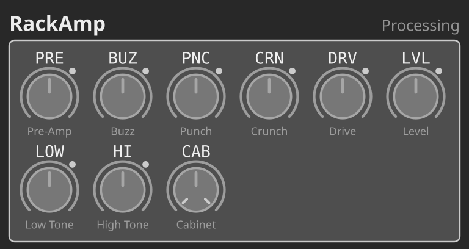

`FX Type` 17, processing. 9 slots, drawn as knobs.

| Slot | Ref | Parameter | Reads as | Control | Group | Range | Mod | Description |
|---|---|---|---|---|---|---|---|---|
| 1 | `PRE` | PreAmp | Pre-Amp | continuous |  | 0.0 to 10.0 | yes | Adjusts the amount of input gain prior to the band-specific distortion adjustment. |
| 2 | `BUZ` | Buzz | Buzz | continuous |  | 0.0 to 10.0 | yes | Adjusts the amount of low-end breakup. |
| 3 | `PNC` | Punch | Punch | continuous |  | 0.0 to 10.0 | yes | Adjusts the amount of midrange distortion. |
| 4 | `CRN` | Crunch | Crunch | continuous |  | 0.0 to 10.0 | yes | Tailors the high-frequency content and distortion for smooth or cutting notes. |
| 5 | `DRV` | Drive | Drive | continuous |  | 0.0 to 10.0 | yes | Emulates the amount of power amp distortion from a tube amp. |
| 6 | `LVL` | Level | Level | continuous |  | 0.0 to 10.0 | yes | Controls the overall output level. |
| 7 | `LOW` | Low | Low Tone | continuous |  | 0.0 to 10.0 | yes | EQ adjustment of the low frequencies, independent of distortion content. |
| 8 | `HI` | High | High Tone | continuous |  | 0.0 to 10.0 | yes | EQ adjustment of the high frequencies, independent of distortion content. |
| 9 | `CAB` | Cabinet | Cabinet | switch |  | OFF to ON |  | Turns the cabinet simulation on or off. |

### Stereo Imaging (EdisonEX1)

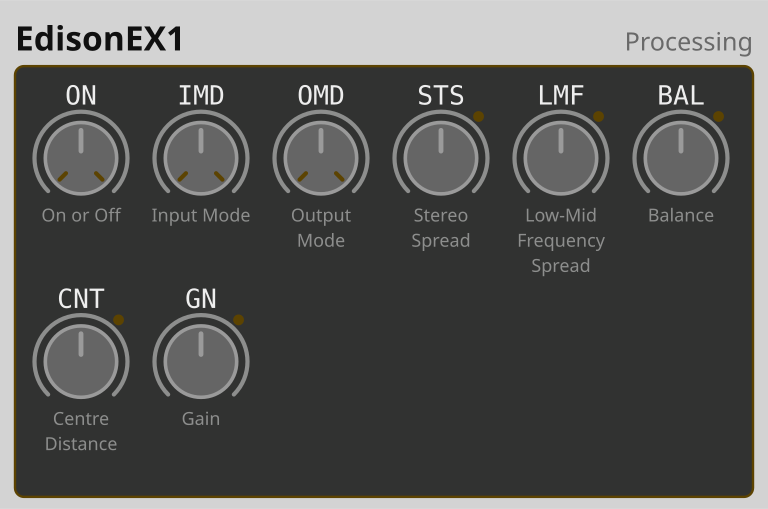

`FX Type` 18, processing. 8 slots, drawn as knobs.

| Slot | Ref | Parameter | Reads as | Control | Group | Range | Mod | Description |
|---|---|---|---|---|---|---|---|---|
| 1 | `ON` | On | On or Off | switch |  | OFF to ON |  | Allows the effect to be turned On or Off. |
| 2 | `IMD` | InMode | Input Mode | selector |  | ST, M/S |  | STM/SControls the input mode (Stereo or Mid/Side). |
| 3 | `OMD` | OutMode | Output Mode | selector |  | ST, M/S |  | STM/SControls the output mode (Stereo or Mid/Side). |
| 4 | `STS` | StSpread | Stereo Spread | continuous |  | -50.0 to 50.0 | yes | Controls the spread of the stereo field. |
| 5 | `LMF` | LMF Spread | Low-Mid Frequency Spread | continuous |  | -50.0 to 50.0 | yes | Controls the spread of the stereo field for low/mid frequencies only. |
| 6 | `BAL` | Balance | Balance | continuous |  | -50.0 to 50.0 | yes | Adjusts the ratio of mono to stereo content. |
| 7 | `CNT` | CntrDist | Centre Distance | continuous |  | -50.0 to 50.0 | yes | Allows the mono content to be panned. |
| 8 | `GN` | Gain | Gain | continuous |  | -12.0 to 12.0 dB | yes | Controls the amount of output gain applied to the signal. |

### Auto Panning (Auto Pan)

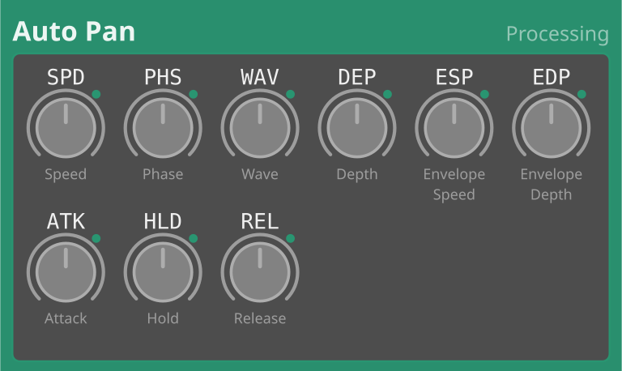

`FX Type` 19, processing. 9 slots, drawn as knobs.

| Slot | Ref | Parameter | Reads as | Control | Group | Range | Mod | Description |
|---|---|---|---|---|---|---|---|---|
| 1 | `SPD` | Speed | Speed | continuous |  | 0.0 to 5.0 Hz | yes | Adjusts the LFO rate. Time synchronised options from 4 to 1/64 bars. |
| 2 | `PHS` | Phase | Phase | continuous |  | 0.0 to 180.0 | yes | Controls the LFO phase difference between the left and right channels. |
| 3 | `WAV` | Wave | Wave | continuous |  | -50.0 to 50.0 | yes | Blends the LFO waveform between triangular and square shape. |
| 4 | `DEP` | Depth | Depth | continuous |  | 0.0 to 100 % | yes | Controls the depth (amount) of modulation. |
| 5 | `ESP` | EnvSpd | Envelope Speed | continuous |  | 0.0 to 100 % | yes | Adjusts how much the LFO speed is modulated by the envelope. |
| 6 | `EDP` | EnvDepth | Envelope Depth | continuous |  | 0.0 to 100 % | yes | Adjusts the depth of the envelope modulation. |
| 7 | `ATK` | Attack | Attack | continuous |  | 10.0 to 1000.0 ms | yes | Controls the envelope attack stage time. |
| 8 | `HLD` | Hold | Hold | continuous |  | 1.0 to 2000.0 ms | yes | Controls the envelope hold stage time. |
| 9 | `REL` | Release | Release | continuous |  | 10.0 to 1000.0 ms | yes | Controls the envelope release stage time. |

### Noise Gate (NoiseGate)

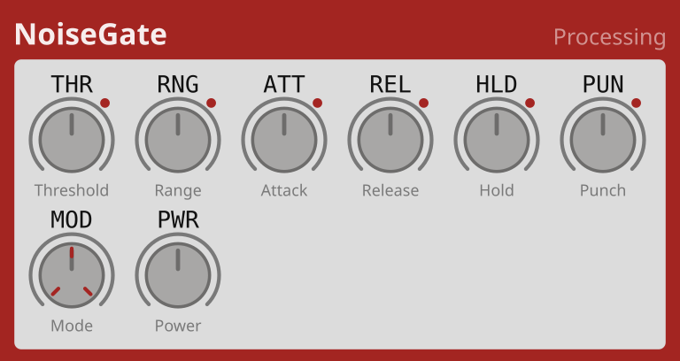

`FX Type` 20, processing. 8 slots, drawn as knobs.

| Slot | Ref | Parameter | Reads as | Control | Group | Range | Mod | Description |
|---|---|---|---|---|---|---|---|---|
| 1 | `THR` | Threshold | Threshold | continuous |  | -50.0 to 0.0 dB | yes | Sets signal level at which gate opens. |
| 2 | `RNG` | Range | Range | continuous |  | -100.0 to 0.0 dB | yes | Control adjusts the amount of gain reduction applied to the signal below threshold. |
| 3 | `ATT` | Attack | Attack | continuous |  | 0.0 to 20.0 ms | yes | Adjusts time taken for gate to open after an over-threshold signal. |
| 4 | `REL` | Release | Release | continuous |  | 2.0 to 1999.9 ms | yes | Adjusts time taken for gate to close after programme material falls back below threshold. |
| 5 | `HLD` | Hold | Hold | continuous |  | 2.0 to 1999.9 ms | yes | This defines a waiting period before the gate starts to close. |
| 6 | `PUN` | Punch | Punch | continuous |  | -6.0 to 6.0 | yes | Used to increase tonal shaping or reduce gated breathing/delay/resonant howl-round. |
| 7 | `MOD` | Mode | Mode | selector |  | GAT, TRN, DUC |  | GAT (Gate), TRN (Transient Gate), DUC (Ducker). |
| 8 | `PWR` | Power | Power | continuous |  | ON to OFF |  | Enables gate in the signal path. When switched off, gate is bypassed. |

### Stereo Delay (Delay)

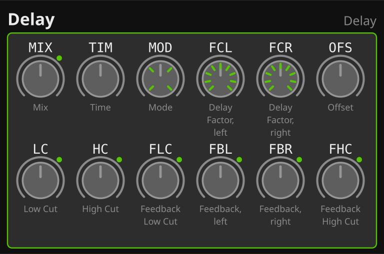

`FX Type` 21, delay. 12 slots, drawn as knobs.

| Slot | Ref | Parameter | Reads as | Control | Group | Range | Mod | Description |
|---|---|---|---|---|---|---|---|---|
| 1 | `MIX` | Mix | Mix | continuous |  | 0.0 to 100 % | yes | Controls the mix (or ratio) of wet (processed) and dry (unprocessed) signals. |
| 2 | `TIM` | Time | Time | continuous |  | 1.0 to 1500.0 ms |  | Adjusts the master delay time. Time synchronised options from 4 to 1/64 bars. |
| 3 | `MOD` | Mode | Mode | selector |  | ST, X, M, P-P |  | ST- Stereo feedback, X - crosses feedback between channels, M - Mono mix in feedback chain. P-P - Ping Pong (Note that Feedback-R (FBR) is disabled in this mode. |
| 4 | `FCL` | FactorL | Delay Factor, left | selector |  | 1/4, 1/3, 1/2, 2/3, 3/4, 1, 4/3, 3/2, 2, 3 |  | Sets left delay to rhythmic fractions of the master delay. |
| 5 | `FCR` | FactorR | Delay Factor, right | selector |  | 1/4, 1/3, 1/2, 2/3, 3/4, 1, 4/3, 3/2, 2, 3 |  | Sets right delay to rhythmic fractions of the master delay. |
| 6 | `OFS` | Offset | Offset | continuous |  | -100.0 to 100.0 ms |  | Adds a delay difference between the left and right delayed signals. |
| 7 | `LC` | LC | Low Cut | continuous |  | 10.0 to 500.0 Hz | yes | Adjusts the low frequency cut, allowing lower frequencies to remain unaffected by the delay. |
| 8 | `HC` | HC | High Cut | continuous |  | 200.0 to 20000.0 Hz | yes | Adjusts the high frequency cut, allowing higher frequencies to remain unaffected by the delay. |
| 9 | `FLC` | FeedLC | Feedback Low Cut | continuous |  | 10.0 to 500.0 Hz | yes | Adjusts the low cut filter frequency in the feedback paths. |
| 10 | `FBL` | FeedL | Feedback, left | continuous |  | 0.0 to 100 % | yes | Control the amount of feedback for the left channel. |
| 11 | `FBR` | FeedR | Feedback, right | continuous |  | 0.0 to 100 % | yes | Control the amount of feedback for the right channel. |
| 12 | `FHC` | FeedHC | Feedback High Cut | continuous |  | 200.0 to 20000.0 Hz | yes | Adjusts the high cut filter frequency in the feedback paths. |

### 3-Tap Delay (3TapDelay)

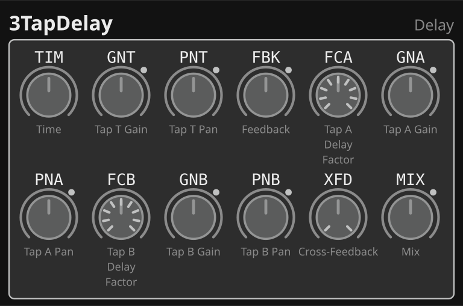

`FX Type` 22, delay. 12 slots, drawn as knobs.

| Slot | Ref | Parameter | Reads as | Control | Group | Range | Mod | Description |
|---|---|---|---|---|---|---|---|---|
| 1 | `TIM` | Time | Time | continuous |  | 1.0 to 1500.0 ms |  | Sets the master delay time, and the first stage. Time synchronised options from 4 to 1/64 bars. |
| 2 | `GNT` | GainT | Tap T Gain | continuous |  | 0.0 to 100 % | yes | Sets the gain level of the first stage of the delay. |
| 3 | `PNT` | PanT | Tap T Pan | continuous |  | -100 to 100 % | yes | Sets the position of the first delay stage in the stereo field. |
| 4 | `FBK` | Feedback | Feedback | continuous |  | 0.0 to 100 % | yes | Adjusts the amount of feedback. |
| 5 | `FCA` | FactorA | Tap A Delay Factor | selector |  | 1/4, 1/3, 1/2, 2/3, 3/4, 1, 4/3, 3/2, 2, 3 |  | Controls the delay time in the second stage of the delay. |
| 6 | `GNA` | GainA | Tap A Gain | continuous |  | 0.0 to 100 % | yes | Controls the gain level of the second delay stage. |
| 7 | `PNA` | PanA | Tap A Pan | continuous |  | -100 to 100 % | yes | Sets the position of the second delay stage in the stereo field. |
| 8 | `FCB` | FactorB | Tap B Delay Factor | selector |  | 1/4, 1/3, 1/2, 2/3, 3/4, 1, 4/3, 3/2, 2, 3 |  | Controls the delay time in the third stage of the delay. |
| 9 | `GNB` | GainB | Tap B Gain | continuous |  | 0.0 to 100 % | yes | Controls the gain level of the third delay stage. |
| 10 | `PNB` | PanB | Tap B Pan | continuous |  | -100 to 100 % | yes | Sets the position of the third gain stage in the stereo field. |
| 11 | `XFD` | X-Feed | Cross-Feedback | switch |  | OFF to ON |  | Turns the stereo cross-feedback of the delays On or Off . |
| 12 | `MIX` | Mix | Mix | continuous |  | 0.0 to 100 % | yes | Controls the mix (or ratio) of wet (processed) and dry (unprocessed) signals. |

### 4-Tap Delay (4TapDelay)

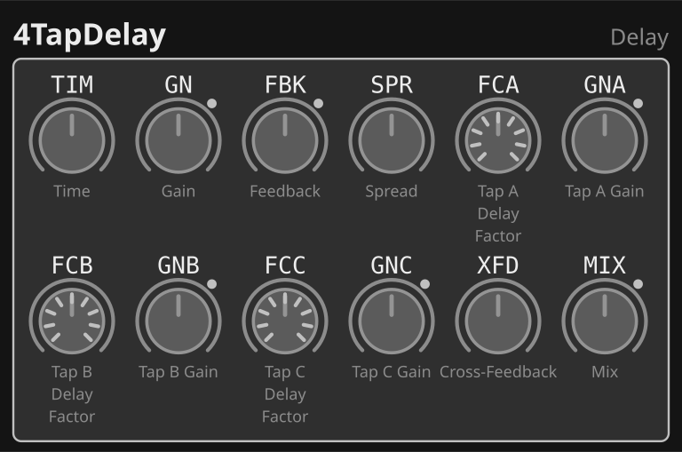

`FX Type` 23, delay. 12 slots, drawn as knobs.

| Slot | Ref | Parameter | Reads as | Control | Group | Range | Mod | Description |
|---|---|---|---|---|---|---|---|---|
| 1 | `TIM` | Time | Time | continuous |  | 1.0 to 1500.0 ms |  | Sets the master delay time, and the first stage. Time synchronised options from 4 to 1/64 bars. |
| 2 | `GN` | Gain | Gain | continuous |  | 0.0 to 100 % | yes | Sets the gain level of the first stage of the delay. |
| 3 | `FBK` | Feedback | Feedback | continuous |  | 0.0 to 100 % | yes | Adjusts the amount of feedback. |
| 4 | `SPR` | Spread | Spread | continuous |  | 0.0 to 6.0 |  | Positions the first delay stage in the stereo field. |
| 5 | `FCA` | FactorA | Tap A Delay Factor | selector |  | 1/4, 1/3, 1/2, 2/3, 3/4, 1, 4/3, 3/2, 2, 3 |  | Controls the delay time in the second stage of the delay. |
| 6 | `GNA` | GainA | Tap A Gain | continuous |  | 0.0 to 100 % | yes | Controls the gain level of the second delay stage. |
| 7 | `FCB` | FactorB | Tap B Delay Factor | selector |  | 1/4, 1/3, 1/2, 2/3, 3/4, 1, 4/3, 3/2, 2, 3 |  | Controls the delay time in the third stage of the delay. |
| 8 | `GNB` | GainB | Tap B Gain | continuous |  | 0.0 to 100 % | yes | Controls the gain level of the third delay stage. |
| 9 | `FCC` | FactorC | Tap C Delay Factor | selector |  | 1/4, 1/3, 1/2, 2/3, 3/4, 1, 4/3, 3/2, 2, 3 |  | Controls the delay time in the fourth stage of the delay. |
| 10 | `GNC` | GainC | Tap C Gain | continuous |  | 0.0 to 100 % | yes | Controls the gain level of the fourth delay stage . |
| 11 | `XFD` | X-Feed | Cross-Feedback | continuous |  | 0.0 to 1.0 |  | Turns the stereo cross-feedback of the delays On or Off. |
| 12 | `MIX` | Mix | Mix | continuous |  | 0.0 to 100 % | yes | Controls the mix (or ratio) of wet (processed) and dry (unprocessed) signals. |

### Tel-Ray Delay (T-RayDelay)

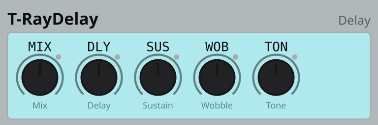

`FX Type` 24, delay. 5 slots, drawn as knobs.

| Slot | Ref | Parameter | Reads as | Control | Group | Range | Mod | Description |
|---|---|---|---|---|---|---|---|---|
| 1 | `MIX` | Mix | Mix | continuous |  | 0.0 to 100 % | yes | Controls the mix (or ratio) of wet (processed) and dry (unprocessed) signals. |
| 2 | `DLY` | Delay | Delay | continuous |  | 0.0 to 100 % | yes | Adjusts the master delay time. |
| 3 | `SUS` | Sustain | Sustain | continuous |  | 0.0 to 100 % | yes | Controls how long the delay is sustained for. Warning at 100% build up will occur. |
| 4 | `WOB` | Wobble | Wobble | continuous |  | 0.0 to 100 % | yes | Adjusts the amount of wobble caused by age and quality of build/materials. |
| 5 | `TON` | Tone | Tone | continuous |  | 0.0 to 100 % | yes | Controls the tone of the delays. |

### Decimator Delay (DecimDelay)

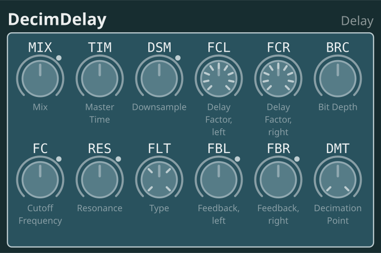

`FX Type` 25, delay. 12 slots, drawn as knobs.

| Slot | Ref | Parameter | Reads as | Control | Group | Range | Mod | Description |
|---|---|---|---|---|---|---|---|---|
| 1 | `MIX` | Mix | Mix | continuous |  | 0.00 to 100.00 % | yes | Controls the mix (or ratio) of wet (processed) and dry (unprocessed) signals. |
| 2 | `TIM` | Time M | Master Time | continuous |  | 1.0 to 1500.0 ms |  | Adjusts the master delay time. Time synchronized options from 4 to 1/64 bars. |
| 3 | `DSM` | Downsample | Downsample | continuous |  | 0.00 to 100.00 % | yes | Decimates the signal by reducing the sampling frequency. |
| 4 | `FCL` | FactorL | Delay Factor, left | selector |  | 1/4, 1/3, 1/2, 2/3, 3/4, 1, 4/3, 3/2, 2, 3 |  | Sets left delay to rhythmic fractions of the master delay. |
| 5 | `FCR` | FactorR | Delay Factor, right | selector |  | 1/4, 1/3, 1/2, 2/3, 3/4, 1, 4/3, 3/2, 2, 3 |  | Sets right delay to rhythmic fractions of the master delay. |
| 6 | `BRC` | Bit-Reduce | Bit Depth | continuous |  | 24 to 1. Counts down: 24 bits at the minimum, 1 bit at the maximum. |  | Decimates the signal by reducing the bit-depth. |
| 7 | `FC` | Cutoff | Cutoff Frequency | continuous |  | 30.0 to 20000.0 Hz | yes | Adjust the cutoff frequency of the filter, allowing specific frequencies to be affected by the delay. |
| 8 | `RES` | Resonance | Resonance | continuous |  | 0.00 to 100.00 % | yes | Adjusts the resonance of the filter. |
| 9 | `FLT` | Type | Type | selector |  | Lowpass, Highpass, Bandpass, Notch |  |  |
| 10 | `FBL` | FeedL | Feedback, left | continuous |  | 0.00 to 100.00 % | yes | Controls the amount of feedback for the left channel. |
| 11 | `FBR` | FeedR | Feedback, right | continuous |  | 0.00 to 100.00 % | yes | Controls the amount of feedback for the right channel. |
| 12 | `DMT` | Decimate | Decimation Point | switch |  | PRE, POST |  | It sets the decimation on the input signal (PRE) or only on the delay (POST). |

### Modulation, Delay and Reverb (ModDlyRev)

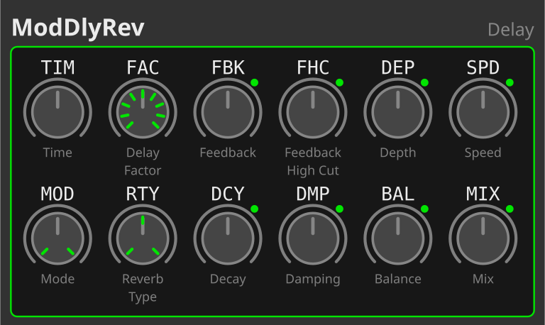

`FX Type` 26, delay. 12 slots, drawn as knobs.

| Slot | Ref | Parameter | Reads as | Control | Group | Range | Mod | Description |
|---|---|---|---|---|---|---|---|---|
| 1 | `TIM` | Time | Time | continuous |  | 1.0 to 1500.0 ms |  | Sets the master delay time. Time synchronised options from 4 to 1/64 bars. |
| 2 | `FAC` | Factor | Delay Factor | selector |  | 1/4, 1/3, 1/2, 2/3, 3/4, 1, 4/3, 3/2, 2, 3 |  | Sets the delay to rhythmic fractions. |
| 3 | `FBK` | Feedback | Feedback | continuous |  | 0.0 to 100 % | yes | Controls the percentage of positive feedback. |
| 4 | `FHC` | FeedHC | Feedback High Cut | continuous |  | 200.0 to 20000.0 Hz | yes | Adjusts the high cut filter frequency in the feedback path. |
| 5 | `DEP` | Depth | Depth | continuous |  | 0.0 to 100 % | yes | Controls the depth (amount) of modulation. |
| 6 | `SPD` | Speed | Speed | continuous |  | 0.0 to 10.0 Hz | yes | Adjusts the rate of the modulation. Time synchronised options from 4 to 1/64 bars. |
| 7 | `MOD` | Mode | Mode | selector |  | PAR, SER |  | PARSERControls the processor chain routing (Serial/Parallel) |
| 8 | `RTY` | Rtype | Reverb Type | selector |  | AMB, CLUB, HALL |  | Reverb Type can be set to AMB (Ambience), CLUB, or HALL. |
| 9 | `DCY` | Decay | Decay | continuous |  | 1.0 to 10.0 | yes | Controls the amount of time it takes for the reverb to dissipate. |
| 10 | `DMP` | Damping | Damping | continuous |  | 1000 to 20000 Hz | yes | Determines the decay of high frequencies within the reverb tail. |
| 11 | `BAL` | Balance | Balance | continuous |  | -100.0 to 100.0 | yes | Adjusts ratio of the delay signal to the reverb signal. |
| 12 | `MIX` | Mix | Mix | continuous |  | 0.0 to 100 % | yes | Controls the mix (or ratio) of wet (processed) and dry (unprocessed) signals |

### Stereo Chorus (Chorus)

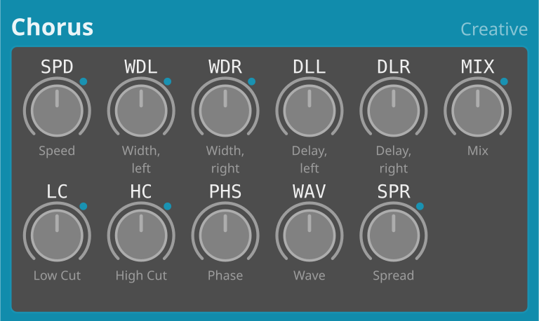

`FX Type` 27, creative. 11 slots, drawn as knobs.

| Slot | Ref | Parameter | Reads as | Control | Group | Range | Mod | Description |
|---|---|---|---|---|---|---|---|---|
| 1 | `SPD` | Speed | Speed | continuous |  | 0.0 to 5 Hz | yes | Sets the modulation speed. Time synchronised options from 4 to 1/64 bars. |
| 2 | `WDL` | WidthL | Width, left | continuous |  | 0.0 to 100 % | yes | Determines the amount of modulated delay in the left channel. |
| 3 | `WDR` | WidthR | Width, right | continuous |  | 0.0 to 100 % | yes | Determines the amount of modulated delay in the right channel. |
| 4 | `DLL` | DelayL | Delay, left | continuous |  | 0.5 to 50.0 ms |  | Sets the total amount of delay for the left channel. |
| 5 | `DLR` | DelayR | Delay, right | continuous |  | 0.5 to 50.0 ms |  | Sets the total amount of delay for the right channel. |
| 6 | `MIX` | Mix | Mix | continuous |  | 0.0 to 100 % | yes | Controls the mix (or ratio) of wet (processed) and dry (unprocessed) signals. |
| 7 | `LC` | LoCut | Low Cut | continuous |  | 10.0 to 500.0 Hz | yes | Allows the low frequencies in the signal to be reduced. |
| 8 | `HC` | Hi Cut | High Cut | continuous |  | 200.0 to 20000.0 Hz | yes | Allows the high frequencies in the signal to be reduced. |
| 9 | `PHS` | Phase | Phase | continuous |  | 0.0 to 100.0 |  | Adjusts the phase offset of the LFO between left and right channel. |
| 10 | `WAV` | Wave | Wave | continuous |  | 0.0 to 100 % |  | Blends between the digital triangular chorus sound and the classic analog sine wave. |
| 11 | `SPR` | Spread | Spread | continuous |  | 0.0 to 100 % | yes | Adjusts how much of the left channel is mixed into the right and vice versa. |

### Dimensional Chorus (Chorus-D)

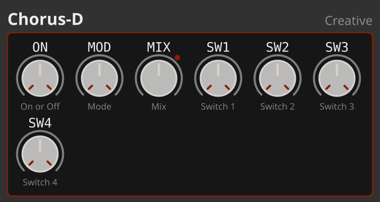

`FX Type` 28, creative. 7 slots, drawn as knobs.

| Slot | Ref | Parameter | Reads as | Control | Group | Range | Mod | Description |
|---|---|---|---|---|---|---|---|---|
| 1 | `ON` | On | On or Off | switch |  | OFF to ON |  | Allows the effect to be turned On or Off. |
| 2 | `MOD` | Mode | Mode | selector |  | M, ST |  | MSTSwitches the operation between Mono and Stereo modes. |
| 3 | `MIX` | Mix | Mix | continuous |  | 0.0 to 100 % | yes | Controls the mix (or ratio) of wet (processed) and dry (unprocessed) signals. |
| 4 | `SW1` | Sw1 | Switch 1 | switch | channel-1 | OFF to ON |  | Engages level one intensity (minimum). |
| 5 | `SW2` | Sw2 | Switch 2 | switch | channel-2 | OFF to ON |  | Engages level two intensity. |
| 6 | `SW3` | Sw3 | Switch 3 | switch |  | OFF to ON |  | Engages level three intensity. |
| 7 | `SW4` | Sw4 | Switch 4 | switch |  | OFF to ON |  | Engages level four intensity (maximum). |

### Stereo Flanger (Flanger)

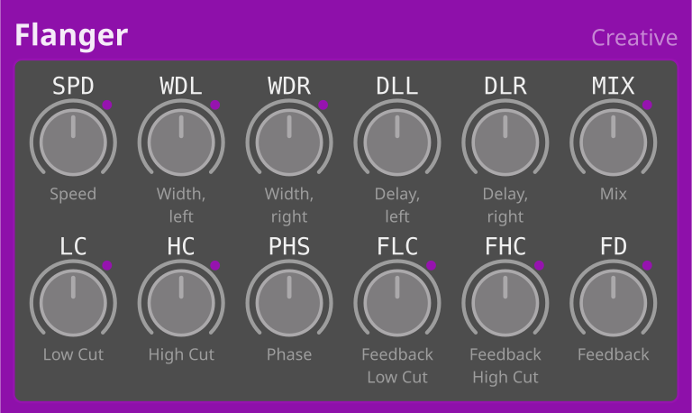

`FX Type` 29, creative. 12 slots, drawn as knobs.

| Slot | Ref | Parameter | Reads as | Control | Group | Range | Mod | Description |
|---|---|---|---|---|---|---|---|---|
| 1 | `SPD` | Speed | Speed | continuous |  | 0.0 to 5 Hz | yes | Sets the modulation speed. Time synchronised options from 4 to 1/64 bars. |
| 2 | `WDL` | WidthL | Width, left | continuous |  | 0.0 to 100 % | yes | Determines the amount of modulated delay in the left channel. |
| 3 | `WDR` | WidthR | Width, right | continuous |  | 0.0 to 100 % | yes | Determines the amount of modulated delay in the right channel. |
| 4 | `DLL` | DelayL | Delay, left | continuous |  | 0.5 to 20.0 ms |  | Sets the total amount of delay for the left channel. |
| 5 | `DLR` | DelayR | Delay, right | continuous |  | 0.5 to 20.0 ms |  | Sets the total amount of delay for the right channel. |
| 6 | `MIX` | Mix | Mix | continuous |  | 0.0 to 100 % | yes | Controls the mix (or ratio) of wet (processed) and dry (unprocessed) signals. |
| 7 | `LC` | LoCut | Low Cut | continuous |  | 10.0 to 500.0 Hz | yes | Allows the low frequencies in the signal to be reduced. |
| 8 | `HC` | Hi Cut | High Cut | continuous |  | 200.0 to 20000.0 Hz | yes | Allows the high frequencies in the signal to be reduced. |
| 9 | `PHS` | Phase | Phase | continuous |  | 0.0 to 180.0 |  | Adjusts the phase offset of the LFO between left and right channel. |
| 10 | `FLC` | FeedLC | Feedback Low Cut | continuous |  | 10.0 to 500.0 Hz | yes | Adjusts the low cut filter frequency in the feedback path. |
| 11 | `FHC` | FeedHC | Feedback High Cut | continuous |  | 200.0 to 20000.0 Hz | yes | Adjusts the high cut filter frequency in the feedback path. |
| 12 | `FD` | Feed | Feedback | continuous |  | -90.0 to 90.0 % | yes | Controls the percentage of positive or negative feedback. |

### Stereo Phaser (Phaser)

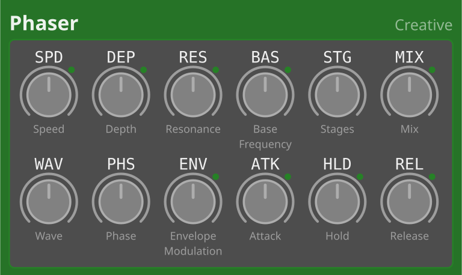

`FX Type` 30, creative. 12 slots, drawn as knobs.

| Slot | Ref | Parameter | Reads as | Control | Group | Range | Mod | Description |
|---|---|---|---|---|---|---|---|---|
| 1 | `SPD` | Speed | Speed | continuous |  | 0.0 to 5 Hz | yes | Sets the modulation speed. Time synchronised options from 4 to 1/64 bars. |
| 2 | `DEP` | Depth | Depth | continuous |  | 0.0 to 100 % | yes | Controls the depth (amount) of modulation. |
| 3 | `RES` | Reso | Resonance | continuous |  | 0.0 to 100 % | yes | Adjusts the resonance of the multiple filter stages. |
| 4 | `BAS` | Base Freq | Base Frequency | continuous |  | 20 to 15000 Hz | yes | Adjusts the frequency range of the modulated filters. |
| 5 | `STG` | Stages | Stages | continuous |  | 2.0 to 12.0 |  | Controls how many filter stages are used. |
| 6 | `MIX` | Mix | Mix | continuous |  | 0.0 to 100 % | yes | Controls the mix (or ratio) of wet (processed) and dry (unprocessed) signals. |
| 7 | `WAV` | Wave | Wave | continuous |  | -50.0 to 50.0 |  | Shapes the symmetry of the LFO waveform. |
| 8 | `PHS` | Phase | Phase | continuous |  | 0.0 to 180.0 deg |  | Adjusts the LFO phase difference between the left and right channel |
| 9 | `ENV` | EnvMod | Envelope Modulation | continuous |  | -100.0 to 100 % | yes | Adjusts the level of positive or negative envelope modulation. |
| 10 | `ATK` | Attack | Attack | continuous |  | 10.0 to 1000.0 ms | yes | Controls the envelope attack stage time . |
| 11 | `HLD` | Hold | Hold | continuous |  | 1.0 to 2000.0 ms | yes | Controls the envelope hold stage time. |
| 12 | `REL` | Release | Release | continuous |  | 10.0 to 1000.0 ms | yes | Controls the envelope release stage time. |

### Moog-Type Filter (MoodFilter)

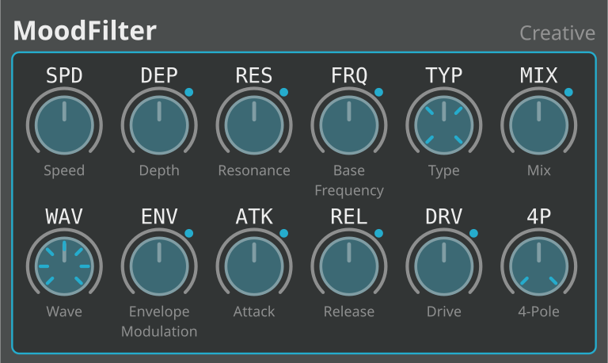

`FX Type` 31, creative. 12 slots, drawn as knobs.

| Slot | Ref | Parameter | Reads as | Control | Group | Range | Mod | Description |
|---|---|---|---|---|---|---|---|---|
| 1 | `SPD` | Speed | Speed | continuous |  | 0.0 to 20.0 Hz |  | Sets the modulation speed. Time synchronised options from 4 to 1/64 bars. |
| 2 | `DEP` | Depth | Depth | continuous |  | 0.0 to 100 % | yes | Controls the depth (amount) of modulation. |
| 3 | `RES` | Resonance | Resonance | continuous |  | 0.0 to 100 % | yes | Adjusts the resonance of the filter. |
| 4 | `FRQ` | Base Freq | Base Frequency | continuous |  | 20 to 15000 Hz | yes | Adjusts the level of positive or negative envelope modulation. |
| 5 | `TYP` | Type | Type | selector |  | LP, HP, BP, NOT |  | Selects between low pass (LP), high-pass (HP), band- pass (BP) and Notch (NOT). |
| 6 | `MIX` | Mix | Mix | continuous |  | 0.0 to 100 % | yes | Controls the mix (or ratio) of wet (processed) and dry (unprocessed) signals. |
| 7 | `WAV` | Wave | Wave | selector |  | Triangle, Sine, Saw Up, Saw Down, Square, Random, Envelope |  | Selects modulation waveform Triangular, Sine, Saw Up, Saw Down, Ramp, Square or Random. |
| 8 | `ENV` | EnvMod | Envelope Modulation | continuous |  | -100.0 to 100 % | yes | Adjusts the level of positive or negative envelope modulation. |
| 9 | `ATK` | Attack | Attack | continuous |  | 10.0 to 249.9 ms | yes | Controls the filter attack time. |
| 10 | `REL` | Release | Release | continuous |  | 10.0 to 500.0 ms | yes | Controls the filter release time. |
| 11 | `DRV` | Drive | Drive | continuous |  | 0.0 to 100 % | yes | Adjusts the level, also introduces an overdrive effect if pushed hard. |
| 12 | `4P` | 4-Pole | 4-Pole | switch |  | 2P, 4P |  | Adjusts the slope of the filter from 2-pole to 4-pole (steeper). |

### Dual Pitch Shifter (DualPitch)

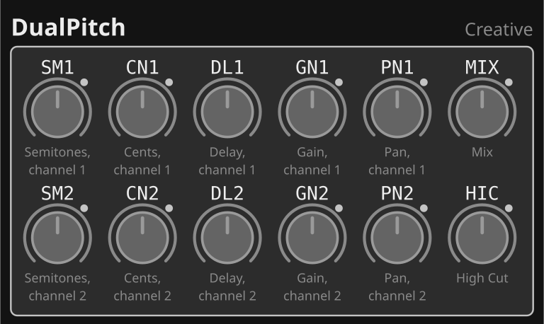

`FX Type` 32, creative. 12 slots, drawn as knobs.

| Slot | Ref | Parameter | Reads as | Control | Group | Range | Mod | Description |
|---|---|---|---|---|---|---|---|---|
| 1 | `SM1` | Semi1 | Semitones, channel 1 | continuous | channel-1 | -12.0 to 12.0 | yes | Adjusts the pitch of the first channel in semi-tones. |
| 2 | `CN1` | Cent1 | Cents, channel 1 | continuous | channel-1 | -50.0 to 50.0 | yes | Adjusts the pitch of the first channel in cents. |
| 3 | `DL1` | Delay1 | Delay, channel 1 | continuous | channel-1 | 1.0 to 500.0 ms |  | Adjusts the time difference between the wet and dry signals. Sync options from 4 to 1/64 bars. |
| 4 | `GN1` | Gain1 | Gain, channel 1 | continuous | channel-1 | 0.0 to 100 % | yes | Allows gain compensation to be applied to the first channel. |
| 5 | `PN1` | Pan1 | Pan, channel 1 | continuous | channel-1 | -100.0 to 100 % | yes | Allows panning of the first channel. |
| 6 | `MIX` | Mix | Mix | continuous |  | 0.0 to 100 % | yes | Controls the mix (or ratio) of wet (processed) and dry (unprocessed) signals. |
| 7 | `SM2` | Semi2 | Semitones, channel 2 | continuous | channel-2 | -12.0 to 12.0 | yes | Adjusts the pitch of the second channel in semi-tones. |
| 8 | `CN2` | Cent2 | Cents, channel 2 | continuous | channel-2 | -50.0 to 50.0 | yes | Adjusts the pitch of the second channel in cents . |
| 9 | `DL2` | Delay2 | Delay, channel 2 | continuous | channel-2 | 1.0 to 500.0 ms |  | Adjusts the time difference between the wet and dry signals. Sync options from 4 to 1/64 bars. |
| 10 | `GN2` | Gain2 | Gain, channel 2 | continuous | channel-2 | 0.0 to 100 % | yes | Allows gain compensation to be applied to the second channel. |
| 11 | `PN2` | Pan2 | Pan, channel 2 | continuous | channel-2 | -100.0 to 100 % | yes | Allows panning of the second channel. |
| 12 | `HIC` | HiCut | High Cut | continuous |  | 200.0 to 20000.0 Hz | yes | Allows the high frequencies affected by the pitch shifting to be reduced. |

### Dual Pitch Shifter (Vintage Pitch)

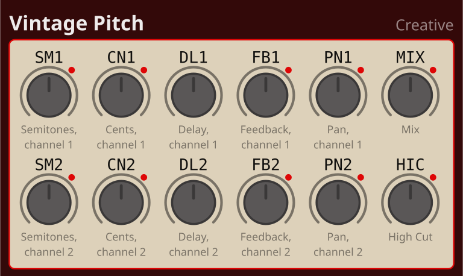

`FX Type` 33, creative. 12 slots, drawn as knobs.

| Slot | Ref | Parameter | Reads as | Control | Group | Range | Mod | Description |
|---|---|---|---|---|---|---|---|---|
| 1 | `SM1` | Semi1 | Semitones, channel 1 | continuous | channel-1 | -12.0 to 12.0 | yes | Adjusts the pitch of the first channel in semi-tones. |
| 2 | `CN1` | Cent1 | Cents, channel 1 | continuous | channel-1 | -50.0 to 50.0 | yes | Adjusts the pitch of the first channel in cents. |
| 3 | `DL1` | Delay1 | Delay, channel 1 | continuous | channel-1 | 1.0 to 500.0 ms |  | Adjusts the time difference between the wet and dry signals. Sync options from 4 to 1/64 bars. |
| 4 | `FB1` | Feedback1 | Feedback, channel 1 | continuous | channel-1 | 0.0 to 100 % | yes | Allows feedback to be applied to the first channel. |
| 5 | `PN1` | Pan1 | Pan, channel 1 | continuous | channel-1 | -100.0 to 100 % | yes | Allows panning of the first channel. |
| 6 | `MIX` | Mix | Mix | continuous |  | 0.0 to 100 % | yes | Controls the mix (or ratio) of wet (processed) and dry (unprocessed) signals. |
| 7 | `SM2` | Semi2 | Semitones, channel 2 | continuous | channel-2 | -12.0 to 12.0 | yes | Adjusts the pitch of the second channel in semi-tones. |
| 8 | `CN2` | Cent2 | Cents, channel 2 | continuous | channel-2 | -50.0 to 50.0 | yes | Adjusts the pitch of the second channel in cents . |
| 9 | `DL2` | Delay2 | Delay, channel 2 | continuous | channel-2 | 1.0 to 500.0 ms |  | Adjusts the time difference between the wet and dry signals. Sync options from 4 to 1/64 bars. |
| 10 | `FB2` | Feedback2 | Feedback, channel 2 | continuous | channel-2 | 0.0 to 100 % | yes | Allows feedback to be applied to the second channel. |
| 11 | `PN2` | Pan2 | Pan, channel 2 | continuous | channel-2 | -100.0 to 100 % | yes | Allows panning of the second channel. |
| 12 | `HIC` | HiCut | High Cut | continuous |  | 2000 to 20000 k Hz | yes | Allows the high frequencies affected by the pitch shifting to be reduced. |

### Rotary Speaker (RotarySpkr)

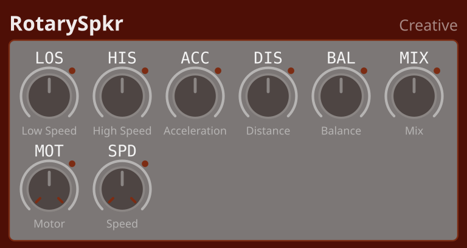

`FX Type` 34, creative. 8 slots, drawn as knobs.

| Slot | Ref | Parameter | Reads as | Control | Group | Range | Mod | Description |
|---|---|---|---|---|---|---|---|---|
| 1 | `LOS` | LoSpeed | Low Speed | continuous |  | 0.1 to 4.0 Hz | yes | Adjusts the rotational speed when the Low Speed operation is selected. |
| 2 | `HIS` | HiSpeed | High Speed | continuous |  | 2.0 to 9.9 Hz | yes | Adjusts the rotational speed when the High Speed operation is selected. |
| 3 | `ACC` | Accel | Acceleration | continuous |  | 0.0 to 100 % | yes | Adjusts how quickly the speed increases and decreases from the Slow mode to the Fast mode. |
| 4 | `DIS` | Distance | Distance | continuous |  | 0.0 to 100 % | yes | Adjusts the distance between the Rotary speakers and the virtual microphone. |
| 5 | `BAL` | Balance | Balance | continuous |  | -100.0 to 100.0 | yes | Adjusts the balance between the virtual horn and virtual drum controlling the signal tone. |
| 6 | `MIX` | Mix | Mix | continuous |  | 0.0 to 100 % | yes | Controls the mix (or ratio) of wet (processed) and dry (unprocessed) signals. |
| 7 | `MOT` | Motor | Motor | switch |  | RUN, STOP | yes | Allows the rotation effect of the motor to be disengaged (STOP). |
| 8 | `SPD` | Speed | Speed | selector |  | SLOW, FAST | yes | SLOWFASTSelects either the slow or fast speeds for rotation. |

<!-- /generated:effects -->

## Corrections to the manual

Where the manual's effect tables contradict themselves, this is what was done
about it. Corrections to the rest of the specification are in
[the MIDI specification](midi-spec.md#corrections-to-the-manual).

<!-- generated:effect-corrections -->

| Effect | Slot | Parameter | Correction |
|---|---|---|---|
| [MoodFilter](#31-moog-type-filter) | 5 | Type | The options were read off the first three words of the description and lost Notch. The manual states four; the table cell states none. |
| [MoodFilter](#31-moog-type-filter) | 12 | 4-Pole | The manual's own table is malformed for this row: MIN reads "2P 4P" and MAX reads "100.0". Read as a two-state 2P to 4P, which is what the FX page screenshot beside the table shows, labelled POL and reading 4P. |

<!-- /generated:effect-corrections -->
