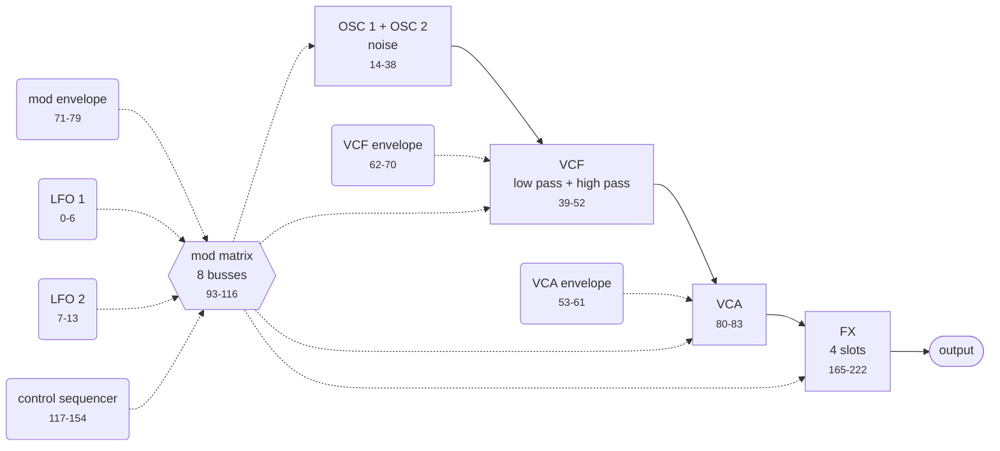
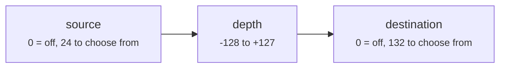
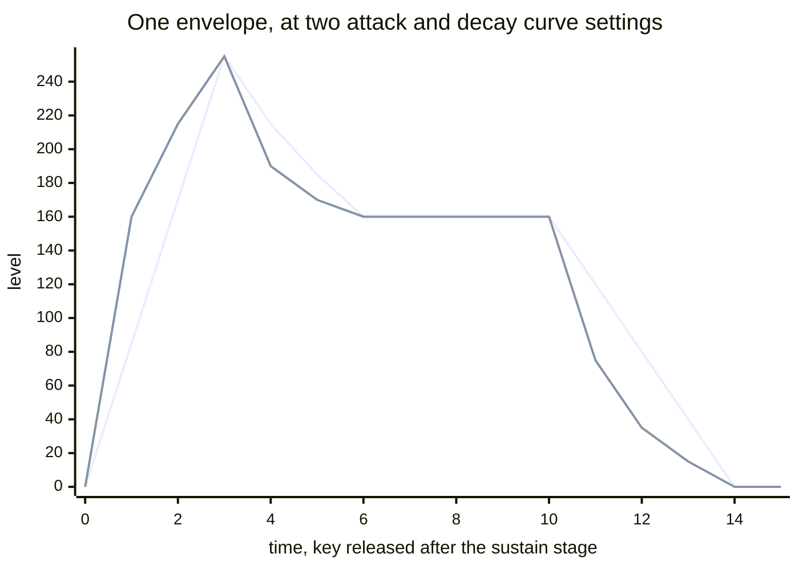

# DeepMind MIDI specification

Built from the DeepMind 12 user manual and checked against real dumps, a
community controller map and a third-party editor layout. Where sources
disagree, the hardware wins and the difference is recorded. Full list at the
[end](#sources).

The tables and diagrams below are generated from `spec/*.toml`. Do not edit them
by hand: change the spec and run `cargo xtask docs`.

## Contents

- [Synth structure](#synth-structure)
- [Addressing](#addressing)
- [Packed MS-bit encoding](#packed-ms-bit-encoding)
- [SysEx messages](#sysex-messages)
- [Device inquiry](#device-inquiry)
- [NRPN edits](#nrpn-edits)
- [Continuous controllers](#continuous-controllers)
- [Program data layout](#program-data-layout)
- [Program parameters](#program-parameters)
- [Value tables](#value-tables)
- [Global settings](#global-settings)
- [Corrections to the manual](#corrections-to-the-manual)
- [Open questions](#open-questions)

## Synth structure

Where the parameters sit in the instrument, so an offset means something before
the tables.

<!-- generated:structure -->

### Voice signal path

Each block is a parameter group, labelled with its offsets. Solid arrows carry audio, dashed arrows carry modulation.



### Modulation matrix

Eight independent busses, each a source, a destination and a signed depth.



Each bus occupies three consecutive offsets: source, destination, depth. Bus 1 is 93, 94, 95, and bus 8 is 114, 115, 116.

### Envelopes

Three identical envelopes: VCA, VCF and mod. Each has the four familiar stages plus a curve control per stage, which bends the segment between linear and exponential.



| Stage | VCA | VCF | Mod |
|---|---|---|---|
| Attack time | 53 | 62 | 71 |
| Decay time | 54 | 63 | 72 |
| Sustain level | 55 | 64 | 73 |
| Release time | 56 | 65 | 74 |
| Attack curve | 58 | 67 | 76 |
| Decay curve | 59 | 68 | 77 |
| Sustain curve | 60 | 69 | 78 |
| Release curve | 61 | 70 | 79 |

<!-- /generated:structure -->

## Addressing

| Field | Value |
|---|---|
| Manufacturer ID | `00 20 32` (Behringer) |
| Model ID | `20`, shared by every variant |
| Device ID | `00`-`0F`, or `7F` to broadcast |

The model ID does not identify the variant. DeepMind 6, 6X, 12, 12X, 12D and
12XD all answer to `20` and speak the same protocol; they differ only in voice
count and whether there is a keyboard. To tell them apart, ask the user.

The device ID doubles as the synthesizer's global MIDI channel: a unit set to
channel 1 answers SysEx addressed to device ID `00`.

Factory preset packs are not consistent about this. *Retro Electro* ships with
`7F`, *Synth Wizards* with `00`, so a parser has to accept both. They also
target different banks, A and H respectively, so importing a pack means
re-targeting rather than trusting the file.

## Packed MS-bit encoding

Bulk dumps carry 8-bit data over 7-bit SysEx. Each group of 7 raw bytes becomes
8 transmitted bytes: one byte holding the seven high bits, then the seven
payload bytes with their high bit cleared.

```
raw:     d0 d1 d2 d3 d4 d5 d6          7 bytes, 8 bits each
packed:  M  d0 d1 d2 d3 d4 d5 d6       8 bytes, 7 bits each
         ^
         bit n of M is bit 7 of raw byte n
```

`packed_len = ceil(raw_len / 7) * 8`. The final group is short when the raw
length is not a multiple of 7.

## SysEx messages

Every message is framed as `F0 00 20 32 20 <device> <command> <payload> F7`.
Responses that carry bulk data put a comms protocol version byte first.

<!-- generated:messages -->

| Cmd | Message | Direction | Payload | Raw | Packed |
|---|---|---|---|---|---|
| `00` | Control App Notify Request | host to synth | One reserved byte |  |  |
| `01` | Program Dump Request | host to synth | Bank (0-7), program (0-127) |  |  |
| `02` | Program Dump Response | synth to host | Version, bank, program, packed program data | 242 | 278 |
| `03` | Edit Buffer Dump Request | host to synth | none |  |  |
| `04` | Edit Buffer Dump Response | synth to host | Version, packed program data | 242 | 278 |
| `05` | Global Parameter Dump Request | host to synth | none |  |  |
| `06` | Global Parameter Dump Response | synth to host | Version, packed global data | 45 | 56 |
| `07` | Single User Pattern Dump Request | host to synth | Pattern (0-31) |  |  |
| `08` | User Pattern Dump Response | synth to host | Version, optional pattern number, packed pattern data | 65 | 80 |
| `09` | Program Bank Dump Request | host to synth | Bank (0-7), first program (0-127), last program (0-127) |  |  |
| `0A` | Bank Program Names Dump Request | host to synth | Bank (0-7) |  |  |
| `0B` | Bank Program Names Dump Response | synth to host | Version, bank, packed names | 2048 | 2344 |
| `0C` | Single Program Name Dump Request | host to synth | Bank (0-7), program (0-127) |  |  |
| `0D` | Single Program Name Dump Response | synth to host | Version, bank, packed name | 16 | 24 |
| `0E` | Edit Buffer Pattern Dump Request | host to synth | none |  |  |
| `10` | Control App Notify Response | synth to host | Rx channel (0-16), tx channel (0-15), interface (0 MIDI, 1 USB, 2 Wi-Fi), bank, program |  |  |
| `11` | Calibration Data Dump Request | host to synth | none |  |  |
| `12` | Calibration Data Dump Response | synth to host | Version, packed voice and controller calibration data |  | 688 |
| `1B` | Chord Memory Dump Request | host to synth | none |  |  |
| `1C` | Chord Memory Dump Response | synth to host | Version, packed chord memory | 26 | 32 |
| `1D` | Poly Chord Memory Dump Request | host to synth | none |  |  |
| `1E` | Poly Chord Memory Dump Response | synth to host | Version, packed poly chord memory | 512 | 592 |

**Control App Notify Request.** Tells the synthesizer that a control application is attached to this interface. It responds by enabling NRPN and SysEx on that interface and emitting extra traffic such as key-down and voice-allocation updates. Nothing enables that stream implicitly.

**Program Dump Response.** Protocol version 7 carries 245 raw bytes in 280 packed, for a 291 byte message.

**User Pattern Dump Response.** The manual assigns this command to both the single pattern response and the edit buffer pattern response. They are told apart by length: the single pattern form carries a pattern number byte before the payload. Pattern data is one length byte, then 32 step velocities, then 32 step gates.

**Program Bank Dump Request.** Answered by a sequence of individual program dump responses, one per program, not by a single aggregate message.

**Bank Program Names Dump Response.** 128 programs of 16 bytes. The cheapest way to index a bank without pulling full programs.

**Chord Memory Dump Response.** Unused locations are set to 0xFF.

**Poly Chord Memory Dump Response.** Unused locations are set to 0xFF.

<!-- /generated:messages -->

## Device inquiry

The universal non-realtime identity request is the only way to find a unit with
an unknown device ID, and the only supported way to read firmware versions.

```
request:  F0 7E <dev|7F> 06 01 F7
response: F0 7E <dev> 06 02 00 20 32 20 00 01 00 <jn> 00 <ii> <nn> F7
```

`jn` packs the main software revision, with `j` the minor revision (0-7) and `n`
the major (0-15). `ii` and `nn` are the voice software major and minor versions.

Firmware itself is distributed as a vendor SysEx file that Behringer's own
updater streams to the synthesizer. That bootloader protocol is not documented
and is not modelled here.

## NRPN edits

```
B0 63 <msb>   NRPN parameter MSB
B0 62 <lsb>   NRPN parameter LSB
B0 06 <msb>   data entry MSB
B0 26 <lsb>   data entry LSB
```

With running status this collapses to `B0 63 aa 62 bb 06 cc 26 dd`.

Three behaviours worth designing around:

- The data entry MSB is optional for switches and for any parameter whose range
  fits in 0-127.
- Once a parameter is selected, further data entry messages keep applying to it.
  A host sweeping one control should send the selection once, then only data
  entry pairs.
- The synthesizer keeps a separate selected-parameter register per interface.
  DIN MIDI, USB and Wi-Fi do not share NRPN state.

Parameter ranges reach 0-255, which does not fit in a single 7-bit data byte, so
the 14-bit data entry pair carries the value.

## Continuous controllers

CC is the coarse path: 7 bits, so a controller reaches 128 of the 256 values an
NRPN can address. Use NRPN where resolution matters, CC where a generic
controller or DAW lane is easier.

<!-- generated:controllers -->

#### Program parameters

Each of these drives one program parameter. The offset column is that parameter's entry in the table above.

| CC | Controls | Offset | Notes |
|---|---|---|---|
| 5 | Portamento time | 34 |  |
| 12 | Arp Rate (tempo) | 157 |  |
| 13 | Arp Gate Time | 160 |  |
| 16 | LFO 1 Rate | 0 |  |
| 17 | LFO 1 Delay / Fade | 1 |  |
| 18 | LFO 2 Rate | 7 |  |
| 19 | LFO 2 Delay / Fade | 8 |  |
| 20 | OSC 1 Pitch Mod Depth | 21 |  |
| 21 | OSC 1 PWM Depth | 25 |  |
| 23 | OSC 2 Pitch Mod Depth | 29 |  |
| 24 | OSC 2 Tone Mod Depth | 28 |  |
| 25 | OSC 2 Pitch | 27 |  |
| 26 | OSC 2 Level | 26 |  |
| 27 | Noise Level | 33 |  |
| 28 | Unison Detune | 87 |  |
| 29 | VCF Frequency | 39 |  |
| 30 | VCF Resonance | 41 |  |
| 33 | VCF LFO Depth | 45 |  |
| 34 | VCF Keyboard Tracking | 49 |  |
| 35 | VCF HighPass Frequency | 40 |  |
| 36 | VCA Level | 80 |  |
| 37 | VCA Envelope Attack Time | 53 |  |
| 39 | VCA Envelope Decay Time | 54 |  |
| 40 | VCA Envelope Sustain Level | 55 | **Unconfirmed.** The source list labels CC 44 "VCA S" and CC 56 "VCA Scrv" and omits CC 40 and CC 52 entirely. Controllers 37-49 run as three envelopes of attack, decay, sustain, release and 50-61 as the same three sets of curves, which puts VCA sustain at 40, VCF sustain at 44, VCA sustain curve at 52 and VCF sustain curve at 56. The run is encoded here; confirm against hardware. |
| 41 | VCA Envelope Release Time | 56 |  |
| 42 | VCF Envelope Attack Time | 62 |  |
| 43 | VCF Envelope Decay Time | 63 |  |
| 44 | VCF Envelope Sustain Level | 64 | **Unconfirmed.** The source list labels CC 44 "VCA S" and CC 56 "VCA Scrv" and omits CC 40 and CC 52 entirely. Controllers 37-49 run as three envelopes of attack, decay, sustain, release and 50-61 as the same three sets of curves, which puts VCA sustain at 40, VCF sustain at 44, VCA sustain curve at 52 and VCF sustain curve at 56. The run is encoded here; confirm against hardware. |
| 45 | VCF Envelope Release Time | 65 |  |
| 46 | Mod Envelope Attack Time | 71 |  |
| 47 | Mod Envelope Decay Time | 72 |  |
| 48 | Mod Envelope Sustain Level | 73 |  |
| 49 | Mod Envelope Release Time | 74 |  |
| 50 | VCA Envelope Attack Curve | 58 |  |
| 51 | VCA Envelope Decay Curve | 59 |  |
| 52 | VCA Envelope Sustain Curve | 60 | **Unconfirmed.** The source list labels CC 44 "VCA S" and CC 56 "VCA Scrv" and omits CC 40 and CC 52 entirely. Controllers 37-49 run as three envelopes of attack, decay, sustain, release and 50-61 as the same three sets of curves, which puts VCA sustain at 40, VCF sustain at 44, VCA sustain curve at 52 and VCF sustain curve at 56. The run is encoded here; confirm against hardware. |
| 53 | VCA Envelope Release Curve | 61 |  |
| 54 | VCF Envelope Attack Curve | 67 |  |
| 55 | VCF Envelope Decay Curve | 68 |  |
| 56 | VCF Envelope Sustain Curve | 69 | **Unconfirmed.** The source list labels CC 44 "VCA S" and CC 56 "VCA Scrv" and omits CC 40 and CC 52 entirely. Controllers 37-49 run as three envelopes of attack, decay, sustain, release and 50-61 as the same three sets of curves, which puts VCA sustain at 40, VCF sustain at 44, VCA sustain curve at 52 and VCF sustain curve at 56. The run is encoded here; confirm against hardware. |
| 57 | VCF Envelope Release Curve | 70 |  |
| 58 | Mod Envelope Attack Curve | 76 |  |
| 59 | Mod Envelope Decay Curve | 77 |  |
| 60 | Mod Envelope Sustain Curve | 78 |  |
| 61 | Mod Envelope Release Curve | 79 |  |
| 62 | FX 1 Param 1 | 167 |  |
| 63 | FX 1 Param 2 | 168 |  |
| 65 | FX 1 Param 3 | 169 |  |
| 66 | FX 1 Param 4 | 170 |  |
| 67 | FX 1 Param 5 | 171 |  |
| 68 | FX 1 Param 6 | 172 |  |
| 69 | FX 1 Param 7 | 173 |  |
| 70 | FX 1 Param 8 | 174 |  |
| 71 | FX 1 Param 9 | 175 |  |
| 72 | FX 1 Param 10 | 176 |  |
| 73 | FX 1 Param 11 | 177 |  |
| 74 | FX 1 Param 12 | 178 |  |
| 75 | FX 2 Param 1 | 180 |  |
| 76 | FX 2 Param 2 | 181 |  |
| 77 | FX 2 Param 3 | 182 |  |
| 78 | FX 2 Param 4 | 183 |  |
| 79 | FX 2 Param 5 | 184 |  |
| 80 | FX 2 Param 6 | 185 |  |
| 81 | FX 2 Param 7 | 186 |  |
| 82 | FX 2 Param 8 | 187 |  |
| 83 | FX 2 Param 9 | 188 |  |
| 84 | FX 2 Param 10 | 189 |  |
| 85 | FX 2 Param 11 | 190 |  |
| 86 | FX 2 Param 12 | 191 |  |
| 87 | FX 3 Param 1 | 193 |  |
| 88 | FX 3 Param 2 | 194 |  |
| 89 | FX 3 Param 3 | 195 |  |
| 90 | FX 3 Param 4 | 196 |  |
| 91 | FX 3 Param 5 | 197 |  |
| 92 | FX 3 Param 6 | 198 |  |
| 93 | FX 3 Param 7 | 199 |  |
| 94 | FX 3 Param 8 | 200 |  |
| 95 | FX 3 Param 9 | 201 |  |
| 102 | FX 3 Param 10 | 202 |  |
| 103 | FX 3 Param 11 | 203 |  |
| 104 | FX 3 Param 12 | 204 |  |
| 105 | FX 1 Type | 166 |  |
| 106 | FX 2 Type | 179 |  |
| 107 | FX 3 Type | 192 |  |
| 108 | FX 4 Type | 205 |  |
| 109 | FX 1 Output Gain | 218 |  |
| 110 | FX 2 Output Gain | 219 |  |
| 111 | FX 3 Output Gain | 220 |  |
| 112 | FX 4 Output Gain | 221 |  |
| 114 | FX Mode | 222 |  |

#### Standard controllers

Ordinary MIDI controllers, answered in the usual way.

| CC | Controls | Notes |
|---|---|---|
| 1 | Modulation Wheel |  |
| 2 | Breath Controller |  |
| 4 | Foot Controller |  |
| 6 | Data Entry MSB |  |
| 7 | Channel Volume |  |
| 8 | Balance |  |
| 10 | Pan |  |
| 11 | Expression |  |
| 32 | Bank Select LSB |  |
| 38 | Data Entry LSB |  |
| 64 | Sustain Pedal |  |
| 96 | Data Increment |  |
| 97 | Data Decrement |  |
| 98 | NRPN LSB |  |
| 99 | NRPN MSB |  |
| 100 | RPN LSB |  |
| 101 | RPN MSB |  |

#### Everything else

Controllers that do something but are not a single program parameter.

| CC | Controls | Notes |
|---|---|---|
| 31 | VCF Mod | The source lists this as "VCF MOD" without saying which VCF modulation depth it drives. Left unmapped. |
| 113 | Analog Thru | Switches the analog thru path. |
| 115 | 3D X axis | Modulation matrix source CC X. |
| 116 | 3D Y axis | Modulation matrix source CC Y. |
| 117 | 3D Z axis | Modulation matrix source CC Z. |

<!-- /generated:controllers -->

## Program data layout

A parameter's 14-bit NRPN number **is** its byte offset in the unpacked program
dump. One parameter, one byte. The table in [Program
parameters](#program-parameters) is therefore both the NRPN map and the dump
layout.

### Protocol version 6 versus 7

The manual documents version 6: 242 raw bytes packed into 278. Current firmware
and both factory packs emit version 7: **245 raw bytes packed into 280**, for a
291-byte message.

Offsets 0-241 are identical between the two. The three extra bytes sit at
242-244 and are zero in all 256 factory programs examined. Treat them as
reserved, preserve them on round-trip, and never assume a dump is 242 bytes.

### Evidence

The offset map holds against 256 factory programs:

| Offset | Expected | Observed |
|---|---|---|
| 241 | transpose, 80-176 with 128 meaning none | `0x80` in 233 of 256 |
| 219-221 | FX output gains, 0-150 | cluster on 100 |
| 222 | FX mode, 0-2 | only ever 0 or 1 |
| 223-239 | 16 ASCII chars plus terminator | clean names in every program |

### Reading state

The synthesizer answers no per-parameter reads. There is no "what is LFO 1 rate
right now" message. State comes from dumps only: the edit buffer for what is
currently playing, a program dump for a stored slot, the global dump for device
settings, and the bank names dump for a cheap 128-program index. A host that
sends an NRPN edit and wants confirmation has to re-request the edit buffer.

## Program parameters

242 parameters, offsets 0 through 241.

<!-- generated:parameters -->

### LFO 1

| Offset | Parameter | Raw | Values | Shows as |
|---|---|---|---|---|
| 0 | LFO 1 Rate | 0-255 | When LFO 1 Arp Sync is on, this selects a division of the master BPM from the LFO clock divider table instead of setting a free-running rate. | 0.041 Hz to 65.4 Hz, or up to 1280 Hz when driven from the modulation matrix |
| 1 | LFO 1 Delay / Fade | 0-255 |  | 0.00 s to 6.59 s |
| 2 | LFO 1 Shape | 0-6 | [LFO Shape](#lfo_shape) |  |
| 3 | LFO 1 Key Sync | 0-1 | Off (0), On (1) |  |
| 4 | LFO 1 Arp Sync | 0-1 | Off (0), On (1) |  |
| 5 | LFO 1 Mono Mode | 0-255 | [LFO Mono Mode](#lfo_mono_mode) |  |
| 6 | LFO 1 Slew Rate | 0-255 |  |  |

### LFO 2

| Offset | Parameter | Raw | Values | Shows as |
|---|---|---|---|---|
| 7 | LFO 2 Rate | 0-255 | When LFO 2 Arp Sync is on, this selects a division of the master BPM from the LFO clock divider table instead of setting a free-running rate. | 0.041 Hz to 65.4 Hz, or up to 1280 Hz when driven from the modulation matrix |
| 8 | LFO 2 Delay / Fade | 0-255 |  | 0.00 s to 6.59 s |
| 9 | LFO 2 Shape | 0-6 | [LFO Shape](#lfo_shape) |  |
| 10 | LFO 2 Key Sync | 0-1 | Off (0), On (1) |  |
| 11 | LFO 2 Arp Sync | 0-1 | Off (0), On (1) |  |
| 12 | LFO 2 Mono Mode | 0-255 | [LFO Mono Mode](#lfo_mono_mode) |  |
| 13 | LFO 2 Slew Rate | 0-255 |  |  |

### Oscillators

| Offset | Parameter | Raw | Values | Shows as |
|---|---|---|---|---|
| 14 | OSC 1 Range | 0-2 | [Oscillator Range](#osc_range) |  |
| 15 | OSC 2 Range | 0-2 | [Oscillator Range](#osc_range) |  |
| 16 | OSC 1 PWM Source | 0-5 | [OSC 1 PWM Source](#pwm_source) |  |
| 17 | OSC 2 Tone Mod Source | 0-5 | [OSC 2 Tone Mod Source](#tone_mod_source) |  |
| 18 | OSC 1 Pulse Enable | 0-1 | Off (0), On (1) |  |
| 19 | OSC 1 Saw Enable | 0-1 | Off (0), On (1) |  |
| 20 | OSC Sync Enable | 0-1 | Off (0), On (1) |  |
| 21 | OSC 1 Pitch Mod Depth | 0-255 |  | 0.00 cents to 36.0 semitones, on a non-linear fader response |
| 22 | OSC 1 Pitch Mod Select | 0-6 | [Oscillator Pitch Mod Source](#pitch_mod_source) |  |
| 23 | OSC 1 Aftertouch > Pitch Mod Depth | 0-255 |  |  |
| 24 | OSC 1 Mod Wheel > Pitch Mod Depth | 0-255 |  |  |
| 25 | OSC 1 PWM Depth | 0-255 |  | 50.0% to 99.0% pulse width when the source is Manual, otherwise 0 to plus or minus 49% modulation |
| 26 | OSC 2 Level | 0-255 |  | Off, then -48.0 dB to 0.0 dB |
| 27 | OSC 2 Pitch | 0-255 |  | -12.0 to +12.0 semitones |
| 28 | OSC 2 Tone Mod Depth | 0-255 |  | 50% to 100% tone modulation when the source is Manual, otherwise 0 to plus or minus 49% |
| 29 | OSC 2 Pitch Mod Depth | 0-255 |  | 0.00 cents to 36.0 semitones, on a non-linear fader response |
| 30 | OSC 2 Aftertouch > Pitch Mod Depth | 0-255 |  |  |
| 31 | OSC 2 Mod Wheel > Pitch Mod Depth | 0-255 |  |  |
| 32 | OSC 2 Pitch Mod Select | 0-6 | [Oscillator Pitch Mod Source](#pitch_mod_source) |  |
| 33 | Noise Level | 0-255 |  | Off, then -48.1 dB to 0.0 dB |
| 34 | Portamento time | 0-255 |  | 0.00 s to 10.00 s |
| 35 | Portamento mode | 0-13 | [Portamento Mode](#portamento_mode) |  |
| 36 | Pitch Bend Up Depth | 0-48 | **Unconfirmed.**  | -24 to +24 semitones, where 24 is no bend. A negative depth inverts the wheel, so pushing up bends down. |
| 37 | Pitch Bend Down Depth | 0-48 | **Unconfirmed.**  | -24 to +24 semitones, where 24 is no bend. A negative depth inverts the wheel, so pulling down bends up. |
| 38 | OSC 1 Pitch Mod Mode | 0-1 | [OSC 1 Pitch Mod Mode](#osc1_pitch_mod_mode) |  |

### VCF

| Offset | Parameter | Raw | Values | Shows as |
|---|---|---|---|---|
| 39 | VCF Frequency | 0-255 |  | 50.0 Hz to 20000.0 Hz |
| 40 | VCF HighPass Frequency | 0-255 |  | 20.0 Hz to 2000.0 Hz |
| 41 | VCF Resonance | 0-255 |  | 0.0% to 100.0% |
| 42 | VCF Envelope Depth | 0-255 |  | 0.0% to 100.0% |
| 43 | VCF Envelope Velocity Sensitivity | 0-255 |  |  |
| 44 | VCF Pitch Bend to Freq Depth | 0-255 |  |  |
| 45 | VCF LFO Depth | 0-255 |  | 0.0% to 100.0% |
| 46 | VCF LFO Select | 0-1 | [VCF LFO Select](#vcf_lfo_select) |  |
| 47 | VCF Aftertouch > LFO Depth | 0-255 |  |  |
| 48 | VCF Mod Wheel > LFO Depth | 0-255 |  |  |
| 49 | VCF Keyboard Tracking | 0-255 |  | 0.0% to 100.0% |
| 50 | VCF Envelope Polarity | 0-1 | [VCF Envelope Polarity](#vcf_envelope_polarity) |  |
| 51 | VCF 2 Pole Mode | 0-1 | [VCF Pole Mode](#vcf_pole_mode) |  |
| 52 | VCF Bass Boost | 0-1 | Off (0), On (1) |  |

### VCA Envelope

| Offset | Parameter | Raw | Values | Shows as |
|---|---|---|---|---|
| 53 | VCA Envelope Attack Time | 0-255 |  |  |
| 54 | VCA Envelope Decay Time | 0-255 |  |  |
| 55 | VCA Envelope Sustain Level | 0-255 |  |  |
| 56 | VCA Envelope Release Time | 0-255 |  |  |
| 57 | VCA Envelope Trigger Mode | 0-4 | [Envelope Trigger Source](#envelope_trigger) |  |
| 58 | VCA Envelope Attack Curve | 0-255 |  |  |
| 59 | VCA Envelope Decay Curve | 0-255 |  |  |
| 60 | VCA Envelope Sustain Curve | 0-255 |  |  |
| 61 | VCA Envelope Release Curve | 0-255 |  |  |

### VCF Envelope

| Offset | Parameter | Raw | Values | Shows as |
|---|---|---|---|---|
| 62 | VCF Envelope Attack Time | 0-255 |  |  |
| 63 | VCF Envelope Decay Time | 0-255 |  |  |
| 64 | VCF Envelope Sustain Level | 0-255 |  |  |
| 65 | VCF Envelope Release Time | 0-255 |  |  |
| 66 | VCF Envelope Trigger Mode | 0-4 | [Envelope Trigger Source](#envelope_trigger) |  |
| 67 | VCF Envelope Attack Curve | 0-255 |  |  |
| 68 | VCF Envelope Decay Curve | 0-255 |  |  |
| 69 | VCF Envelope Sustain Curve | 0-255 |  |  |
| 70 | VCF Envelope Release Curve | 0-255 |  |  |

### Mod Envelope

| Offset | Parameter | Raw | Values | Shows as |
|---|---|---|---|---|
| 71 | Mod Envelope Attack Time | 0-255 |  |  |
| 72 | Mod Envelope Decay Time | 0-255 |  |  |
| 73 | Mod Envelope Sustain Level | 0-255 |  |  |
| 74 | Mod Envelope Release Time | 0-255 |  |  |
| 75 | Mod Envelope Trigger Mode | 0-4 | [Envelope Trigger Source](#envelope_trigger) |  |
| 76 | Mod Envelope Attack Curve | 0-255 |  |  |
| 77 | Mod Envelope Decay Curve | 0-255 |  |  |
| 78 | Mod Envelope Sustain Curve | 0-255 |  |  |
| 79 | Mod Envelope Release Curve | 0-255 |  |  |

### VCA

| Offset | Parameter | Raw | Values | Shows as |
|---|---|---|---|---|
| 80 | VCA Level | 0-255 |  | -12.0 dB to +6.0 dB |
| 81 | VCA Envelope Depth | 0-255 |  |  |
| 82 | VCA Envelope Velocity Sensitivity | 0-255 |  |  |
| 83 | VCA Pan Spread | 0-255 | -128 (0) to +127 (255) |  |

### Voicing

| Offset | Parameter | Raw | Values | Shows as |
|---|---|---|---|---|
| 84 | Voice Priority Mode | 0-2 | [Voice Priority Mode](#voice_priority) |  |
| 85 | Polyphony Mode | 0-12 | [Polyphony Mode](#polyphony_mode) |  |
| 86 | Envelope Trigger Mode | 0-3 | [Envelope Trigger Mode](#key_assign_mode) |  |
| 87 | Unison Detune | 0-255 | Sets the amount phatness! | plus or minus 0.0 to 50.0 cents |
| 88 | Voice Drift | 0-255 |  |  |
| 89 | Parameter Drift | 0-255 |  |  |
| 90 | Drift Rate | 0-255 |  | Each drift step lasts a random time between 25-50 ms at 0 and 2.5-5.0 s at 255 |
| 91 | OSC Portamento Balance | 0-255 | -128 (0) to +127 (255) |  |
| 92 | OSC Key Down Reset | 0-1 | Off (0), On (1) |  |

### Mod Matrix

| Offset | Parameter | Raw | Values | Shows as |
|---|---|---|---|---|
| 93 | Mod 1 Source | 0-24 | [Modulation Matrix Source](#mod_source) |  |
| 94 | Mod 1 Destination | 0-132 | [Modulation Matrix Destination](#mod_destination) |  |
| 95 | Mod 1 Depth | 0-255 | -128 (0) to +127 (255) |  |
| 96 | Mod 2 Source | 0-24 | [Modulation Matrix Source](#mod_source) |  |
| 97 | Mod 2 Destination | 0-132 | [Modulation Matrix Destination](#mod_destination) |  |
| 98 | Mod 2 Depth | 0-255 | -128 (0) to +127 (255) |  |
| 99 | Mod 3 Source | 0-24 | [Modulation Matrix Source](#mod_source) |  |
| 100 | Mod 3 Destination | 0-132 | [Modulation Matrix Destination](#mod_destination) |  |
| 101 | Mod 3 Depth | 0-255 | -128 (0) to +127 (255) |  |
| 102 | Mod 4 Source | 0-24 | [Modulation Matrix Source](#mod_source) |  |
| 103 | Mod 4 Destination | 0-132 | [Modulation Matrix Destination](#mod_destination) |  |
| 104 | Mod 4 Depth | 0-255 | -128 (0) to +127 (255) |  |
| 105 | Mod 5 Source | 0-24 | [Modulation Matrix Source](#mod_source) |  |
| 106 | Mod 5 Destination | 0-132 | [Modulation Matrix Destination](#mod_destination) |  |
| 107 | Mod 5 Depth | 0-255 | -128 (0) to +127 (255) |  |
| 108 | Mod 6 Source | 0-24 | [Modulation Matrix Source](#mod_source) |  |
| 109 | Mod 6 Destination | 0-132 | [Modulation Matrix Destination](#mod_destination) |  |
| 110 | Mod 6 Depth | 0-255 | -128 (0) to +127 (255) |  |
| 111 | Mod 7 Source | 0-24 | [Modulation Matrix Source](#mod_source) |  |
| 112 | Mod 7 Destination | 0-132 | [Modulation Matrix Destination](#mod_destination) |  |
| 113 | Mod 7 Depth | 0-255 | -128 (0) to +127 (255) |  |
| 114 | Mod 8 Source | 0-24 | [Modulation Matrix Source](#mod_source) |  |
| 115 | Mod 8 Destination | 0-132 | [Modulation Matrix Destination](#mod_destination) |  |
| 116 | Mod 8 Depth | 0-255 | -128 (0) to +127 (255) |  |

### Control Sequencer

| Offset | Parameter | Raw | Values | Shows as |
|---|---|---|---|---|
| 117 | Ctrl Sequencer Enable | 0-1 | Off (0), On (1) |  |
| 118 | Ctrl Sequencer Clock Divider | 0-15 | [Control Sequencer Clock Divider](#sequencer_clock) |  |
| 119 | Sequence Length | 0-31 | 1 (0) to 32 (31) steps |  |
| 120 | Sequencer Swing Timing | 0-255 | 0 is 50%, no swing. 255 is 75%, full swing. 66% is a triplet feel. | 50% to 75% |
| 121 | Key Sync & Loop | 0-2 | [Control Sequencer Key Sync and Loop](#sequencer_sync) |  |
| 122 | Slew Rate | 0-255 |  |  |
| 123 | Seq Step Value 1 | 0-255 | Bipolar step value -127 (1) to +127 (255). A value of 0 means "skip step". |  |
| 124 | Seq Step Value 2 | 0-255 | Bipolar step value -127 (1) to +127 (255). A value of 0 means "skip step". |  |
| 125 | Seq Step Value 3 | 0-255 | Bipolar step value -127 (1) to +127 (255). A value of 0 means "skip step". |  |
| 126 | Seq Step Value 4 | 0-255 | Bipolar step value -127 (1) to +127 (255). A value of 0 means "skip step". |  |
| 127 | Seq Step Value 5 | 0-255 | Bipolar step value -127 (1) to +127 (255). A value of 0 means "skip step". |  |
| 128 | Seq Step Value 6 | 0-255 | Bipolar step value -127 (1) to +127 (255). A value of 0 means "skip step". |  |
| 129 | Seq Step Value 7 | 0-255 | Bipolar step value -127 (1) to +127 (255). A value of 0 means "skip step". |  |
| 130 | Seq Step Value 8 | 0-255 | Bipolar step value -127 (1) to +127 (255). A value of 0 means "skip step". |  |
| 131 | Seq Step Value 9 | 0-255 | Off (0), On (1) |  |
| 132 | Seq Step Value 10 | 0-255 | Bipolar step value -127 (1) to +127 (255). A value of 0 means "skip step". |  |
| 133 | Seq Step Value 11 | 0-255 | Off (0), On (1) |  |
| 134 | Seq Step Value 12 | 0-255 | Bipolar step value -127 (1) to +127 (255). A value of 0 means "skip step". |  |
| 135 | Seq Step Value 13 | 0-255 | Bipolar step value -127 (1) to +127 (255). A value of 0 means "skip step". |  |
| 136 | Seq Step Value 14 | 0-255 | Bipolar step value -127 (1) to +127 (255). A value of 0 means "skip step". |  |
| 137 | Seq Step Value 15 | 0-255 | Bipolar step value -127 (1) to +127 (255). A value of 0 means "skip step". |  |
| 138 | Seq Step Value 16 | 0-255 | Bipolar step value -127 (1) to +127 (255). A value of 0 means "skip step". |  |
| 139 | Seq Step Value 17 | 0-255 | Bipolar step value -127 (1) to +127 (255). A value of 0 means "skip step". |  |
| 140 | Seq Step Value 18 | 0-255 | Bipolar step value -127 (1) to +127 (255). A value of 0 means "skip step". |  |
| 141 | Seq Step Value 19 | 0-255 | Bipolar step value -127 (1) to +127 (255). A value of 0 means "skip step". |  |
| 142 | Seq Step Value 20 | 0-255 | Bipolar step value -127 (1) to +127 (255). A value of 0 means "skip step". |  |
| 143 | Seq Step Value 21 | 0-255 | Bipolar step value -127 (1) to +127 (255). A value of 0 means "skip step". |  |
| 144 | Seq Step Value 22 | 0-255 | Bipolar step value -127 (1) to +127 (255). A value of 0 means "skip step". |  |
| 145 | Seq Step Value 23 | 0-255 | Bipolar step value -127 (1) to +127 (255). A value of 0 means "skip step". |  |
| 146 | Seq Step Value 24 | 0-255 | Bipolar step value -127 (1) to +127 (255). A value of 0 means "skip step". |  |
| 147 | Seq Step Value 25 | 0-255 | Bipolar step value -127 (1) to +127 (255). A value of 0 means "skip step". |  |
| 148 | Seq Step Value 26 | 0-255 | Bipolar step value -127 (1) to +127 (255). A value of 0 means "skip step". |  |
| 149 | Seq Step Value 27 | 0-255 | Bipolar step value -127 (1) to +127 (255). A value of 0 means "skip step". |  |
| 150 | Seq Step Value 28 | 0-255 | Bipolar step value -127 (1) to +127 (255). A value of 0 means "skip step". |  |
| 151 | Seq Step Value 29 | 0-255 | Bipolar step value -127 (1) to +127 (255). A value of 0 means "skip step". |  |
| 152 | Seq Step Value 30 | 0-255 | Bipolar step value -127 (1) to +127 (255). A value of 0 means "skip step". |  |
| 153 | Seq Step Value 31 | 0-255 | Bipolar step value -127 (1) to +127 (255). A value of 0 means "skip step". |  |
| 154 | Seq Step Value 32 | 0-255 | Bipolar step value -127 (1) to +127 (255). A value of 0 means "skip step". |  |

### Arpeggiator

| Offset | Parameter | Raw | Values | Shows as |
|---|---|---|---|---|
| 155 | Arp On/Off | 0-1 | Off (0), On (1) |  |
| 156 | Arp Mode | 0-10 | [Arpeggiator Mode](#arp_mode) |  |
| 157 | Arp Rate (tempo) | 0-255 | 20 bpm (0) to 275 bpm (255) | 20.0 to 275.0 BPM |
| 158 | Arp Clock | 0-12 | [Arpeggiator Clock Divider](#arp_clock) |  |
| 159 | Arp Key Sync | 0-1 | Off (0), On (1) |  |
| 160 | Arp Gate Time | 0-255 |  |  |
| 161 | Arp Hold | 0-1 | Off (0), On (1) |  |
| 162 | Arp Pattern | 0-64 | [Arpeggiator Pattern](#arp_pattern) |  |
| 163 | Arp Swing | 0-255 | 0 is 50%, no swing. 255 is 75%, full swing. 66% is a triplet feel. | 50% to 75% |
| 164 | Arp Octaves | 0-5 | 1 to 6 octaves |  |

### Effects

| Offset | Parameter | Raw | Values | Shows as |
|---|---|---|---|---|
| 165 | FX Routing | 0-9 | [FX Connection Mode](#fx_routing) |  |
| 166 | FX 1 Type | 0-34 | [FX Type](#fx_type) |  |
| 167 | FX 1 Param 1 | 0-255 | Meaning depends on FX 1 Type |  |
| 168 | FX 1 Param 2 | 0-255 | Meaning depends on FX 1 Type |  |
| 169 | FX 1 Param 3 | 0-255 | Meaning depends on FX 1 Type |  |
| 170 | FX 1 Param 4 | 0-255 | Meaning depends on FX 1 Type |  |
| 171 | FX 1 Param 5 | 0-255 | Meaning depends on FX 1 Type |  |
| 172 | FX 1 Param 6 | 0-255 | Meaning depends on FX 1 Type |  |
| 173 | FX 1 Param 7 | 0-255 | Meaning depends on FX 1 Type |  |
| 174 | FX 1 Param 8 | 0-255 | Meaning depends on FX 1 Type |  |
| 175 | FX 1 Param 9 | 0-255 | Meaning depends on FX 1 Type |  |
| 176 | FX 1 Param 10 | 0-255 | Meaning depends on FX 1 Type |  |
| 177 | FX 1 Param 11 | 0-255 | Meaning depends on FX 1 Type |  |
| 178 | FX 1 Param 12 | 0-255 | Meaning depends on FX 1 Type |  |
| 179 | FX 2 Type | 0-34 | [FX Type](#fx_type) |  |
| 180 | FX 2 Param 1 | 0-255 | Meaning depends on FX 2 Type |  |
| 181 | FX 2 Param 2 | 0-255 | Meaning depends on FX 2 Type |  |
| 182 | FX 2 Param 3 | 0-255 | Meaning depends on FX 2 Type |  |
| 183 | FX 2 Param 4 | 0-255 | Meaning depends on FX 2 Type |  |
| 184 | FX 2 Param 5 | 0-255 | Meaning depends on FX 2 Type |  |
| 185 | FX 2 Param 6 | 0-255 | Meaning depends on FX 2 Type |  |
| 186 | FX 2 Param 7 | 0-255 | Meaning depends on FX 2 Type |  |
| 187 | FX 2 Param 8 | 0-255 | Meaning depends on FX 2 Type |  |
| 188 | FX 2 Param 9 | 0-255 | Meaning depends on FX 2 Type |  |
| 189 | FX 2 Param 10 | 0-255 | Meaning depends on FX 2 Type |  |
| 190 | FX 2 Param 11 | 0-255 | Meaning depends on FX 2 Type |  |
| 191 | FX 2 Param 12 | 0-255 | Meaning depends on FX 2 Type |  |
| 192 | FX 3 Type | 0-34 | [FX Type](#fx_type) |  |
| 193 | FX 3 Param 1 | 0-255 | Meaning depends on FX 3 Type |  |
| 194 | FX 3 Param 2 | 0-255 | Meaning depends on FX 3 Type |  |
| 195 | FX 3 Param 3 | 0-255 | Meaning depends on FX 3 Type |  |
| 196 | FX 3 Param 4 | 0-255 | Meaning depends on FX 3 Type |  |
| 197 | FX 3 Param 5 | 0-255 | Meaning depends on FX 3 Type |  |
| 198 | FX 3 Param 6 | 0-255 | Meaning depends on FX 3 Type |  |
| 199 | FX 3 Param 7 | 0-255 | Meaning depends on FX 3 Type |  |
| 200 | FX 3 Param 8 | 0-255 | Meaning depends on FX 3 Type |  |
| 201 | FX 3 Param 9 | 0-255 | Meaning depends on FX 3 Type |  |
| 202 | FX 3 Param 10 | 0-255 | Meaning depends on FX 3 Type |  |
| 203 | FX 3 Param 11 | 0-255 | Meaning depends on FX 3 Type |  |
| 204 | FX 3 Param 12 | 0-255 | Meaning depends on FX 3 Type |  |
| 205 | FX 4 Type | 0-34 | [FX Type](#fx_type) |  |
| 206 | FX 4 Param 1 | 0-255 | Meaning depends on FX 4 Type |  |
| 207 | FX 4 Param 2 | 0-255 | Meaning depends on FX 4 Type |  |
| 208 | FX 4 Param 3 | 0-255 | Meaning depends on FX 4 Type |  |
| 209 | FX 4 Param 4 | 0-255 | Meaning depends on FX 4 Type |  |
| 210 | FX 4 Param 5 | 0-255 | Meaning depends on FX 4 Type |  |
| 211 | FX 4 Param 6 | 0-255 | Meaning depends on FX 4 Type |  |
| 212 | FX 4 Param 7 | 0-255 | Meaning depends on FX 4 Type |  |
| 213 | FX 4 Param 8 | 0-255 | Meaning depends on FX 4 Type |  |
| 214 | FX 4 Param 9 | 0-255 | Meaning depends on FX 4 Type |  |
| 215 | FX 4 Param 10 | 0-255 | Meaning depends on FX 4 Type |  |
| 216 | FX 4 Param 11 | 0-255 | Meaning depends on FX 4 Type |  |
| 217 | FX 4 Param 12 | 0-255 | Meaning depends on FX 4 Type |  |
| 218 | FX 1 Output Gain | 0-150 |  |  |
| 219 | FX 2 Output Gain | 0-150 |  |  |
| 220 | FX 3 Output Gain | 0-150 |  |  |
| 221 | FX 4 Output Gain | 0-150 |  |  |
| 222 | FX Mode | 0-2 | [FX Mode](#fx_mode) |  |

### Program

| Offset | Parameter | Raw | Values | Shows as |
|---|---|---|---|---|
| 223 | Program Name Char 1 | 0-127 | Null-terminated 16 char ASCII string |  |
| 224 | Program Name Char 2 | 0-127 | Null-terminated 16 char ASCII string |  |
| 225 | Program Name Char 3 | 0-127 | Null-terminated 16 char ASCII string |  |
| 226 | Program Name Char 4 | 0-127 | Null-terminated 16 char ASCII string |  |
| 227 | Program Name Char 5 | 0-127 | Null-terminated 16 char ASCII string |  |
| 228 | Program Name Char 6 | 0-127 | Null-terminated 16 char ASCII string |  |
| 229 | Program Name Char 7 | 0-127 | Null-terminated 16 char ASCII string |  |
| 230 | Program Name Char 8 | 0-127 | Null-terminated 16 char ASCII string |  |
| 231 | Program Name Char 9 | 0-127 | Null-terminated 16 char ASCII string |  |
| 232 | Program Name Char 10 | 0-127 | Null-terminated 16 char ASCII string |  |
| 233 | Program Name Char 11 | 0-127 | Null-terminated 16 char ASCII string |  |
| 234 | Program Name Char 12 | 0-127 | Null-terminated 16 char ASCII string |  |
| 235 | Program Name Char 13 | 0-127 | Null-terminated 16 char ASCII string |  |
| 236 | Program Name Char 14 | 0-127 | Null-terminated 16 char ASCII string |  |
| 237 | Program Name Char 15 | 0-127 | Null-terminated 16 char ASCII string |  |
| 238 | Program Name Char 16 | 0-127 | Null-terminated 16 char ASCII string |  |
| 239 | Program Name Char 17 | 0-127 | Null-terminated 16 char ASCII string |  |
| 240 | Program Category | 0-16 | [Program Category](#program_category) |  |
| 241 | Program Transpose | 80-176 | -48 (80) ... 0 (128) ... +48 (176) |  |

<!-- /generated:parameters -->

## Value tables

<!-- generated:value-tables -->

<a id="lfo_shape"></a>

#### LFO Shape

| Value | Name | Notes |
|---|---|---|
| 0 | Sine |  |
| 1 | Triangle |  |
| 2 | Square |  |
| 3 | Ramp Up |  |
| 4 | Ramp Down |  |
| 5 | Sample & Hold |  |
| 6 | Sample & Glide |  |

<a id="osc_range"></a>

#### Oscillator Range

| Value | Name | Notes |
|---|---|---|
| 0 | 16' |  |
| 1 | 8' |  |
| 2 | 4' |  |

<a id="pwm_source"></a>

#### OSC 1 PWM Source

| Value | Name | Notes |
|---|---|---|
| 0 | Manual |  |
| 1 | LFO 1 |  |
| 2 | LFO 2 |  |
| 3 | VCA Env |  |
| 4 | VCF Env |  |
| 5 | Mod Env |  |

<a id="tone_mod_source"></a>

#### OSC 2 Tone Mod Source

| Value | Name | Notes |
|---|---|---|
| 0 | Manual |  |
| 1 | LFO 1 |  |
| 2 | LFO 2 |  |
| 3 | VCA Env |  |
| 4 | VCF Env |  |
| 5 | Mod Env |  |

<a id="pitch_mod_source"></a>

#### Oscillator Pitch Mod Source

| Value | Name | Notes |
|---|---|---|
| 0 | LFO 1 |  |
| 1 | LFO 2 |  |
| 2 | VCA Env |  |
| 3 | VCF Env |  |
| 4 | Mod Env |  |
| 5 | LFO 1 Unipolar |  |
| 6 | LFO 2 Unipolar |  |

<a id="portamento_mode"></a>

#### Portamento Mode

| Value | Name | Notes |
|---|---|---|
| 0 | Normal |  |
| 1 | Fingered |  |
| 2 | Fixed Rate |  |
| 3 | Fixed Rate Fingered |  |
| 4 | Exponential |  |
| 5 | Exponential Fingered |  |
| 6 | Fixed +2 |  |
| 7 | Fixed -2 |  |
| 8 | Fixed +5 |  |
| 9 | Fixed -5 |  |
| 10 | Fixed +12 |  |
| 11 | Fixed -12 |  |
| 12 | Fixed +24 |  |
| 13 | Fixed -24 |  |

<a id="osc1_pitch_mod_mode"></a>

#### OSC 1 Pitch Mod Mode

| Value | Name | Notes |
|---|---|---|
| 0 | OSC 1 + 2 |  |
| 1 | OSC 1 only |  |

<a id="vcf_lfo_select"></a>

#### VCF LFO Select

| Value | Name | Notes |
|---|---|---|
| 0 | LFO 1 |  |
| 1 | LFO 2 |  |

<a id="vcf_envelope_polarity"></a>

#### VCF Envelope Polarity

| Value | Name | Notes |
|---|---|---|
| 0 | Negative |  |
| 1 | Positive |  |

<a id="vcf_pole_mode"></a>

#### VCF Pole Mode

| Value | Name | Notes |
|---|---|---|
| 0 | 4 Pole |  |
| 1 | 2 Pole |  |

<a id="envelope_trigger"></a>

#### Envelope Trigger Source

| Value | Name | Notes |
|---|---|---|
| 0 | Key |  |
| 1 | LFO 1 |  |
| 2 | LFO 2 |  |
| 3 | Loop |  |
| 4 | Control Sequencer Step |  |

<a id="voice_priority"></a>

#### Voice Priority Mode

| Value | Name | Notes |
|---|---|---|
| 0 | Lowest |  |
| 1 | Highest |  |
| 2 | Last |  |

<a id="polyphony_mode"></a>

#### Polyphony Mode

| Value | Name | Notes |
|---|---|---|
| 0 | Poly |  |
| 1 | Unison 2 |  |
| 2 | Unison 3 |  |
| 3 | Unison 4 |  |
| 4 | Unison 6 |  |
| 5 | Unison 12 |  |
| 6 | Mono |  |
| 7 | Mono 2 |  |
| 8 | Mono 3 |  |
| 9 | Mono 4 |  |
| 10 | Mono 6 |  |
| 11 | Poly 6 |  |
| 12 | Poly 8 |  |

<a id="key_assign_mode"></a>

#### Envelope Trigger Mode

| Value | Name | Notes |
|---|---|---|
| 0 | Mono |  |
| 1 | Re-Trigger |  |
| 2 | Legato |  |
| 3 | One-Shot |  |

<a id="sequencer_sync"></a>

#### Control Sequencer Key Sync and Loop

| Value | Name | Notes |
|---|---|---|
| 0 | Loop on |  |
| 1 | Key sync on |  |
| 2 | Loop and key sync on |  |

<a id="arp_mode"></a>

#### Arpeggiator Mode

| Value | Name | Notes |
|---|---|---|
| 0 | Up |  |
| 1 | Down |  |
| 2 | Up & Down |  |
| 3 | Up Inv |  |
| 4 | Down Inv |  |
| 5 | Up & Down Inv |  |
| 6 | Up Alt |  |
| 7 | Down Alt |  |
| 8 | Random |  |
| 9 | As Played |  |
| 10 | Chord |  |

<a id="fx_routing"></a>

#### FX Connection Mode

| Value | Name | Notes |
|---|---|---|
| 0 | Serial 1-2-3-4 |  |
| 1 | Parallel 1/2, serial 3-4 |  |
| 2 | Parallel 1/2, parallel 3/4 |  |
| 3 | Parallel 1/2/3/4 |  |
| 4 | Parallel 1/2/3, serial 4 |  |
| 5 | Serial 1-2, parallel 3/4 |  |
| 6 | Serial 1, parallel 2/3/4 |  |
| 7 | Parallel (serial 1-2-3)/4 |  |
| 8 | Serial 3-4 feedback 4(1-2) |  |
| 9 | Serial 4 feedback 4(1-2-3) |  |

<a id="fx_mode"></a>

#### FX Mode

| Value | Name | Notes |
|---|---|---|
| 0 | Insert |  |
| 1 | Send |  |
| 2 | Bypass |  |

<a id="program_category"></a>

#### Program Category

| Value | Name | Notes |
|---|---|---|
| 0 | None |  |
| 1 | Bass |  |
| 2 | Pad |  |
| 3 | Lead |  |
| 4 | Mono |  |
| 5 | Poly |  |
| 6 | Stab |  |
| 7 | SFX |  |
| 8 | Arp |  |
| 9 | Seq |  |
| 10 | Perc |  |
| 11 | Ambient |  |
| 12 | Modular |  |
| 13 | User-1 |  |
| 14 | User-2 |  |
| 15 | User-3 |  |
| 16 | User-4 |  |

<a id="lfo_mono_mode"></a>

#### LFO Mono Mode

Values 2 through 255 select SPREAD-1 through SPREAD-254.

| Value | Name | Notes |
|---|---|---|
| 0 | Poly |  |
| 1 | Mono |  |
| 2 | SPREAD-1 | Through SPREAD-254 at value 255 |

<a id="arp_pattern"></a>

#### Arpeggiator Pattern

Values 1-32 select the presets, 33-64 the user patterns.

| Value | Name | Notes |
|---|---|---|
| 0 | None |  |
| 1 | Preset-1 | Through Preset-32 at value 32 |
| 33 | User-1 | Through User-32 at value 64 |

<a id="arp_clock"></a>

#### Arpeggiator Clock Divider

Section 8.1.7 of the manual lists these thirteen ratios, which is exactly the 0-12 range the NRPN table gives. Divides the master BPM.

| Value | Name | Notes |
|---|---|---|
| 0 | 1/2 | Half note |
| 1 | 3/8 | Dotted quarter note |
| 2 | 1/3 | Third note, half note triplets |
| 3 | 1/4 | Quarter note |
| 4 | 3/16 | Dotted eighth note |
| 5 | 1/6 | Sixth note, quarter note triplets |
| 6 | 1/8 | Eighth note |
| 7 | 3/32 | Dotted sixteenth note |
| 8 | 1/12 | Twelfth note, eighth note triplets |
| 9 | 1/16 | Sixteenth note, the default |
| 10 | 1/24 | Twenty-fourth note, sixteenth note triplets |
| 11 | 1/32 | Thirty-second note |
| 12 | 1/48 | Forty-eighth note, thirty-second note triplets |

<a id="sequencer_clock"></a>

#### Control Sequencer Clock Divider

Section 8.1.8 lists these twenty ratios, but the NRPN table gives the parameter a range of 0-15. One of the two is wrong and the manual does not say which. The list is recorded as printed; the mapping needs confirmation against hardware.

> Unconfirmed. This mapping is inferred and needs checking against hardware.

| Value | Name | Notes |
|---|---|---|
| 0 | 4 | Four notes |
| 1 | 3 | Three notes |
| 2 | 2 | Two notes |
| 3 | 1 | One note |
| 4 | 1/2 | Half note |
| 5 | 3/8 | Dotted quarter note |
| 6 | 1/3 | Third note, half note triplets |
| 7 | 1/4 | Quarter note |
| 8 | 3/16 | Dotted eighth note |
| 9 | 1/6 | Sixth note, quarter note triplets |
| 10 | 1/8 | Eighth note |
| 11 | 3/32 | Dotted sixteenth note |
| 12 | 1/12 | Twelfth note, eighth note triplets |
| 13 | 1/16 | Sixteenth note, the default |
| 14 | 3/64 | Dotted thirty-second note |
| 15 | 1/24 | Twenty-fourth note, sixteenth note triplets |
| 16 | 1/32 | Thirty-second note |
| 17 | 3/128 | Dotted sixty-fourth note |
| 18 | 1/48 | Forty-eighth note, thirty-second note triplets |
| 19 | 1/64 | Sixty-fourth note |

<a id="lfo_clock"></a>

#### LFO Clock Divider

Section 8.2.4. When LFO Arp Sync is on, the LFO rate parameter selects one of these divisions of the master BPM instead of a free-running rate. Same twenty ratios as the control sequencer.

> Unconfirmed. This mapping is inferred and needs checking against hardware.

| Value | Name | Notes |
|---|---|---|
| 0 | 4 | Four notes |
| 1 | 3 | Three notes |
| 2 | 2 | Two notes |
| 3 | 1 | One note |
| 4 | 1/2 | Half note |
| 5 | 3/8 | Dotted quarter note |
| 6 | 1/3 | Third note, half note triplets |
| 7 | 1/4 | Quarter note |
| 8 | 3/16 | Dotted eighth note |
| 9 | 1/6 | Sixth note, quarter note triplets |
| 10 | 1/8 | Eighth note |
| 11 | 3/32 | Dotted sixteenth note |
| 12 | 1/12 | Twelfth note, eighth note triplets |
| 13 | 1/16 | Sixteenth note, the default |
| 14 | 3/64 | Dotted thirty-second note |
| 15 | 1/24 | Twenty-fourth note, sixteenth note triplets |
| 16 | 1/32 | Thirty-second note |
| 17 | 3/128 | Dotted sixty-fourth note |
| 18 | 1/48 | Forty-eighth note, thirty-second note triplets |
| 19 | 1/64 | Sixty-fourth note |

<a id="mod_source"></a>

#### Modulation Matrix Source

Value 0 selects Off. Firmware 1.1 inserted Expression at 6 and Uni Voice at 21, renumbering everything after each, and moved the CC axes from CC 114-116 to CC 115-117. See mod_source_fw10 for the earlier ordering.

| Value | Name | Notes |
|---|---|---|
| 0 | Off |  |
| 1 | Pitch Bend | Pitch bend wheel |
| 2 | Mod Wheel | Modulation wheel |
| 3 | Foot Ctrl | Foot controller |
| 4 | BreathCtrl | Breath controller |
| 5 | Pressure | Aftertouch pressure |
| 6 | Expression | Expression pedal |
| 7 | LFO1 | LFO 1 |
| 8 | LFO2 | LFO 2 |
| 9 | Env 1 | VCA envelope |
| 10 | Env 2 | VCF envelope |
| 11 | Env 3 | Mod envelope |
| 12 | Note Num | Note number |
| 13 | Note Vel | Note velocity |
| 14 | Note Off Vel | Note off velocity |
| 15 | Ctrl Seq | Control sequencer |
| 16 | LFO1 (Uni) | LFO 1, unipolar |
| 17 | LFO2 (Uni) | LFO 2, unipolar |
| 18 | LFO1 (Fade) | LFO 1 fade envelope |
| 19 | LFO2 (Fade) | LFO 2 fade envelope |
| 20 | Voice Num | Voice number |
| 21 | Uni Voice | Unison voice number |
| 22 | CC X (115) | Continuous controller X axis, CC 115 |
| 23 | CC Y (116) | Continuous controller Y axis, CC 116 |
| 24 | CC Z (117) | Continuous controller Z axis, CC 117 |

<a id="mod_source_fw10"></a>

#### Modulation Matrix Source (firmware 1.0)

Superseded by mod_source on firmware 1.1 and later. Value 0 selects Off.

| Value | Name | Notes |
|---|---|---|
| 0 | Off |  |
| 1 | Pitch Bend |  |
| 2 | Mod Wheel |  |
| 3 | Foot Ctrl |  |
| 4 | BreathCtrl |  |
| 5 | Pressure |  |
| 6 | LFO1 |  |
| 7 | LFO2 |  |
| 8 | Env 1 |  |
| 9 | Env 2 |  |
| 10 | Env 3 |  |
| 11 | Note Num |  |
| 12 | Note Vel |  |
| 13 | Ctrl Seq |  |
| 14 | LFO1 (Uni) |  |
| 15 | LFO2 (Uni) |  |
| 16 | LFO1 (Fade) |  |
| 17 | LFO2 (Fade) |  |
| 18 | NoteOff Vel |  |
| 19 | Voice Num |  |
| 20 | CC X (114) |  |
| 21 | CC Y (115) |  |
| 22 | CC Z (116) |  |

<a id="mod_destination"></a>

#### Modulation Matrix Destination

Value 0 selects Off. Firmware 1.0 had 129 destinations; firmware 1.1 inserted OSC1+2 Fine, OSC1 Fine and OSC2 Fine at values 10, 12 and 14. To read a firmware 1.0 value: 1-9 are unchanged, 10 becomes 11, 11 becomes 13, and 12 or above gain 3.

| Value | Name | Notes |
|---|---|---|
| 0 | Off |  |
| 1 | LFO1 Rate |  |
| 2 | LFO1 Delay |  |
| 3 | LFO1 Slew |  |
| 4 | LFO1 Shape |  |
| 5 | LFO2 Rate |  |
| 6 | LFO2 Delay |  |
| 7 | LFO2 Slew |  |
| 8 | LFO2 Shape |  |
| 9 | OSC1+2 Pit |  |
| 10 | OSC1+2 Fine |  |
| 11 | OSC1 Pitch |  |
| 12 | OSC1 Fine |  |
| 13 | OSC2 Pitch |  |
| 14 | OSC2 Fine |  |
| 15 | OSC1 PM Dep |  |
| 16 | PWM Depth |  |
| 17 | TMod Depth |  |
| 18 | OSC2 PM Dep |  |
| 19 | Porta Time |  |
| 20 | VCF Freq |  |
| 21 | VCF Res |  |
| 22 | VCF Env |  |
| 23 | VCF LFO |  |
| 24 | Env Rates |  |
| 25 | All Attack |  |
| 26 | All Decay |  |
| 27 | All Sus |  |
| 28 | All Rel |  |
| 29 | Env1 Rates |  |
| 30 | Env2 Rates |  |
| 31 | Env3 Rates |  |
| 32 | Env1CurveS |  |
| 33 | Env2CurveS |  |
| 34 | Env3CurveS |  |
| 35 | Env1 Attack |  |
| 36 | Env1 Decay |  |
| 37 | Env1 Sus |  |
| 38 | Env1 Rel |  |
| 39 | Env1 AtCur |  |
| 40 | Env1 DcyCur |  |
| 41 | Env1 SuSCur |  |
| 42 | Env1 RelCur |  |
| 43 | Env2 Attack |  |
| 44 | Env2 Decay |  |
| 45 | Env2 Sus |  |
| 46 | Env2 Rel |  |
| 47 | Env2 AtCur |  |
| 48 | Env2 DcyCur |  |
| 49 | Env2 SuSCur |  |
| 50 | Env2 RelCur |  |
| 51 | Env3 Attack |  |
| 52 | Env3 Decay |  |
| 53 | Env3 Sus |  |
| 54 | Env3 Rel |  |
| 55 | Env3 AtCur |  |
| 56 | Env3 DcyCur |  |
| 57 | Env3 SuSCur |  |
| 58 | Env3 RelCur |  |
| 59 | VCA All |  |
| 60 | VCA Active |  |
| 61 | VCA EnvDep |  |
| 62 | Pan Spread |  |
| 63 | VCA Pan |  |
| 64 | OSC2 Lvl |  |
| 65 | Noise Lvl |  |
| 66 | HP Freq |  |
| 67 | Uni Detune |  |
| 68 | OSC Drift |  |
| 69 | Param Drift |  |
| 70 | Drift Rate |  |
| 71 | Arp Gate |  |
| 72 | Seq Slew |  |
| 73 | Mod 1 Dep |  |
| 74 | Mod 2 Dep |  |
| 75 | Mod 3 Dep |  |
| 76 | Mod 4 Dep |  |
| 77 | Mod 5 Dep |  |
| 78 | Mod 6 Dep |  |
| 79 | Mod 7 Dep |  |
| 80 | Mod 8 Dep |  |
| 81 | Fx 1 Param 1 |  |
| 82 | Fx 1 Param 2 |  |
| 83 | Fx 1 Param 3 |  |
| 84 | Fx 1 Param 4 |  |
| 85 | Fx 1 Param 5 |  |
| 86 | Fx 1 Param 6 |  |
| 87 | Fx 1 Param 7 |  |
| 88 | Fx 1 Param 8 |  |
| 89 | Fx 1 Param 9 |  |
| 90 | Fx 1 Param 10 |  |
| 91 | Fx 1 Param 11 |  |
| 92 | Fx 1 Param 12 |  |
| 93 | Fx 2 Param 1 |  |
| 94 | Fx 2 Param 2 |  |
| 95 | Fx 2 Param 3 |  |
| 96 | Fx 2 Param 4 |  |
| 97 | Fx 2 Param 5 |  |
| 98 | Fx 2 Param 6 |  |
| 99 | Fx 2 Param 7 |  |
| 100 | Fx 2 Param 8 |  |
| 101 | Fx 2 Param 9 |  |
| 102 | Fx 2 Param 10 |  |
| 103 | Fx 2 Param 11 |  |
| 104 | Fx 2 Param 12 |  |
| 105 | Fx 3 Param 1 |  |
| 106 | Fx 3 Param 2 |  |
| 107 | Fx 3 Param 3 |  |
| 108 | Fx 3 Param 4 |  |
| 109 | Fx 3 Param 5 |  |
| 110 | Fx 3 Param 6 |  |
| 111 | Fx 3 Param 7 |  |
| 112 | Fx 3 Param 8 |  |
| 113 | Fx 3 Param 9 |  |
| 114 | Fx 3 Param 10 |  |
| 115 | Fx 3 Param 11 |  |
| 116 | Fx 3 Param 12 |  |
| 117 | Fx 4 Param 1 |  |
| 118 | Fx 4 Param 2 |  |
| 119 | Fx 4 Param 3 |  |
| 120 | Fx 4 Param 4 |  |
| 121 | Fx 4 Param 5 |  |
| 122 | Fx 4 Param 6 |  |
| 123 | Fx 4 Param 7 |  |
| 124 | Fx 4 Param 8 |  |
| 125 | Fx 4 Param 9 |  |
| 126 | Fx 4 Param 10 |  |
| 127 | Fx 4 Param 11 |  |
| 128 | Fx 4 Param 12 |  |
| 129 | Fx 1 Level |  |
| 130 | Fx 2 Level |  |
| 131 | Fx 3 Level |  |
| 132 | Fx 4 Level |  |

<a id="fx_type"></a>

#### FX Type

Firmware 1.1 added Vintage Pitch at value 33, shifting Rotary Speaker to 34. Firmware 1.0 stopped at 33.

| Value | Name | Notes |
|---|---|---|
| 0 | TC-DeepVRB | TC Deep Reverb (Reverb) |
| 1 | AmbVerb | Ambient Reverb (Reverb) |
| 2 | RoomRev | Room Reverb (Reverb) |
| 3 | VintageRev | Vintage Room Reverb (Reverb) |
| 4 | HallRev | Hall Reverb (Reverb) |
| 5 | ChamberRev | Chamber Reverb (Reverb) |
| 6 | PlateRev | Plate Reverb (Reverb) |
| 7 | RichPltRev | Rich Plate Reverb (Reverb) |
| 8 | GatedRev | Gated Reverb (Reverb) |
| 9 | Reverse | Reverse Reverb (Reverb) |
| 10 | ChorusVerb | Chorus and Reverb (Reverb) |
| 11 | DelayVerb | Delay and Reverb (Reverb) |
| 12 | FlangVerb | Flange and Reverb (Reverb) |
| 13 | MidasEQ | Midas Equaliser (Processing) |
| 14 | Enhancer | Enhancer (Processing) |
| 15 | FairComp | Fair Compressor (Processing) |
| 16 | MulBndDist | Multi-Band Distortion (Processing) |
| 17 | RackAmp | Rack Amplifier (Processing) |
| 18 | EdisonEX1 | Stereo Imaging (Processing) |
| 19 | Auto Pan | Auto-Panning (Processing) |
| 20 | NoiseGate | Noise Gate (Processing) |
| 21 | Delay | Delay (Delay) |
| 22 | 3TapDelay | 3-Tap Delay (Delay) |
| 23 | 4TapDelay | 4-Tap Delay (Delay) |
| 24 | T-RayDelay | Tel-Ray Delay (Delay) |
| 25 | DecimDelay | Decimator Delay (Delay) |
| 26 | ModDlyRev | Mod, Delay and Reverb (Delay) |
| 27 | Chorus | Chorus (Creative) |
| 28 | Chorus-D | Chorus D (Creative) |
| 29 | Flanger | Flanger (Creative) |
| 30 | Phaser | Phaser (Creative) |
| 31 | MoodFilter | Mood Filter (Creative) |
| 32 | DualPitch | Dual Pitch Shifter (Creative) |
| 33 | Vintage Pitch | Vintage Dual Pitch Shifter (Creative) |
| 34 | RotarySpkr | Rotary Speaker (Creative) |

<!-- /generated:value-tables -->

## Global settings

Device-wide, not per-program. Read back with the global parameter dump, which
carries 45 raw bytes. The manual lists the settings but not their byte offsets
within that dump, so the offsets are still unknown.

<!-- generated:globals -->

| Setting | Range | Notes |
|---|---|---|
| MIDI Channel | 0-16 | Rx and Tx channel. 0 is All, 1-16 select a channel. Doubles as the SysEx device ID. |
| Keyboard Local | 0-1 | Whether the keyboard and wheels drive the synth (1) or only send MIDI (0). |
| Fader Local | 0-1 | Whether the faders drive the synth (1) or only send MIDI (0). |
| Global Tune | 0-255 | -128 cents (0) through 0 cents (128) to +127 cents (255). |
| MIDI Clock Source | 0-2 | Internal (0), MIDI (1), USB (2). |
| MIDI Program Change Mode | 0-2 | Rx (0), Tx (1), Both (2). |
| USB Control Mode | 0-2 | Whether the synth sends CC or NRPN over USB. Set automatically on receiving an app notify request. |
| MIDI Control Mode | 0-2 | Whether the synth sends CC or NRPN over DIN MIDI. Set automatically on receiving an app notify request. |
| MIDI Soft Thru | 0-1 | Forward messages received on MIDI In to MIDI Out. |
| USB to MIDI | 0-1 | Forward messages received on USB to MIDI Out. |
| MIDI to USB | 0-1 | Forward messages received on MIDI In to USB. |
| Fixed Velocity | 0-1 | Keyboard sends fixed (1) or dynamic (0) note-on velocity. |
| Velocity | 0-127 | The velocity sent when Fixed Velocity is on. |
| Velocity Curve | 0-127 | Key velocity to MIDI velocity curve. The manual gives the display range as -64 to +63 and marks it TBD. |
| Transpose | 0-96 | -48 to +48 semitones. Affects both local play and MIDI output. |
| Aftertouch Curve | 0-127 | Key pressure to MIDI aftertouch curve. The manual gives the display range as -64 to +63 and marks it TBD. |
| Pedal CC | 0-6 | **Unconfirmed.** What the pedal or control voltage input drives: Foot Control (0), Mod Wheel (1), Breath (2), Volume (3), Expression (4), Portamento Time (5), Aftertouch (6). |
| Sustain CC | 0-9 | **Unconfirmed.** Sustain input polarity and function: Norm-Open (0), Norm-Closed (1), Tap-N.O (2), Tap-N.C (3), Arp+Gate (4), Arp-Gate (5), Seq+Gate (6), Seq-Gate (7), Arp&Seq+Gate (8), Arp&Seq-Gate (9). The gate modes step the arpeggiator or the control sequencer from a 0-5 V gate signal. |
| Sustain Pedal Mode | 0-1 | **Unconfirmed.** Sustain (0) holds every note while the pedal is down. Sostenuto (1) holds only the notes that were already sounding, like the middle pedal of a piano. |
| Fader Pick Up Mode | 0-2 | **Unconfirmed.** Relative (0), Pass-thru (1), Jump (2). |
| LCD Brightness | 0-9 | 10% steps. |
| LCD Contrast | 0-9 | 10% steps. |
| Arp Send to MIDI | 0-1 | Transmit arpeggiator output to MIDI Out and USB. |
| Send NRPN on Load | 0-2 | Dump NRPN values when a program is loaded: Off (0), MIDI (1), USB (2). The manual marks this as possibly removed before release. |
| Keyboard Octave | 0-7 | Octave shift. At 0 the leftmost key is C0. |

<!-- /generated:globals -->

## Corrections to the manual

Where this document departs from what the manual prints, and why.

<!-- generated:corrections -->

| Offsets | Parameter | Correction |
|---|---|---|
| 5 | LFO 1 Mono Mode | The manual prints 0-1, but its own note describes Poly (0), Mono (1) and SPREAD-1 (2) through SPREAD-254 (255), matching LFO 2 Mono Mode at offset 12. |
| 14 | OSC 1 Range | The manual prints "0-216' (0), 8' (1), 4' (2)". The range is 0-2. |
| 15 | OSC 2 Range | Same run-together as offset 14. The range is 0-2. |
| 36 | Pitch Bend Up Depth | The NRPN table gives a range of 0-24, but section 8.4.4 states both pitch bend depths run from -24 to +24, which is 49 values. Encoded as 0-48 with 24 as zero, matching how the manual encodes Global Transpose (0-96 for -48 to +48). Needs confirming against hardware. |
| 37 | Pitch Bend Down Depth | Same as offset 36. |
| 38 | OSC 1 Pitch Mod Mode | The manual prints "0-10 (OSC1+2), 1 (OSC 1 Only)". The range is 0-1. |
| 51 | VCF 2 Pole Mode | The manual prints "0-14 Pole (0), 2 Pole (1)". The range is 0-1. |
| 61 | VCA Envelope Release Curve | The manual repeats "Attack Curve" here. Offsets 58-61 are the attack, decay, sustain and release curves, matching the Env1 AtCur / DcyCur / SuSCur / RelCur modulation destinations. |
| 70, 79 | VCF Envelope Release Curve and 1 more | Same repeated-name error as offset 61. |
| 93, 96, 99, 102, 105, 108, 111, 114 | Mod 1 Source and 7 more | Firmware 1.1 added two modulation sources, raising the range from 0-22 to 0-24. The manual's NRPN table still prints the firmware 1.0 range. |
| 94, 97, 100, 103, 106, 109, 112, 115 | Mod 1 Destination and 7 more | Firmware 1.1 added three modulation destinations, raising the range from 0-129 to 0-132. The manual's NRPN table still prints the firmware 1.0 range. |
| 118 | Ctrl Sequencer Clock Divider | Section 8.1.8 lists twenty clock divisions against this range of 0-15. The range is left as printed and the value table is marked unconfirmed. |
| 119 | Sequence Length | The manual runs the range and the first note value together as "0-311 (0) to 32 (31) steps". The range is 0-31. |
| 120 | Sequencer Swing Timing | The NRPN note reads "0% (0) to 75% (25)". Sections 8.1.7 and 8.1.8 give the swing range as 50% to 75%, so 0 is 50% and 255 is 75%. |
| 163 | Arp Swing | Same as offset 120. |
| 164 | Arp Octaves | The manual prints "0-51 to 6 Octaves". The range is 0-5. |
| 166, 179, 192, 205 | FX 1 Type and 3 more | Firmware 1.1 added the Vintage Pitch algorithm, raising the range from 0-33 to 0-34. The manual's NRPN table still prints the firmware 1.0 range. |

<!-- /generated:corrections -->

## Open questions

Four things the manual does not settle. Each needs a hardware session.

- **The global dump layout.** The dump carries 45 bytes and nothing maps them to
  settings. This makes every row in [Global settings](#global-settings)
  unverified, including the four whose ranges the manual gives twice and
  differently.
- **The control sequencer clock divider.** Section 8.1.8 lists twenty divisions;
  the NRPN table gives offset 118 a range of 0-15. The twenty are recorded,
  marked unconfirmed.
- **Four controller assignments.** CC 40, 44, 52 and 56, where the controller
  map's labels do not line up with its own attack, decay, sustain, release runs.
- **Where VCA Mode lives.** Section 8.6.2 describes a per-program VCA Mode,
  Ballsy or Transparent, with no NRPN number anywhere in the manual. Protocol
  version 7 added three bytes at offsets 242-244 which are zero in every factory
  program, so that is the likely home for it and for anything else firmware 1.1
  added.

## Cross-verification

The parameter table was checked against a DeepMind 12D layout for MIDI Designer,
which addresses the synthesizer by NRPN and had no part in building it. All 35 of
its named controls agree, including offsets 61, 70 and 79, where this document
says Release Curve and the manual repeats "Attack Curve".

The controller map is a third source and corroborates the firmware 1.1 reading:
it puts the 3D axes on CC 115, 116 and 117, matching the modulation source list
in the newer manual rather than the CC 114-116 of the older one.

## Sources

- DeepMind 12 user manual, sections 16 through 19, plus sections 8.9 and 9.1.
  Two editions, one per firmware generation
- Behringer *Retro Electro* sound bank, 128 programs, protocol version 7
- Behringer *Synth Wizards* sound bank, 128 programs, protocol version 7
- A community controller map for the DeepMind 12
- A DeepMind 12D layout for MIDI Designer, used only to check this table against
