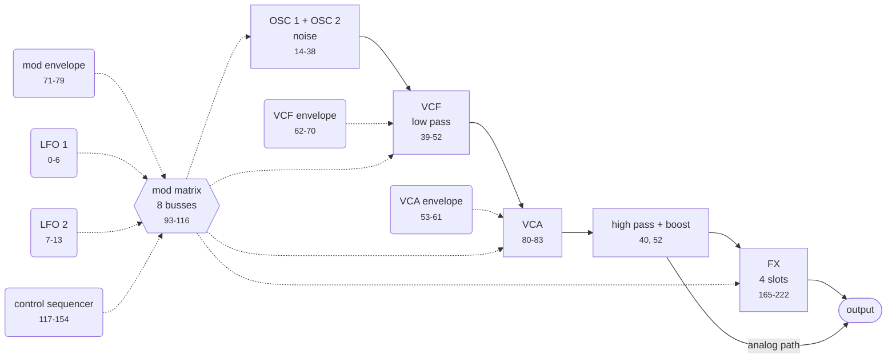
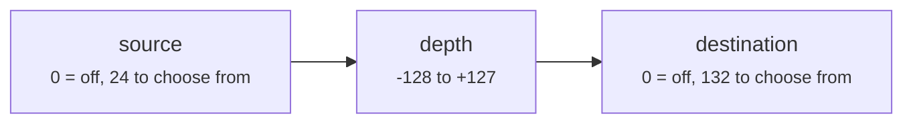
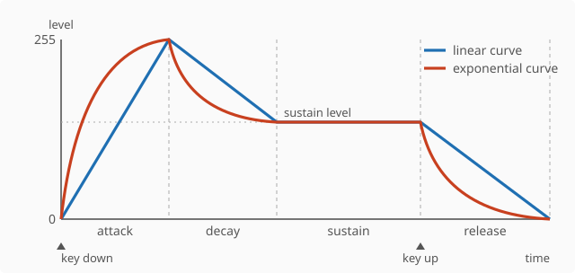
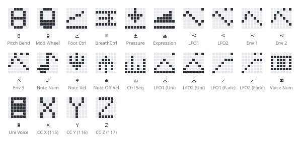
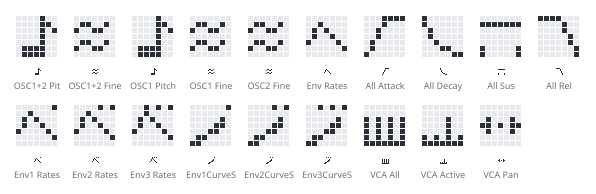

# DeepMind MIDI specification

Built from the DeepMind 12 user manual and checked against real dumps, a
community controller map and a third-party editor layout. Where sources
disagree, the hardware wins and the difference is recorded. Full list at the
[end](#sources).

The tables and diagrams below are generated from `spec/*.toml`. Do not edit them
by hand: change the spec and run `cargo xtask docs`.

## Contents

- [Synth structure](#synth-structure)
- [Addressing](#addressing)
- [Packed MS-bit encoding](#packed-ms-bit-encoding)
- [SysEx messages](#sysex-messages)
- [Device inquiry](#device-inquiry)
- [Wire mapping](#wire-mapping)
- [NRPN edits](#nrpn-edits)
- [Continuous controllers](#continuous-controllers)
- [Program data layout](#program-data-layout)
- [Program parameters](#program-parameters)
- [Front panel](#front-panel)
- [Firmware versions](#firmware-versions)
- [Value tables](#value-tables)
- [Global settings](#global-settings)
- [FX routing](#fx-routing)
- [Effect parameters](#effect-parameters), in full in [Effects](effects.md)
- [Corrections to the manual](#corrections-to-the-manual)
- [Scaling](#scaling-raw-values-to-displayed-values)
- [Open questions](#open-questions)

## Synth structure

Where the parameters sit in the instrument, so an offset means something before
the tables.

<!-- generated:structure -->

### Voice signal path

Each block is a parameter group, labelled with its offsets. Solid arrows carry audio, dashed arrows carry modulation.



Offsets 40 and 52, the high pass frequency and the bass boost, appear twice on purpose. The front panel groups them with the VCF and this specification follows the panel, but the block diagram in section 6 of the manual places both after the VCA, where they act on the mixed voices rather than on one. The analog path skips the FX block; the [`FX Mode`](#fx-routing) parameter decides which paths carry signal.

### Modulation matrix

Eight independent busses, each a source, a destination and a signed depth.



Each bus occupies three consecutive offsets: source, destination, depth. Bus 1 is 93, 94, 95, and bus 8 is 114, 115, 116.

### Envelopes

Three identical envelopes: VCA, VCF and mod. Each has the four stages plus a curve control per stage, which bends the segment from linear towards exponential in either direction.



| Stage | VCA | VCF | Mod |
|---|---|---|---|
| Attack time | 53 | 62 | 71 |
| Decay time | 54 | 63 | 72 |
| Sustain level | 55 | 64 | 73 |
| Release time | 56 | 65 | 74 |
| Attack curve | 58 | 67 | 76 |
| Decay curve | 59 | 68 | 77 |
| Sustain curve | 60 | 69 | 78 |
| Release curve | 61 | 70 | 79 |

<!-- /generated:structure -->

## Addressing

| Field | Value |
|---|---|
| Manufacturer ID | `00 20 32` (Behringer) |
| Model ID | `20`, shared by every variant |
| Device ID | `00`-`0F`, or `7F` to broadcast |

The model ID does not identify the variant. DeepMind 6, 6X, 12, 12X, 12D and
12XD all answer to `20` and speak the same protocol; they differ only in voice
count and whether there is a keyboard. To tell them apart, ask the user.

The device ID doubles as the synthesizer's global MIDI channel: a unit set to
channel 1 answers SysEx addressed to device ID `00`.

Factory preset packs are not consistent about this. *Retro Electro* ships with
`7F`, *Synth Wizards* with `00`, so a parser has to accept both. They also
target different banks, A and H respectively, so importing a pack means
re-targeting rather than trusting the file.

## Packed MS-bit encoding

Bulk dumps carry 8-bit data over 7-bit SysEx. Each group of 7 raw bytes becomes
8 transmitted bytes: one byte holding the seven high bits, then the seven
payload bytes with their high bit cleared.

```
raw:     d0 d1 d2 d3 d4 d5 d6          7 bytes, 8 bits each
packed:  M  d0 d1 d2 d3 d4 d5 d6       8 bytes, 7 bits each
         ^
         bit n of M is bit 7 of raw byte n
```

A raw length that is not a multiple of 7 leaves a last group with a choice: pad
it out to eight bytes, or send only the bytes it needs. The manual's own figures
answer it. Five of the six packed lengths it tabulates are
`ceil(raw_len / 7) * 8` exactly, the padded form, and not one of them is the
short form:

| Dump | Raw | Printed | Padded | Short |
|---|---|---|---|---|
| Global parameters | 45 | 56 | 56 | 52 |
| User pattern | 65 | 80 | 80 | 75 |
| Bank program names | 2048 | 2344 | 2344 | 2341 |
| Single program name | 16 | 24 | 24 | 19 |
| Chord memory | 26 | 32 | 32 | 30 |
| Poly chord memory | 512 | 592 | 592 | 586 |
| Program | 242 | 278 | 280 | 277 |

The program dump is the last row and the odd one, printed as 278 where padding
gives 280 and the short form gives 277. It is recorded as printed and nothing
relies on it; see [Open questions](#open-questions).

So this library pads when it writes and accepts either when it reads, because a
parser that insisted on one of them would turn a figure that cannot be right
into a rejected dump.

One consequence: a packed run does not carry its own raw length. 280 packed
bytes hold 245, which is a version 7 program and also a version 6 program with
three bytes to spare. The comms protocol version byte says which, so
[the two versions](#protocol-version-6-versus-7) cannot be told apart by length.

## SysEx messages

Every message is framed as `F0 00 20 32 20 <device> <command> <payload> F7`.
Responses that carry bulk data put a comms protocol version byte first.

<!-- generated:messages -->

| Cmd | Message | Direction | Payload | Raw | Packed |
|---|---|---|---|---|---|
| `00` | Control App Notify Request | host to synth | One reserved byte |  |  |
| `01` | Program Dump Request | host to synth | Bank (0-7), program (0-127) |  |  |
| `02` | Program Dump Response | synth to host | Version, bank, program, packed program data | 242 | 278 |
| `03` | Edit Buffer Dump Request | host to synth | none |  |  |
| `04` | Edit Buffer Dump Response | synth to host | Version, packed program data | 242 | 278 |
| `05` | Global Parameter Dump Request | host to synth | none |  |  |
| `06` | Global Parameter Dump Response | synth to host | Version, packed global data | 45 | 56 |
| `07` | Single User Pattern Dump Request | host to synth | Pattern (0-31) |  |  |
| `08` | User Pattern Dump Response | synth to host | Version, optional pattern number, packed pattern data | 65 | 80 |
| `09` | Program Bank Dump Request | host to synth | Bank (0-7), first program (0-127), last program (0-127) |  |  |
| `0A` | Bank Program Names Dump Request | host to synth | Bank (0-7) |  |  |
| `0B` | Bank Program Names Dump Response | synth to host | Version, bank, packed names | 2048 | 2344 |
| `0C` | Single Program Name Dump Request | host to synth | Bank (0-7), program (0-127) |  |  |
| `0D` | Single Program Name Dump Response | synth to host | Version, bank, packed name | 16 | 24 |
| `0E` | Edit Buffer Pattern Dump Request | host to synth | none |  |  |
| `10` | Control App Notify Response | synth to host | Rx channel (0-16), tx channel (0-15), interface (0 MIDI, 1 USB, 2 Wi-Fi), bank, program |  |  |
| `11` | Calibration Data Dump Request | host to synth | none |  |  |
| `12` | Calibration Data Dump Response | synth to host | Version, packed voice and controller calibration data |  | 688 |
| `1B` | Chord Memory Dump Request | host to synth | none |  |  |
| `1C` | Chord Memory Dump Response | synth to host | Version, packed chord memory | 26 | 32 |
| `1D` | Poly Chord Memory Dump Request | host to synth | none |  |  |
| `1E` | Poly Chord Memory Dump Response | synth to host | Version, packed poly chord memory | 512 | 592 |

**Control App Notify Request.** Tells the synthesizer that a control application is attached to this interface. It responds by enabling NRPN and SysEx on that interface and emitting extra traffic such as key-down and voice-allocation updates. Nothing enables that stream implicitly.

**Program Dump Response.** Protocol version 7 carries 245 raw bytes in 280 packed, for a 291 byte message. The 278 printed here for version 6 matches neither packing rule: padding the last group gives 280, sending it short gives 277. Every other packed length in this table is the padded rule exactly, so the figure is recorded as printed and nothing depends on it.

**User Pattern Dump Response.** The manual assigns this command to both the single pattern response and the edit buffer pattern response. They are told apart by length: the single pattern form carries a pattern number byte before the payload. Pattern data is one length byte, then 32 step velocities, then 32 step gates.

**Program Bank Dump Request.** Answered by a sequence of individual program dump responses, one per program, not by a single aggregate message.

**Bank Program Names Dump Response.** 128 programs of 16 bytes. The cheapest way to index a bank without pulling full programs.

**Chord Memory Dump Response.** Unused locations are set to 0xFF.

**Poly Chord Memory Dump Response.** Unused locations are set to 0xFF.

<!-- /generated:messages -->

## Device inquiry

The universal non-realtime identity request is the only way to find a unit with
an unknown device ID, and the only supported way to read firmware versions.

```
request:  F0 7E <dev|7F> 06 01 F7
response: F0 7E <dev> 06 02 00 20 32 20 00 01 00 <jn> 00 <ii> <nn> F7
```

`jn` packs the main software revision, with `j` the minor revision (0-7) and `n`
the major (0-15). `ii` and `nn` are the voice software major and minor versions.

Firmware itself is distributed as a vendor SysEx file that Behringer's own
updater streams to the synthesizer. That bootloader protocol is not documented
and is not modelled here.

## Wire mapping

How an address and a value become bytes. This section is generated from
`spec/mapping.toml`, which exists so a host that is not this library can be
driven from the same data rather than from hard-coded byte patterns.

`Bn` is a status byte carrying the MIDI channel in its low nibble.

<!-- generated:mapping -->

### NRPN edit

Sets one program parameter. The only way to reach every parameter.

```
Bn 63 <number_msb> Bn 62 <number_lsb> Bn 06 <value_msb> Bn 26 <value_lsb>
```

Running status collapses this to a single status byte. The selected parameter persists, so sweeping one control means sending the selection once and then data entry pairs alone. Each interface (DIN, USB, Wi-Fi) keeps its own selected-parameter register.

| Field | From | Encoding | Bits | Notes |
|---|---|---|---|---|
| `number_msb` | `parameter.offset` | [shift_right_7](#encodings) | 7 |  |
| `number_lsb` | `parameter.offset` | [low_7](#encodings) | 7 |  |
| `value_msb` | `value` | [shift_right_7](#encodings) | 7 | Optional. The parameter's maximum is 127 or less. |
| `value_lsb` | `value` | [low_7](#encodings) | 7 |  |

### Control change

Reaches 90 of the 242 parameters, one byte of resolution each.

```
Bn <cc> <value>
```

A shortcut, not a second address space: controllers.toml maps each controller number onto the parameter offset it drives. A parameter whose range exceeds 0-127 loses resolution here, so NRPN is the general path.

| Field | From | Encoding | Bits | Notes |
|---|---|---|---|---|
| `cc` | `controller.cc` | - | 7 |  |
| `value` | `value` | [scale_to_7](#encodings) | 7 |  |

### SysEx

Bulk data: program dumps, bank dumps, globals, patterns, inquiries.

```
F0 00 20 32 20 <device> <command> <payload> F7
```

`00 20 32` is Behringer's manufacturer ID and `20` the shared DeepMind model ID; no model in the range identifies itself further. Commands are listed in messages.toml.

| Field | From | Encoding | Bits | Notes |
|---|---|---|---|---|
| `device` | `device_id` | - | 7 | The unit's global MIDI channel, or 7F to address every unit on the port. |
| `command` | `message.command` | - | 7 |  |
| `payload` | `message.payload` | [packed_ms_bit](#encodings) | - | Bulk payloads only. Short commands carry their arguments unpacked. |

<a id="encodings"></a>

### Encodings

| Encoding | Name | Rule | Notes |
|---|---|---|---|
| `low_7` | Low seven bits | value & 0x7F |  |
| `shift_right_7` | High seven bits | (value >> 7) & 0x7F |  |
| `scale_to_7` | Scaled to seven bits | value * 127 / maximum | Lossy for a parameter whose range exceeds 0-127. |
| `packed_ms_bit` | Packed MS-bit | Seven raw bytes become eight: one byte of their high bits, then the seven with bit 7 cleared. | SysEx data bytes cannot set bit 7, so bulk payloads carry it separately. The last group is short when the payload length is not a multiple of seven. |

<!-- /generated:mapping -->

## NRPN edits

```
B0 63 <msb>   NRPN parameter MSB
B0 62 <lsb>   NRPN parameter LSB
B0 06 <msb>   data entry MSB
B0 26 <lsb>   data entry LSB
```

With running status this collapses to `B0 63 aa 62 bb 06 cc 26 dd`.

Three behaviours to design around:

- The data entry MSB is optional for switches and for any parameter whose range
  fits in 0-127.
- Once a parameter is selected, further data entry messages keep applying to it.
  A host sweeping one control should send the selection once, then only data
  entry pairs.
- The synthesizer keeps a separate selected-parameter register per interface.
  DIN MIDI, USB and Wi-Fi do not share NRPN state.

Parameter ranges reach 0-255, which does not fit in a single 7-bit data byte, so
the 14-bit data entry pair carries the value.

## Continuous controllers

CC is the coarse path: 7 bits, so a controller reaches 128 of the 256 values an
NRPN can address. Use NRPN where resolution matters, CC where a generic
controller or DAW lane is easier.

<!-- generated:controllers -->

#### Program parameters

Each of these drives one program parameter. The offset column is that parameter's entry in the table above.

| CC | Controls | Offset | Glyph | Notes |
|---|---|---|---|---|
| 5 | Portamento time | 34 | [glide](effects.md#glyph-glide) |  |
| 12 | Arp Rate (tempo) | 157 | [time](effects.md#glyph-time) |  |
| 13 | Arp Gate Time | 160 | [gate](effects.md#glyph-gate) |  |
| 16 | LFO 1 Rate | 0 | [rate](effects.md#glyph-rate) |  |
| 17 | LFO 1 Delay / Fade | 1 | [attack](effects.md#glyph-attack) |  |
| 18 | LFO 2 Rate | 7 | [rate](effects.md#glyph-rate) |  |
| 19 | LFO 2 Delay / Fade | 8 | [attack](effects.md#glyph-attack) |  |
| 20 | OSC 1 Pitch Mod Depth | 21 | [depth](effects.md#glyph-depth) |  |
| 21 | OSC 1 PWM Depth | 25 | [square](effects.md#glyph-square) |  |
| 23 | OSC 2 Pitch Mod Depth | 29 | [depth](effects.md#glyph-depth) |  |
| 24 | OSC 2 Tone Mod Depth | 28 | [depth](effects.md#glyph-depth) |  |
| 25 | OSC 2 Pitch | 27 | [pitch](effects.md#glyph-pitch) |  |
| 26 | OSC 2 Level | 26 | [level](effects.md#glyph-level) |  |
| 27 | Noise Level | 33 | [noise](effects.md#glyph-noise) |  |
| 28 | Unison Detune | 87 | [detune](effects.md#glyph-detune) |  |
| 29 | VCF Frequency | 39 | [high cut](effects.md#glyph-high-cut) |  |
| 30 | VCF Resonance | 41 | [resonance](effects.md#glyph-resonance) |  |
| 33 | VCF LFO Depth | 45 | [wave](effects.md#glyph-wave) |  |
| 34 | VCF Keyboard Tracking | 49 | [keys](effects.md#glyph-keys) |  |
| 35 | VCF HighPass Frequency | 40 | [low cut](effects.md#glyph-low-cut) |  |
| 36 | VCA Level | 80 | [level](effects.md#glyph-level) |  |
| 37 | VCA Envelope Attack Time | 53 | [attack](effects.md#glyph-attack) |  |
| 39 | VCA Envelope Decay Time | 54 | [decay](effects.md#glyph-decay) |  |
| 40 | VCA Envelope Sustain Level | 55 | [hold](effects.md#glyph-hold) | **Unconfirmed.** The source list labels CC 44 "VCA S" and CC 56 "VCA Scrv" and omits CC 40 and CC 52 entirely. Controllers 37-49 run as three envelopes of attack, decay, sustain, release and 50-61 as the same three sets of curves, which puts VCA sustain at 40, VCF sustain at 44, VCA sustain curve at 52 and VCF sustain curve at 56. The run is encoded here; confirm against hardware. |
| 41 | VCA Envelope Release Time | 56 | [release](effects.md#glyph-release) |  |
| 42 | VCF Envelope Attack Time | 62 | [attack](effects.md#glyph-attack) |  |
| 43 | VCF Envelope Decay Time | 63 | [decay](effects.md#glyph-decay) |  |
| 44 | VCF Envelope Sustain Level | 64 | [hold](effects.md#glyph-hold) | **Unconfirmed.** The source list labels CC 44 "VCA S" and CC 56 "VCA Scrv" and omits CC 40 and CC 52 entirely. Controllers 37-49 run as three envelopes of attack, decay, sustain, release and 50-61 as the same three sets of curves, which puts VCA sustain at 40, VCF sustain at 44, VCA sustain curve at 52 and VCF sustain curve at 56. The run is encoded here; confirm against hardware. |
| 45 | VCF Envelope Release Time | 65 | [release](effects.md#glyph-release) |  |
| 46 | Mod Envelope Attack Time | 71 | [attack](effects.md#glyph-attack) |  |
| 47 | Mod Envelope Decay Time | 72 | [decay](effects.md#glyph-decay) |  |
| 48 | Mod Envelope Sustain Level | 73 | [hold](effects.md#glyph-hold) |  |
| 49 | Mod Envelope Release Time | 74 | [release](effects.md#glyph-release) |  |
| 50 | VCA Envelope Attack Curve | 58 | [curve](effects.md#glyph-curve) |  |
| 51 | VCA Envelope Decay Curve | 59 | [curve](effects.md#glyph-curve) |  |
| 52 | VCA Envelope Sustain Curve | 60 | [curve](effects.md#glyph-curve) | **Unconfirmed.** The source list labels CC 44 "VCA S" and CC 56 "VCA Scrv" and omits CC 40 and CC 52 entirely. Controllers 37-49 run as three envelopes of attack, decay, sustain, release and 50-61 as the same three sets of curves, which puts VCA sustain at 40, VCF sustain at 44, VCA sustain curve at 52 and VCF sustain curve at 56. The run is encoded here; confirm against hardware. |
| 53 | VCA Envelope Release Curve | 61 | [curve](effects.md#glyph-curve) |  |
| 54 | VCF Envelope Attack Curve | 67 | [curve](effects.md#glyph-curve) |  |
| 55 | VCF Envelope Decay Curve | 68 | [curve](effects.md#glyph-curve) |  |
| 56 | VCF Envelope Sustain Curve | 69 | [curve](effects.md#glyph-curve) | **Unconfirmed.** The source list labels CC 44 "VCA S" and CC 56 "VCA Scrv" and omits CC 40 and CC 52 entirely. Controllers 37-49 run as three envelopes of attack, decay, sustain, release and 50-61 as the same three sets of curves, which puts VCA sustain at 40, VCF sustain at 44, VCA sustain curve at 52 and VCF sustain curve at 56. The run is encoded here; confirm against hardware. |
| 57 | VCF Envelope Release Curve | 70 | [curve](effects.md#glyph-curve) |  |
| 58 | Mod Envelope Attack Curve | 76 | [curve](effects.md#glyph-curve) |  |
| 59 | Mod Envelope Decay Curve | 77 | [curve](effects.md#glyph-curve) |  |
| 60 | Mod Envelope Sustain Curve | 78 | [curve](effects.md#glyph-curve) |  |
| 61 | Mod Envelope Release Curve | 79 | [curve](effects.md#glyph-curve) |  |
| 62 | FX 1 Param 1 | 167 |  |  |
| 63 | FX 1 Param 2 | 168 |  |  |
| 65 | FX 1 Param 3 | 169 |  |  |
| 66 | FX 1 Param 4 | 170 |  |  |
| 67 | FX 1 Param 5 | 171 |  |  |
| 68 | FX 1 Param 6 | 172 |  |  |
| 69 | FX 1 Param 7 | 173 |  |  |
| 70 | FX 1 Param 8 | 174 |  |  |
| 71 | FX 1 Param 9 | 175 |  |  |
| 72 | FX 1 Param 10 | 176 |  |  |
| 73 | FX 1 Param 11 | 177 |  |  |
| 74 | FX 1 Param 12 | 178 |  |  |
| 75 | FX 2 Param 1 | 180 |  |  |
| 76 | FX 2 Param 2 | 181 |  |  |
| 77 | FX 2 Param 3 | 182 |  |  |
| 78 | FX 2 Param 4 | 183 |  |  |
| 79 | FX 2 Param 5 | 184 |  |  |
| 80 | FX 2 Param 6 | 185 |  |  |
| 81 | FX 2 Param 7 | 186 |  |  |
| 82 | FX 2 Param 8 | 187 |  |  |
| 83 | FX 2 Param 9 | 188 |  |  |
| 84 | FX 2 Param 10 | 189 |  |  |
| 85 | FX 2 Param 11 | 190 |  |  |
| 86 | FX 2 Param 12 | 191 |  |  |
| 87 | FX 3 Param 1 | 193 |  |  |
| 88 | FX 3 Param 2 | 194 |  |  |
| 89 | FX 3 Param 3 | 195 |  |  |
| 90 | FX 3 Param 4 | 196 |  |  |
| 91 | FX 3 Param 5 | 197 |  |  |
| 92 | FX 3 Param 6 | 198 |  |  |
| 93 | FX 3 Param 7 | 199 |  |  |
| 94 | FX 3 Param 8 | 200 |  |  |
| 95 | FX 3 Param 9 | 201 |  |  |
| 102 | FX 3 Param 10 | 202 |  |  |
| 103 | FX 3 Param 11 | 203 |  |  |
| 104 | FX 3 Param 12 | 204 |  |  |
| 105 | FX 1 Type | 166 | [selection](effects.md#glyph-selection) |  |
| 106 | FX 2 Type | 179 | [selection](effects.md#glyph-selection) |  |
| 107 | FX 3 Type | 192 | [selection](effects.md#glyph-selection) |  |
| 108 | FX 4 Type | 205 | [selection](effects.md#glyph-selection) |  |
| 109 | FX 1 Output Gain | 218 | [level](effects.md#glyph-level) |  |
| 110 | FX 2 Output Gain | 219 | [level](effects.md#glyph-level) |  |
| 111 | FX 3 Output Gain | 220 | [level](effects.md#glyph-level) |  |
| 112 | FX 4 Output Gain | 221 | [level](effects.md#glyph-level) |  |
| 114 | FX Mode | 222 | [selection](effects.md#glyph-selection) |  |

#### Standard controllers

Ordinary MIDI controllers, answered in the usual way.

| CC | Controls | Glyph | Notes |
|---|---|---|---|
| 1 | Modulation Wheel | [mod wheel](effects.md#glyph-mod-wheel) |  |
| 2 | Breath Controller | [breath](effects.md#glyph-breath) |  |
| 4 | Foot Controller | [pedal](effects.md#glyph-pedal) |  |
| 6 | Data Entry MSB |  |  |
| 7 | Channel Volume | [level](effects.md#glyph-level) |  |
| 8 | Balance | [pan](effects.md#glyph-pan) |  |
| 10 | Pan | [pan](effects.md#glyph-pan) |  |
| 11 | Expression | [expression](effects.md#glyph-expression) |  |
| 32 | Bank Select LSB |  |  |
| 38 | Data Entry LSB |  |  |
| 64 | Sustain Pedal | [footswitch](effects.md#glyph-footswitch) |  |
| 96 | Data Increment |  |  |
| 97 | Data Decrement |  |  |
| 98 | NRPN LSB |  |  |
| 99 | NRPN MSB |  |  |
| 100 | RPN LSB |  |  |
| 101 | RPN MSB |  |  |

#### Everything else

Controllers that do something but are not a single program parameter.

| CC | Controls | Glyph | Notes |
|---|---|---|---|
| 31 | VCF Mod |  | The source lists this as "VCF MOD" without saying which VCF modulation depth it drives. Left unmapped. |
| 113 | Analog Thru |  | Switches the analog thru path. |
| 115 | 3D X axis |  | Modulation matrix source CC X. |
| 116 | 3D Y axis |  | Modulation matrix source CC Y. |
| 117 | 3D Z axis |  | Modulation matrix source CC Z. |

<!-- /generated:controllers -->

## Program data layout

A parameter's 14-bit NRPN number **is** its byte offset in the unpacked program
dump. One parameter, one byte. The table in [Program
parameters](#program-parameters) is therefore both the NRPN map and the dump
layout.

### Protocol version 6 versus 7

The manual documents version 6: 242 raw bytes packed into 278. Current firmware
and both factory packs emit version 7: **245 raw bytes packed into 280**, for a
291-byte message.

Offsets 0-241 are identical between the two. The three extra bytes sit at
242-244 and are zero in all 256 factory programs examined. Treat them as
reserved, preserve them on round-trip, and never assume a dump is 242 bytes.

### Evidence

The offset map holds against 256 factory programs:

| Offset | Expected | Observed |
|---|---|---|
| 241 | transpose, 80-176 with 128 meaning none | `0x80` in 233 of 256 |
| 219-221 | FX output gains, 0-150 | cluster on 100 |
| 222 | FX mode, 0-2 | only ever 0 or 1 |
| 223-239 | 16 ASCII chars plus terminator | clean names in every program |

### Reading state

The synthesizer answers no per-parameter reads. There is no "what is LFO 1 rate
right now" message. State comes from dumps only: the edit buffer for what is
currently playing, a program dump for a stored slot, the global dump for device
settings, and the bank names dump for a cheap 128-program index. A host that
sends an NRPN edit and wants confirmation has to re-request the edit buffer.

## Program parameters

242 parameters, offsets 0 through 241.

The `Raw` column is the range on the wire. For 197 of them the value counts up
from that range's floor; for the other 45 it is read about a centre, which the
manual states and the `Values` column carries. The eight modulation depths, the
pan spread and the portamento balance run -128 to +127 about 128; the 32
sequencer steps run -127 to +127 about the same point, with 0 meaning "skip
this step" rather than the smallest modulation; `Program Transpose` runs -48 to
+48 about 128; and the two pitch bend depths run -24 to +24 about 24. A control
drawn from the floor of one of those ranges is a bar that is half full at no
modulation, which is why the crate publishes the centre rather than leaving it
in the prose.

The `What it does` column is written for this specification against the rest of
it - the signal path above, the value tables below, the notes and the ranges -
and is not transcribed from the manual, which is the other way round from the
effect parameter descriptions in [effects.md](effects.md). A parameter whose
behaviour this specification does not establish has no sentence rather than a
guessed one. The library returns the same sentences from `ParamId::description`
under its `descriptions` feature, which is off by default.

<!-- generated:parameters -->

### LFO 1

| Offset | Parameter | Raw | Values | Shows as | Glyph | What it does |
|---|---|---|---|---|---|---|
| 0 | LFO 1 Rate | 0-255 | When LFO 1 Arp Sync is on, this selects a division of the master BPM from the LFO clock divider table instead of setting a free-running rate. | 0.041 Hz to 65.4 Hz, or up to 1280 Hz when driven from the modulation matrix | [rate](effects.md#glyph-rate) | Sets how fast LFO 1 runs, which is what the modulation depths elsewhere in the program are a depth of. |
| 1 | LFO 1 Delay / Fade | 0-255 |  | 0.00 s to 6.59 s | [attack](effects.md#glyph-attack) | Sets how long LFO 1 takes to reach full depth after a note starts, so that vibrato can arrive rather than being there from the attack. |
| 2 | LFO 1 Shape | 0-6 | [LFO Shape](#lfo_shape) |  | [wave](effects.md#glyph-wave) | Chooses the waveform LFO 1 runs: one of the four periodic shapes, or one of the two that pick a fresh random value each cycle. |
| 3 | LFO 1 Key Sync | 0-1 | Off (0), On (1) |  | [keys](effects.md#glyph-keys) | Restarts LFO 1 at the start of its cycle on each new note, so every note is modulated the same way instead of catching the LFO wherever it had got to. |
| 4 | LFO 1 Arp Sync | 0-1 | Off (0), On (1) |  | [time](effects.md#glyph-time) | Locks LFO 1 to the master tempo, which is what turns its rate into a choice of clock division rather than a speed. |
| 5 | LFO 1 Mono Mode | 0-255 | [LFO Mono Mode](#lfo_mono_mode) |  | [selection](effects.md#glyph-selection) | Chooses whether each voice gets its own copy of LFO 1, whether all voices share one, or whether the voices' copies are spread apart in phase. |
| 6 | LFO 1 Slew Rate | 0-255 |  |  | [curve](effects.md#glyph-curve) | Rounds the corners off LFO 1's waveform, which turns a square into something that ramps between its two levels rather than jumping. |

### LFO 2

| Offset | Parameter | Raw | Values | Shows as | Glyph | What it does |
|---|---|---|---|---|---|---|
| 7 | LFO 2 Rate | 0-255 | When LFO 2 Arp Sync is on, this selects a division of the master BPM from the LFO clock divider table instead of setting a free-running rate. | 0.041 Hz to 65.4 Hz, or up to 1280 Hz when driven from the modulation matrix | [rate](effects.md#glyph-rate) | Sets how fast LFO 2 runs, which is what the modulation depths elsewhere in the program are a depth of. |
| 8 | LFO 2 Delay / Fade | 0-255 |  | 0.00 s to 6.59 s | [attack](effects.md#glyph-attack) | Sets how long LFO 2 takes to reach full depth after a note starts, so that vibrato can arrive rather than being there from the attack. |
| 9 | LFO 2 Shape | 0-6 | [LFO Shape](#lfo_shape) |  | [wave](effects.md#glyph-wave) | Chooses the waveform LFO 2 runs: one of the four periodic shapes, or one of the two that pick a fresh random value each cycle. |
| 10 | LFO 2 Key Sync | 0-1 | Off (0), On (1) |  | [keys](effects.md#glyph-keys) | Restarts LFO 2 at the start of its cycle on each new note, so every note is modulated the same way instead of catching the LFO wherever it had got to. |
| 11 | LFO 2 Arp Sync | 0-1 | Off (0), On (1) |  | [time](effects.md#glyph-time) | Locks LFO 2 to the master tempo, which is what turns its rate into a choice of clock division rather than a speed. |
| 12 | LFO 2 Mono Mode | 0-255 | [LFO Mono Mode](#lfo_mono_mode) |  | [selection](effects.md#glyph-selection) | Chooses whether each voice gets its own copy of LFO 2, whether all voices share one, or whether the voices' copies are spread apart in phase. |
| 13 | LFO 2 Slew Rate | 0-255 |  |  | [curve](effects.md#glyph-curve) | Rounds the corners off LFO 2's waveform, which turns a square into something that ramps between its two levels rather than jumping. |

### Oscillators

| Offset | Parameter | Raw | Values | Shows as | Glyph | What it does |
|---|---|---|---|---|---|---|
| 14 | OSC 1 Range | 0-2 | [Oscillator Range](#osc_range) |  | [pitch](effects.md#glyph-pitch) | Sets the octave OSC 1 sounds at, in the organ footages the display prints: 16' is the lowest and 4' the highest. |
| 15 | OSC 2 Range | 0-2 | [Oscillator Range](#osc_range) |  | [pitch](effects.md#glyph-pitch) | Sets the octave OSC 2 sounds at, in the organ footages the display prints: 16' is the lowest and 4' the highest. |
| 16 | OSC 1 PWM Source | 0-5 | [OSC 1 PWM Source](#pwm_source) |  | [selection](effects.md#glyph-selection) | Chooses what moves OSC 1's pulse width: a fixed setting, either LFO, or one of the three envelopes. |
| 17 | OSC 2 Tone Mod Source | 0-5 | [OSC 2 Tone Mod Source](#tone_mod_source) |  | [selection](effects.md#glyph-selection) | Chooses what moves OSC 2's tone modulation: a fixed setting, either LFO, or one of the three envelopes. |
| 18 | OSC 1 Pulse Enable | 0-1 | Off (0), On (1) |  | [square](effects.md#glyph-square) | Adds OSC 1's pulse wave to the mix. It and the saw are independent, so either, both or neither can sound. |
| 19 | OSC 1 Saw Enable | 0-1 | Off (0), On (1) |  | [saw](effects.md#glyph-saw) | Adds OSC 1's sawtooth wave to the mix. It and the pulse are independent, so either, both or neither can sound. |
| 20 | OSC Sync Enable | 0-1 | Off (0), On (1) |  | [switch](effects.md#glyph-switch) | Hard-syncs the oscillators, so that one restarts each time the other completes a cycle and its own pitch becomes a timbre control rather than a note. |
| 21 | OSC 1 Pitch Mod Depth | 0-255 |  | 0.00 cents to 36.0 semitones, on a non-linear fader response | [depth](effects.md#glyph-depth) | Sets how far the source chosen by OSC 1 Pitch Mod Select moves OSC 1's pitch. |
| 22 | OSC 1 Pitch Mod Select | 0-6 | [Oscillator Pitch Mod Source](#pitch_mod_source) |  | [selection](effects.md#glyph-selection) | Chooses what moves OSC 1's pitch: either LFO, one of the three envelopes, or an LFO taken unipolar so that it only bends one way. |
| 23 | OSC 1 Aftertouch > Pitch Mod Depth | 0-255 |  |  | [pressure](effects.md#glyph-pressure) | Sets how much aftertouch adds to OSC 1's pitch modulation depth, so that leaning on a held key deepens the vibrato. |
| 24 | OSC 1 Mod Wheel > Pitch Mod Depth | 0-255 |  |  | [mod wheel](effects.md#glyph-mod-wheel) | Sets how much the modulation wheel adds to OSC 1's pitch modulation depth. |
| 25 | OSC 1 PWM Depth | 0-255 |  | 50.0% to 99.0% pulse width when the source is Manual, otherwise 0 to plus or minus 49% modulation | [square](effects.md#glyph-square) | Sets how far OSC 1's pulse width moves. With a fixed source this is the width itself; with an LFO or an envelope it is how far that source sweeps it. |
| 26 | OSC 2 Level | 0-255 |  | Off, then -48.0 dB to 0.0 dB | [level](effects.md#glyph-level) | Sets how much of OSC 2 reaches the filter. |
| 27 | OSC 2 Pitch | 0-255 |  | -12.0 to +12.0 semitones | [pitch](effects.md#glyph-pitch) | Tunes OSC 2 away from OSC 1, up to an octave either way, which is what a detune or an interval between the two is set with. |
| 28 | OSC 2 Tone Mod Depth | 0-255 |  | 50% to 100% tone modulation when the source is Manual, otherwise 0 to plus or minus 49% | [depth](effects.md#glyph-depth) | Sets how far OSC 2's tone modulation moves. With a fixed source this is the setting itself; with an LFO or an envelope it is how far that source sweeps it. |
| 29 | OSC 2 Pitch Mod Depth | 0-255 |  | 0.00 cents to 36.0 semitones, on a non-linear fader response | [depth](effects.md#glyph-depth) | Sets how far the source chosen by OSC 2 Pitch Mod Select moves OSC 2's pitch. |
| 30 | OSC 2 Aftertouch > Pitch Mod Depth | 0-255 |  |  | [pressure](effects.md#glyph-pressure) | Sets how much aftertouch adds to OSC 2's pitch modulation depth, so that leaning on a held key deepens the vibrato. |
| 31 | OSC 2 Mod Wheel > Pitch Mod Depth | 0-255 |  |  | [mod wheel](effects.md#glyph-mod-wheel) | Sets how much the modulation wheel adds to OSC 2's pitch modulation depth. |
| 32 | OSC 2 Pitch Mod Select | 0-6 | [Oscillator Pitch Mod Source](#pitch_mod_source) |  | [selection](effects.md#glyph-selection) | Chooses what moves OSC 2's pitch: either LFO, one of the three envelopes, or an LFO taken unipolar so that it only bends one way. |
| 33 | Noise Level | 0-255 |  | Off, then -48.1 dB to 0.0 dB | [noise](effects.md#glyph-noise) | Sets how much of the noise generator is mixed in with the oscillators ahead of the filter. |
| 34 | Portamento time | 0-255 |  | 0.00 s to 10.00 s | [glide](effects.md#glyph-glide) | Sets how long a new note takes to slide to its pitch from the note before it. |
| 35 | Portamento mode | 0-13 | [Portamento Mode](#portamento_mode) |  | [selection](effects.md#glyph-selection) | Chooses how the slide behaves: whether it happens on every note or only where two overlap, whether its time or its rate is what stays fixed, and whether it is a fixed interval away rather than a slide at all. |
| 36 | Pitch Bend Up Depth | 0-48 | **Unconfirmed.**  | -24 to +24 semitones, where 24 is no bend. A negative depth inverts the wheel, so pushing up bends down. | [bend](effects.md#glyph-bend) | Sets how far the pitch bender bends when it is pushed up. |
| 37 | Pitch Bend Down Depth | 0-48 | **Unconfirmed.**  | -24 to +24 semitones, where 24 is no bend. A negative depth inverts the wheel, so pulling down bends up. | [bend](effects.md#glyph-bend) | Sets how far the pitch bender bends when it is pulled down. |
| 38 | OSC 1 Pitch Mod Mode | 0-1 | [OSC 1 Pitch Mod Mode](#osc1_pitch_mod_mode) |  | [selection](effects.md#glyph-selection) | Chooses whether OSC 1's pitch modulation moves both oscillators together or OSC 1 alone. |

### VCF

| Offset | Parameter | Raw | Values | Shows as | Glyph | What it does |
|---|---|---|---|---|---|---|
| 39 | VCF Frequency | 0-255 |  | 50.0 Hz to 20000.0 Hz | [high cut](effects.md#glyph-high-cut) | Sets the cutoff frequency of the low pass filter, the point above which the oscillators' harmonics are removed. Turning it down darkens the sound. |
| 40 | VCF HighPass Frequency | 0-255 |  | 20.0 Hz to 2000.0 Hz | [low cut](effects.md#glyph-low-cut) | Sets the cutoff of the high pass filter, which removes what is below it. The manual's block diagram places this after the VCA, so it acts on the mixed voices rather than on one. |
| 41 | VCF Resonance | 0-255 |  | 0.0% to 100.0% | [resonance](effects.md#glyph-resonance) | Emphasises the frequencies around the low pass cutoff, which sharpens the filter's peak and thins out what sits below it. |
| 42 | VCF Envelope Depth | 0-255 |  | 0.0% to 100.0% | [envelope](effects.md#glyph-envelope) | Sets how far the VCF envelope moves the low pass cutoff, and so how much of the filter's sweep is played by the envelope rather than set by hand. |
| 43 | VCF Envelope Velocity Sensitivity | 0-255 |  |  | [velocity](effects.md#glyph-velocity) | Sets how much playing harder deepens the VCF envelope's effect on the cutoff. |
| 44 | VCF Pitch Bend to Freq Depth | 0-255 |  |  | [bend](effects.md#glyph-bend) | Sets how much the pitch bender moves the low pass cutoff along with the pitch. |
| 45 | VCF LFO Depth | 0-255 |  | 0.0% to 100.0% | [wave](effects.md#glyph-wave) | Sets how far the LFO chosen by VCF LFO Select moves the low pass cutoff. |
| 46 | VCF LFO Select | 0-1 | [VCF LFO Select](#vcf_lfo_select) |  | [selection](effects.md#glyph-selection) | Chooses which of the two LFOs moves the low pass cutoff. |
| 47 | VCF Aftertouch > LFO Depth | 0-255 |  |  | [pressure](effects.md#glyph-pressure) | Sets how much aftertouch adds to the LFO's effect on the cutoff, so that leaning on a held key opens up the filter's wobble. |
| 48 | VCF Mod Wheel > LFO Depth | 0-255 |  |  | [mod wheel](effects.md#glyph-mod-wheel) | Sets how much the modulation wheel adds to the LFO's effect on the cutoff. |
| 49 | VCF Keyboard Tracking | 0-255 |  | 0.0% to 100.0% | [keys](effects.md#glyph-keys) | Sets how far the low pass cutoff follows the note played, so that high notes keep the brightness low ones have instead of being filtered away. |
| 50 | VCF Envelope Polarity | 0-1 | [VCF Envelope Polarity](#vcf_envelope_polarity) |  | [polarity](effects.md#glyph-polarity) | Chooses whether the VCF envelope opens the filter or closes it. |
| 51 | VCF 2 Pole Mode | 0-1 | [VCF Pole Mode](#vcf_pole_mode) |  | [high cut](effects.md#glyph-high-cut) | Chooses the low pass filter's slope: four poles for the steeper, darker response, two for the gentler one. |
| 52 | VCF Bass Boost | 0-1 | Off (0), On (1) |  | [low shelf](effects.md#glyph-low-shelf) | Lifts the low end after the filter, putting back the weight a resonant low pass takes out. |

### VCA Envelope

| Offset | Parameter | Raw | Values | Shows as | Glyph | What it does |
|---|---|---|---|---|---|---|
| 53 | VCA Envelope Attack Time | 0-255 |  |  | [attack](effects.md#glyph-attack) | Sets how long the envelope takes to rise to full level once it is triggered. |
| 54 | VCA Envelope Decay Time | 0-255 |  |  | [decay](effects.md#glyph-decay) | Sets how long the envelope takes to fall from full level to its sustain level. |
| 55 | VCA Envelope Sustain Level | 0-255 |  |  | [hold](effects.md#glyph-hold) | Sets the level the envelope holds at for as long as the note is held. |
| 56 | VCA Envelope Release Time | 0-255 |  |  | [release](effects.md#glyph-release) | Sets how long the envelope takes to fall back to nothing once the key is released. |
| 57 | VCA Envelope Trigger Mode | 0-4 | [Envelope Trigger Source](#envelope_trigger) |  | [selection](effects.md#glyph-selection) | Chooses what triggers the envelope: a key, either LFO, a free-running loop, or a step of the control sequencer. |
| 58 | VCA Envelope Attack Curve | 0-255 |  |  | [curve](effects.md#glyph-curve) | Bends the attack segment away from a straight line, towards an exponential in either direction. |
| 59 | VCA Envelope Decay Curve | 0-255 |  |  | [curve](effects.md#glyph-curve) | Bends the decay segment away from a straight line, towards an exponential in either direction. |
| 60 | VCA Envelope Sustain Curve | 0-255 |  |  | [curve](effects.md#glyph-curve) | Bends the sustain segment away from a straight line, towards an exponential in either direction. |
| 61 | VCA Envelope Release Curve | 0-255 |  |  | [curve](effects.md#glyph-curve) | Bends the release segment away from a straight line, towards an exponential in either direction. |

### VCF Envelope

| Offset | Parameter | Raw | Values | Shows as | Glyph | What it does |
|---|---|---|---|---|---|---|
| 62 | VCF Envelope Attack Time | 0-255 |  |  | [attack](effects.md#glyph-attack) | Sets how long the envelope takes to rise to full level once it is triggered. |
| 63 | VCF Envelope Decay Time | 0-255 |  |  | [decay](effects.md#glyph-decay) | Sets how long the envelope takes to fall from full level to its sustain level. |
| 64 | VCF Envelope Sustain Level | 0-255 |  |  | [hold](effects.md#glyph-hold) | Sets the level the envelope holds at for as long as the note is held. |
| 65 | VCF Envelope Release Time | 0-255 |  |  | [release](effects.md#glyph-release) | Sets how long the envelope takes to fall back to nothing once the key is released. |
| 66 | VCF Envelope Trigger Mode | 0-4 | [Envelope Trigger Source](#envelope_trigger) |  | [selection](effects.md#glyph-selection) | Chooses what triggers the envelope: a key, either LFO, a free-running loop, or a step of the control sequencer. |
| 67 | VCF Envelope Attack Curve | 0-255 |  |  | [curve](effects.md#glyph-curve) | Bends the attack segment away from a straight line, towards an exponential in either direction. |
| 68 | VCF Envelope Decay Curve | 0-255 |  |  | [curve](effects.md#glyph-curve) | Bends the decay segment away from a straight line, towards an exponential in either direction. |
| 69 | VCF Envelope Sustain Curve | 0-255 |  |  | [curve](effects.md#glyph-curve) | Bends the sustain segment away from a straight line, towards an exponential in either direction. |
| 70 | VCF Envelope Release Curve | 0-255 |  |  | [curve](effects.md#glyph-curve) | Bends the release segment away from a straight line, towards an exponential in either direction. |

### Mod Envelope

| Offset | Parameter | Raw | Values | Shows as | Glyph | What it does |
|---|---|---|---|---|---|---|
| 71 | Mod Envelope Attack Time | 0-255 |  |  | [attack](effects.md#glyph-attack) | Sets how long the envelope takes to rise to full level once it is triggered. |
| 72 | Mod Envelope Decay Time | 0-255 |  |  | [decay](effects.md#glyph-decay) | Sets how long the envelope takes to fall from full level to its sustain level. |
| 73 | Mod Envelope Sustain Level | 0-255 |  |  | [hold](effects.md#glyph-hold) | Sets the level the envelope holds at for as long as the note is held. |
| 74 | Mod Envelope Release Time | 0-255 |  |  | [release](effects.md#glyph-release) | Sets how long the envelope takes to fall back to nothing once the key is released. |
| 75 | Mod Envelope Trigger Mode | 0-4 | [Envelope Trigger Source](#envelope_trigger) |  | [selection](effects.md#glyph-selection) | Chooses what triggers the envelope: a key, either LFO, a free-running loop, or a step of the control sequencer. |
| 76 | Mod Envelope Attack Curve | 0-255 |  |  | [curve](effects.md#glyph-curve) | Bends the attack segment away from a straight line, towards an exponential in either direction. |
| 77 | Mod Envelope Decay Curve | 0-255 |  |  | [curve](effects.md#glyph-curve) | Bends the decay segment away from a straight line, towards an exponential in either direction. |
| 78 | Mod Envelope Sustain Curve | 0-255 |  |  | [curve](effects.md#glyph-curve) | Bends the sustain segment away from a straight line, towards an exponential in either direction. |
| 79 | Mod Envelope Release Curve | 0-255 |  |  | [curve](effects.md#glyph-curve) | Bends the release segment away from a straight line, towards an exponential in either direction. |

### VCA

| Offset | Parameter | Raw | Values | Shows as | Glyph | What it does |
|---|---|---|---|---|---|---|
| 80 | VCA Level | 0-255 |  | -12.0 dB to +6.0 dB | [level](effects.md#glyph-level) | Sets the level the voice leaves the amplifier at, ahead of the high pass and the effects. |
| 81 | VCA Envelope Depth | 0-255 |  |  | [envelope](effects.md#glyph-envelope) | Sets how far the VCA envelope moves the voice's level, and so how much of the loudness is played by the envelope rather than held flat. |
| 82 | VCA Envelope Velocity Sensitivity | 0-255 |  |  | [velocity](effects.md#glyph-velocity) | Sets how much playing harder raises the voice's level. |
| 83 | VCA Pan Spread | 0-255 | -128 (0) to +127 (255) |  | [spread](effects.md#glyph-spread) | Spreads the voices across the stereo field, so that a chord is placed across it rather than stacked in the middle. |

### Voicing

| Offset | Parameter | Raw | Values | Shows as | Glyph | What it does |
|---|---|---|---|---|---|---|
| 84 | Voice Priority Mode | 0-2 | [Voice Priority Mode](#voice_priority) |  | [selection](effects.md#glyph-selection) | Chooses which note keeps a voice when more are held than there are voices: the lowest, the highest, or the most recently played. |
| 85 | Polyphony Mode | 0-12 | [Polyphony Mode](#polyphony_mode) |  | [selection](effects.md#glyph-selection) | Chooses how the voices are handed out: one to a note, several stacked on each note in unison, a limited number of them at a time, or the whole instrument reduced to one voice. |
| 86 | Envelope Trigger Mode | 0-3 | [Envelope Trigger Mode](#key_assign_mode) |  | [selection](effects.md#glyph-selection) | Chooses whether the envelopes restart on each new note or run on from where they are when notes overlap, and whether they run once through however long the key is held. |
| 87 | Unison Detune | 0-255 | Sets the amount phatness! | plus or minus 0.0 to 50.0 cents | [detune](effects.md#glyph-detune) | Sets how far the stacked voices of a unison mode are tuned apart from one another, which is what thickens the sound. |
| 88 | Voice Drift | 0-255 |  |  | [noise](effects.md#glyph-noise) | Sets how much drift is applied per voice, which is what keeps two voices playing the same note from being identical. |
| 89 | Parameter Drift | 0-255 |  |  | [noise](effects.md#glyph-noise) | Sets how much drift is applied to parameter values, which is what keeps a setting from sounding exactly where it was left. |
| 90 | Drift Rate | 0-255 |  | Each drift step lasts a random time between 25-50 ms at 0 and 2.5-5.0 s at 255 | [rate](effects.md#glyph-rate) | Sets how quickly drift moves from one random value to the next. |
| 91 | OSC Portamento Balance | 0-255 | -128 (0) to +127 (255) |  | [glide](effects.md#glyph-glide) | Sets how the portamento time is split between the two oscillators, so that one can arrive at the new note ahead of the other. |
| 92 | OSC Key Down Reset | 0-1 | Off (0), On (1) |  | [keys](effects.md#glyph-keys) | Restarts the oscillators' waveforms on each new note, so that every note begins from the same point in the cycle. |

### Mod Matrix

| Offset | Parameter | Raw | Values | Shows as | Glyph | What it does |
|---|---|---|---|---|---|---|
| 93 | Mod 1 Source | 0-24 | [Modulation Matrix Source](#mod_source) |  | [selection](effects.md#glyph-selection) | Chooses what drives this modulation bus. Zero is off; the rest are the instrument's own controls, its envelopes, its LFOs and the control sequencer. |
| 94 | Mod 1 Destination | 0-132 | [Modulation Matrix Destination](#mod_destination) |  | [selection](effects.md#glyph-selection) | Chooses what this modulation bus moves. Zero is off, and a destination names an abbreviation the display prints rather than a single parameter, so one of them can move several parameters together. |
| 95 | Mod 1 Depth | 0-255 | -128 (0) to +127 (255) |  | [depth](effects.md#glyph-depth) | Sets how far this bus moves its destination, and which way round: the value is signed about its centre, and below the centre it inverts what the source does. |
| 96 | Mod 2 Source | 0-24 | [Modulation Matrix Source](#mod_source) |  | [selection](effects.md#glyph-selection) | Chooses what drives this modulation bus. Zero is off; the rest are the instrument's own controls, its envelopes, its LFOs and the control sequencer. |
| 97 | Mod 2 Destination | 0-132 | [Modulation Matrix Destination](#mod_destination) |  | [selection](effects.md#glyph-selection) | Chooses what this modulation bus moves. Zero is off, and a destination names an abbreviation the display prints rather than a single parameter, so one of them can move several parameters together. |
| 98 | Mod 2 Depth | 0-255 | -128 (0) to +127 (255) |  | [depth](effects.md#glyph-depth) | Sets how far this bus moves its destination, and which way round: the value is signed about its centre, and below the centre it inverts what the source does. |
| 99 | Mod 3 Source | 0-24 | [Modulation Matrix Source](#mod_source) |  | [selection](effects.md#glyph-selection) | Chooses what drives this modulation bus. Zero is off; the rest are the instrument's own controls, its envelopes, its LFOs and the control sequencer. |
| 100 | Mod 3 Destination | 0-132 | [Modulation Matrix Destination](#mod_destination) |  | [selection](effects.md#glyph-selection) | Chooses what this modulation bus moves. Zero is off, and a destination names an abbreviation the display prints rather than a single parameter, so one of them can move several parameters together. |
| 101 | Mod 3 Depth | 0-255 | -128 (0) to +127 (255) |  | [depth](effects.md#glyph-depth) | Sets how far this bus moves its destination, and which way round: the value is signed about its centre, and below the centre it inverts what the source does. |
| 102 | Mod 4 Source | 0-24 | [Modulation Matrix Source](#mod_source) |  | [selection](effects.md#glyph-selection) | Chooses what drives this modulation bus. Zero is off; the rest are the instrument's own controls, its envelopes, its LFOs and the control sequencer. |
| 103 | Mod 4 Destination | 0-132 | [Modulation Matrix Destination](#mod_destination) |  | [selection](effects.md#glyph-selection) | Chooses what this modulation bus moves. Zero is off, and a destination names an abbreviation the display prints rather than a single parameter, so one of them can move several parameters together. |
| 104 | Mod 4 Depth | 0-255 | -128 (0) to +127 (255) |  | [depth](effects.md#glyph-depth) | Sets how far this bus moves its destination, and which way round: the value is signed about its centre, and below the centre it inverts what the source does. |
| 105 | Mod 5 Source | 0-24 | [Modulation Matrix Source](#mod_source) |  | [selection](effects.md#glyph-selection) | Chooses what drives this modulation bus. Zero is off; the rest are the instrument's own controls, its envelopes, its LFOs and the control sequencer. |
| 106 | Mod 5 Destination | 0-132 | [Modulation Matrix Destination](#mod_destination) |  | [selection](effects.md#glyph-selection) | Chooses what this modulation bus moves. Zero is off, and a destination names an abbreviation the display prints rather than a single parameter, so one of them can move several parameters together. |
| 107 | Mod 5 Depth | 0-255 | -128 (0) to +127 (255) |  | [depth](effects.md#glyph-depth) | Sets how far this bus moves its destination, and which way round: the value is signed about its centre, and below the centre it inverts what the source does. |
| 108 | Mod 6 Source | 0-24 | [Modulation Matrix Source](#mod_source) |  | [selection](effects.md#glyph-selection) | Chooses what drives this modulation bus. Zero is off; the rest are the instrument's own controls, its envelopes, its LFOs and the control sequencer. |
| 109 | Mod 6 Destination | 0-132 | [Modulation Matrix Destination](#mod_destination) |  | [selection](effects.md#glyph-selection) | Chooses what this modulation bus moves. Zero is off, and a destination names an abbreviation the display prints rather than a single parameter, so one of them can move several parameters together. |
| 110 | Mod 6 Depth | 0-255 | -128 (0) to +127 (255) |  | [depth](effects.md#glyph-depth) | Sets how far this bus moves its destination, and which way round: the value is signed about its centre, and below the centre it inverts what the source does. |
| 111 | Mod 7 Source | 0-24 | [Modulation Matrix Source](#mod_source) |  | [selection](effects.md#glyph-selection) | Chooses what drives this modulation bus. Zero is off; the rest are the instrument's own controls, its envelopes, its LFOs and the control sequencer. |
| 112 | Mod 7 Destination | 0-132 | [Modulation Matrix Destination](#mod_destination) |  | [selection](effects.md#glyph-selection) | Chooses what this modulation bus moves. Zero is off, and a destination names an abbreviation the display prints rather than a single parameter, so one of them can move several parameters together. |
| 113 | Mod 7 Depth | 0-255 | -128 (0) to +127 (255) |  | [depth](effects.md#glyph-depth) | Sets how far this bus moves its destination, and which way round: the value is signed about its centre, and below the centre it inverts what the source does. |
| 114 | Mod 8 Source | 0-24 | [Modulation Matrix Source](#mod_source) |  | [selection](effects.md#glyph-selection) | Chooses what drives this modulation bus. Zero is off; the rest are the instrument's own controls, its envelopes, its LFOs and the control sequencer. |
| 115 | Mod 8 Destination | 0-132 | [Modulation Matrix Destination](#mod_destination) |  | [selection](effects.md#glyph-selection) | Chooses what this modulation bus moves. Zero is off, and a destination names an abbreviation the display prints rather than a single parameter, so one of them can move several parameters together. |
| 116 | Mod 8 Depth | 0-255 | -128 (0) to +127 (255) |  | [depth](effects.md#glyph-depth) | Sets how far this bus moves its destination, and which way round: the value is signed about its centre, and below the centre it inverts what the source does. |

### Control Sequencer

| Offset | Parameter | Raw | Values | Shows as | Glyph | What it does |
|---|---|---|---|---|---|---|
| 117 | Ctrl Sequencer Enable | 0-1 | Off (0), On (1) |  | [switch](effects.md#glyph-switch) | Runs the control sequencer, the stepped modulation source the matrix can draw on. |
| 118 | Ctrl Sequencer Clock Divider | 0-15 | [Control Sequencer Clock Divider](#sequencer_clock) |  | [time](effects.md#glyph-time) | Sets how fast the sequencer steps, as a division of the master tempo. |
| 119 | Sequence Length | 0-31 | 1 (0) to 32 (31) steps |  | [steps](effects.md#glyph-steps) | Sets how many of the 32 steps are played before the sequence returns to the first. |
| 120 | Sequencer Swing Timing | 0-255 | 0 is 50%, no swing. 255 is 75%, full swing. 66% is a triplet feel. | 50% to 75% | [swing](effects.md#glyph-swing) | Holds every second step back, which is what turns an even run of steps into a swung one. |
| 121 | Key Sync & Loop | 0-2 | [Control Sequencer Key Sync and Loop](#sequencer_sync) |  | [keys](effects.md#glyph-keys) | Chooses whether the sequence restarts on a new note, whether it repeats when it reaches its end, or both. |
| 122 | Slew Rate | 0-255 |  |  | [curve](effects.md#glyph-curve) | Smooths the jump from one step's value to the next, which turns a staircase into a slope. |
| 123 | Seq Step Value 1 | 0-255 | Bipolar step value -127 (1) to +127 (255). A value of 0 means "skip step". |  | [steps](effects.md#glyph-steps) | Sets how far this step moves whatever the matrix points at it. The value is signed about its centre, so a step can modulate either way from nothing. |
| 124 | Seq Step Value 2 | 0-255 | Bipolar step value -127 (1) to +127 (255). A value of 0 means "skip step". |  | [steps](effects.md#glyph-steps) | Sets how far this step moves whatever the matrix points at it. The value is signed about its centre, so a step can modulate either way from nothing. |
| 125 | Seq Step Value 3 | 0-255 | Bipolar step value -127 (1) to +127 (255). A value of 0 means "skip step". |  | [steps](effects.md#glyph-steps) | Sets how far this step moves whatever the matrix points at it. The value is signed about its centre, so a step can modulate either way from nothing. |
| 126 | Seq Step Value 4 | 0-255 | Bipolar step value -127 (1) to +127 (255). A value of 0 means "skip step". |  | [steps](effects.md#glyph-steps) | Sets how far this step moves whatever the matrix points at it. The value is signed about its centre, so a step can modulate either way from nothing. |
| 127 | Seq Step Value 5 | 0-255 | Bipolar step value -127 (1) to +127 (255). A value of 0 means "skip step". |  | [steps](effects.md#glyph-steps) | Sets how far this step moves whatever the matrix points at it. The value is signed about its centre, so a step can modulate either way from nothing. |
| 128 | Seq Step Value 6 | 0-255 | Bipolar step value -127 (1) to +127 (255). A value of 0 means "skip step". |  | [steps](effects.md#glyph-steps) | Sets how far this step moves whatever the matrix points at it. The value is signed about its centre, so a step can modulate either way from nothing. |
| 129 | Seq Step Value 7 | 0-255 | Bipolar step value -127 (1) to +127 (255). A value of 0 means "skip step". |  | [steps](effects.md#glyph-steps) | Sets how far this step moves whatever the matrix points at it. The value is signed about its centre, so a step can modulate either way from nothing. |
| 130 | Seq Step Value 8 | 0-255 | Bipolar step value -127 (1) to +127 (255). A value of 0 means "skip step". |  | [steps](effects.md#glyph-steps) | Sets how far this step moves whatever the matrix points at it. The value is signed about its centre, so a step can modulate either way from nothing. |
| 131 | Seq Step Value 9 | 0-255 | Bipolar step value -127 (1) to +127 (255). A value of 0 means "skip step". |  | [steps](effects.md#glyph-steps) | Sets how far this step moves whatever the matrix points at it. The value is signed about its centre, so a step can modulate either way from nothing. |
| 132 | Seq Step Value 10 | 0-255 | Bipolar step value -127 (1) to +127 (255). A value of 0 means "skip step". |  | [steps](effects.md#glyph-steps) | Sets how far this step moves whatever the matrix points at it. The value is signed about its centre, so a step can modulate either way from nothing. |
| 133 | Seq Step Value 11 | 0-255 | Bipolar step value -127 (1) to +127 (255). A value of 0 means "skip step". |  | [steps](effects.md#glyph-steps) | Sets how far this step moves whatever the matrix points at it. The value is signed about its centre, so a step can modulate either way from nothing. |
| 134 | Seq Step Value 12 | 0-255 | Bipolar step value -127 (1) to +127 (255). A value of 0 means "skip step". |  | [steps](effects.md#glyph-steps) | Sets how far this step moves whatever the matrix points at it. The value is signed about its centre, so a step can modulate either way from nothing. |
| 135 | Seq Step Value 13 | 0-255 | Bipolar step value -127 (1) to +127 (255). A value of 0 means "skip step". |  | [steps](effects.md#glyph-steps) | Sets how far this step moves whatever the matrix points at it. The value is signed about its centre, so a step can modulate either way from nothing. |
| 136 | Seq Step Value 14 | 0-255 | Bipolar step value -127 (1) to +127 (255). A value of 0 means "skip step". |  | [steps](effects.md#glyph-steps) | Sets how far this step moves whatever the matrix points at it. The value is signed about its centre, so a step can modulate either way from nothing. |
| 137 | Seq Step Value 15 | 0-255 | Bipolar step value -127 (1) to +127 (255). A value of 0 means "skip step". |  | [steps](effects.md#glyph-steps) | Sets how far this step moves whatever the matrix points at it. The value is signed about its centre, so a step can modulate either way from nothing. |
| 138 | Seq Step Value 16 | 0-255 | Bipolar step value -127 (1) to +127 (255). A value of 0 means "skip step". |  | [steps](effects.md#glyph-steps) | Sets how far this step moves whatever the matrix points at it. The value is signed about its centre, so a step can modulate either way from nothing. |
| 139 | Seq Step Value 17 | 0-255 | Bipolar step value -127 (1) to +127 (255). A value of 0 means "skip step". |  | [steps](effects.md#glyph-steps) | Sets how far this step moves whatever the matrix points at it. The value is signed about its centre, so a step can modulate either way from nothing. |
| 140 | Seq Step Value 18 | 0-255 | Bipolar step value -127 (1) to +127 (255). A value of 0 means "skip step". |  | [steps](effects.md#glyph-steps) | Sets how far this step moves whatever the matrix points at it. The value is signed about its centre, so a step can modulate either way from nothing. |
| 141 | Seq Step Value 19 | 0-255 | Bipolar step value -127 (1) to +127 (255). A value of 0 means "skip step". |  | [steps](effects.md#glyph-steps) | Sets how far this step moves whatever the matrix points at it. The value is signed about its centre, so a step can modulate either way from nothing. |
| 142 | Seq Step Value 20 | 0-255 | Bipolar step value -127 (1) to +127 (255). A value of 0 means "skip step". |  | [steps](effects.md#glyph-steps) | Sets how far this step moves whatever the matrix points at it. The value is signed about its centre, so a step can modulate either way from nothing. |
| 143 | Seq Step Value 21 | 0-255 | Bipolar step value -127 (1) to +127 (255). A value of 0 means "skip step". |  | [steps](effects.md#glyph-steps) | Sets how far this step moves whatever the matrix points at it. The value is signed about its centre, so a step can modulate either way from nothing. |
| 144 | Seq Step Value 22 | 0-255 | Bipolar step value -127 (1) to +127 (255). A value of 0 means "skip step". |  | [steps](effects.md#glyph-steps) | Sets how far this step moves whatever the matrix points at it. The value is signed about its centre, so a step can modulate either way from nothing. |
| 145 | Seq Step Value 23 | 0-255 | Bipolar step value -127 (1) to +127 (255). A value of 0 means "skip step". |  | [steps](effects.md#glyph-steps) | Sets how far this step moves whatever the matrix points at it. The value is signed about its centre, so a step can modulate either way from nothing. |
| 146 | Seq Step Value 24 | 0-255 | Bipolar step value -127 (1) to +127 (255). A value of 0 means "skip step". |  | [steps](effects.md#glyph-steps) | Sets how far this step moves whatever the matrix points at it. The value is signed about its centre, so a step can modulate either way from nothing. |
| 147 | Seq Step Value 25 | 0-255 | Bipolar step value -127 (1) to +127 (255). A value of 0 means "skip step". |  | [steps](effects.md#glyph-steps) | Sets how far this step moves whatever the matrix points at it. The value is signed about its centre, so a step can modulate either way from nothing. |
| 148 | Seq Step Value 26 | 0-255 | Bipolar step value -127 (1) to +127 (255). A value of 0 means "skip step". |  | [steps](effects.md#glyph-steps) | Sets how far this step moves whatever the matrix points at it. The value is signed about its centre, so a step can modulate either way from nothing. |
| 149 | Seq Step Value 27 | 0-255 | Bipolar step value -127 (1) to +127 (255). A value of 0 means "skip step". |  | [steps](effects.md#glyph-steps) | Sets how far this step moves whatever the matrix points at it. The value is signed about its centre, so a step can modulate either way from nothing. |
| 150 | Seq Step Value 28 | 0-255 | Bipolar step value -127 (1) to +127 (255). A value of 0 means "skip step". |  | [steps](effects.md#glyph-steps) | Sets how far this step moves whatever the matrix points at it. The value is signed about its centre, so a step can modulate either way from nothing. |
| 151 | Seq Step Value 29 | 0-255 | Bipolar step value -127 (1) to +127 (255). A value of 0 means "skip step". |  | [steps](effects.md#glyph-steps) | Sets how far this step moves whatever the matrix points at it. The value is signed about its centre, so a step can modulate either way from nothing. |
| 152 | Seq Step Value 30 | 0-255 | Bipolar step value -127 (1) to +127 (255). A value of 0 means "skip step". |  | [steps](effects.md#glyph-steps) | Sets how far this step moves whatever the matrix points at it. The value is signed about its centre, so a step can modulate either way from nothing. |
| 153 | Seq Step Value 31 | 0-255 | Bipolar step value -127 (1) to +127 (255). A value of 0 means "skip step". |  | [steps](effects.md#glyph-steps) | Sets how far this step moves whatever the matrix points at it. The value is signed about its centre, so a step can modulate either way from nothing. |
| 154 | Seq Step Value 32 | 0-255 | Bipolar step value -127 (1) to +127 (255). A value of 0 means "skip step". |  | [steps](effects.md#glyph-steps) | Sets how far this step moves whatever the matrix points at it. The value is signed about its centre, so a step can modulate either way from nothing. |

### Arpeggiator

| Offset | Parameter | Raw | Values | Shows as | Glyph | What it does |
|---|---|---|---|---|---|---|
| 155 | Arp On/Off | 0-1 | Off (0), On (1) |  | [switch](effects.md#glyph-switch) | Runs the arpeggiator over the notes being held. |
| 156 | Arp Mode | 0-10 | [Arpeggiator Mode](#arp_mode) |  | [selection](effects.md#glyph-selection) | Chooses the order the held notes are played in: up, down, alternating, as they were played, at random, or all at once. |
| 157 | Arp Rate (tempo) | 0-255 | 20 bpm (0) to 275 bpm (255) | 20.0 to 275.0 BPM | [time](effects.md#glyph-time) | Sets the master tempo, in beats per minute. The arpeggiator, the control sequencer and a tempo-locked LFO all divide it. |
| 158 | Arp Clock | 0-12 | [Arpeggiator Clock Divider](#arp_clock) |  | [time](effects.md#glyph-time) | Sets how fast the arpeggiator steps, as a division of the master tempo. |
| 159 | Arp Key Sync | 0-1 | Off (0), On (1) |  | [keys](effects.md#glyph-keys) | Restarts the arpeggiated pattern on each new note rather than letting it run on. |
| 160 | Arp Gate Time | 0-255 |  |  | [gate](effects.md#glyph-gate) | Sets how much of each step the note actually sounds for, from a short stab to a run that joins up. |
| 161 | Arp Hold | 0-1 | Off (0), On (1) |  | [hold](effects.md#glyph-hold) | Keeps the arpeggio running after the keys are let go. |
| 162 | Arp Pattern | 0-64 | [Arpeggiator Pattern](#arp_pattern) |  | [selection](effects.md#glyph-selection) | Chooses the rhythm the arpeggiator plays: which of its steps sound and which are rests. |
| 163 | Arp Swing | 0-255 | 0 is 50%, no swing. 255 is 75%, full swing. 66% is a triplet feel. | 50% to 75% | [swing](effects.md#glyph-swing) | Holds every second step of the arpeggio back, which is what turns an even run into a swung one. |
| 164 | Arp Octaves | 0-5 | 1 to 6 octaves |  | [pitch](effects.md#glyph-pitch) | Sets how many octaves the arpeggio climbs through before it returns to the note it started on. |

### Effects

| Offset | Parameter | Raw | Values | Shows as | Glyph | What it does |
|---|---|---|---|---|---|---|
| 165 | FX Routing | 0-9 | [FX Connection Mode](#fx_routing) |  | [selection](effects.md#glyph-selection) | Chooses how the four effect engines are wired to each other: in a chain, side by side, or a mixture of the two, with two of the ten routings feeding a later engine back into an earlier one. |
| 166 | FX 1 Type | 0-34 | [FX Type](#fx_type) |  | [selection](effects.md#glyph-selection) | Chooses which algorithm this engine runs, which is what decides what its twelve parameter bytes mean. |
| 167 | FX 1 Param 1 | 0-255 | Meaning depends on FX 1 Type |  |  | One of the engine's twelve parameter bytes. What it controls depends on the algorithm the engine is running, so on its own it has no meaning to show. |
| 168 | FX 1 Param 2 | 0-255 | Meaning depends on FX 1 Type |  |  | One of the engine's twelve parameter bytes. What it controls depends on the algorithm the engine is running, so on its own it has no meaning to show. |
| 169 | FX 1 Param 3 | 0-255 | Meaning depends on FX 1 Type |  |  | One of the engine's twelve parameter bytes. What it controls depends on the algorithm the engine is running, so on its own it has no meaning to show. |
| 170 | FX 1 Param 4 | 0-255 | Meaning depends on FX 1 Type |  |  | One of the engine's twelve parameter bytes. What it controls depends on the algorithm the engine is running, so on its own it has no meaning to show. |
| 171 | FX 1 Param 5 | 0-255 | Meaning depends on FX 1 Type |  |  | One of the engine's twelve parameter bytes. What it controls depends on the algorithm the engine is running, so on its own it has no meaning to show. |
| 172 | FX 1 Param 6 | 0-255 | Meaning depends on FX 1 Type |  |  | One of the engine's twelve parameter bytes. What it controls depends on the algorithm the engine is running, so on its own it has no meaning to show. |
| 173 | FX 1 Param 7 | 0-255 | Meaning depends on FX 1 Type |  |  | One of the engine's twelve parameter bytes. What it controls depends on the algorithm the engine is running, so on its own it has no meaning to show. |
| 174 | FX 1 Param 8 | 0-255 | Meaning depends on FX 1 Type |  |  | One of the engine's twelve parameter bytes. What it controls depends on the algorithm the engine is running, so on its own it has no meaning to show. |
| 175 | FX 1 Param 9 | 0-255 | Meaning depends on FX 1 Type |  |  | One of the engine's twelve parameter bytes. What it controls depends on the algorithm the engine is running, so on its own it has no meaning to show. |
| 176 | FX 1 Param 10 | 0-255 | Meaning depends on FX 1 Type |  |  | One of the engine's twelve parameter bytes. What it controls depends on the algorithm the engine is running, so on its own it has no meaning to show. |
| 177 | FX 1 Param 11 | 0-255 | Meaning depends on FX 1 Type |  |  | One of the engine's twelve parameter bytes. What it controls depends on the algorithm the engine is running, so on its own it has no meaning to show. |
| 178 | FX 1 Param 12 | 0-255 | Meaning depends on FX 1 Type |  |  | One of the engine's twelve parameter bytes. What it controls depends on the algorithm the engine is running, so on its own it has no meaning to show. |
| 179 | FX 2 Type | 0-34 | [FX Type](#fx_type) |  | [selection](effects.md#glyph-selection) | Chooses which algorithm this engine runs, which is what decides what its twelve parameter bytes mean. |
| 180 | FX 2 Param 1 | 0-255 | Meaning depends on FX 2 Type |  |  | One of the engine's twelve parameter bytes. What it controls depends on the algorithm the engine is running, so on its own it has no meaning to show. |
| 181 | FX 2 Param 2 | 0-255 | Meaning depends on FX 2 Type |  |  | One of the engine's twelve parameter bytes. What it controls depends on the algorithm the engine is running, so on its own it has no meaning to show. |
| 182 | FX 2 Param 3 | 0-255 | Meaning depends on FX 2 Type |  |  | One of the engine's twelve parameter bytes. What it controls depends on the algorithm the engine is running, so on its own it has no meaning to show. |
| 183 | FX 2 Param 4 | 0-255 | Meaning depends on FX 2 Type |  |  | One of the engine's twelve parameter bytes. What it controls depends on the algorithm the engine is running, so on its own it has no meaning to show. |
| 184 | FX 2 Param 5 | 0-255 | Meaning depends on FX 2 Type |  |  | One of the engine's twelve parameter bytes. What it controls depends on the algorithm the engine is running, so on its own it has no meaning to show. |
| 185 | FX 2 Param 6 | 0-255 | Meaning depends on FX 2 Type |  |  | One of the engine's twelve parameter bytes. What it controls depends on the algorithm the engine is running, so on its own it has no meaning to show. |
| 186 | FX 2 Param 7 | 0-255 | Meaning depends on FX 2 Type |  |  | One of the engine's twelve parameter bytes. What it controls depends on the algorithm the engine is running, so on its own it has no meaning to show. |
| 187 | FX 2 Param 8 | 0-255 | Meaning depends on FX 2 Type |  |  | One of the engine's twelve parameter bytes. What it controls depends on the algorithm the engine is running, so on its own it has no meaning to show. |
| 188 | FX 2 Param 9 | 0-255 | Meaning depends on FX 2 Type |  |  | One of the engine's twelve parameter bytes. What it controls depends on the algorithm the engine is running, so on its own it has no meaning to show. |
| 189 | FX 2 Param 10 | 0-255 | Meaning depends on FX 2 Type |  |  | One of the engine's twelve parameter bytes. What it controls depends on the algorithm the engine is running, so on its own it has no meaning to show. |
| 190 | FX 2 Param 11 | 0-255 | Meaning depends on FX 2 Type |  |  | One of the engine's twelve parameter bytes. What it controls depends on the algorithm the engine is running, so on its own it has no meaning to show. |
| 191 | FX 2 Param 12 | 0-255 | Meaning depends on FX 2 Type |  |  | One of the engine's twelve parameter bytes. What it controls depends on the algorithm the engine is running, so on its own it has no meaning to show. |
| 192 | FX 3 Type | 0-34 | [FX Type](#fx_type) |  | [selection](effects.md#glyph-selection) | Chooses which algorithm this engine runs, which is what decides what its twelve parameter bytes mean. |
| 193 | FX 3 Param 1 | 0-255 | Meaning depends on FX 3 Type |  |  | One of the engine's twelve parameter bytes. What it controls depends on the algorithm the engine is running, so on its own it has no meaning to show. |
| 194 | FX 3 Param 2 | 0-255 | Meaning depends on FX 3 Type |  |  | One of the engine's twelve parameter bytes. What it controls depends on the algorithm the engine is running, so on its own it has no meaning to show. |
| 195 | FX 3 Param 3 | 0-255 | Meaning depends on FX 3 Type |  |  | One of the engine's twelve parameter bytes. What it controls depends on the algorithm the engine is running, so on its own it has no meaning to show. |
| 196 | FX 3 Param 4 | 0-255 | Meaning depends on FX 3 Type |  |  | One of the engine's twelve parameter bytes. What it controls depends on the algorithm the engine is running, so on its own it has no meaning to show. |
| 197 | FX 3 Param 5 | 0-255 | Meaning depends on FX 3 Type |  |  | One of the engine's twelve parameter bytes. What it controls depends on the algorithm the engine is running, so on its own it has no meaning to show. |
| 198 | FX 3 Param 6 | 0-255 | Meaning depends on FX 3 Type |  |  | One of the engine's twelve parameter bytes. What it controls depends on the algorithm the engine is running, so on its own it has no meaning to show. |
| 199 | FX 3 Param 7 | 0-255 | Meaning depends on FX 3 Type |  |  | One of the engine's twelve parameter bytes. What it controls depends on the algorithm the engine is running, so on its own it has no meaning to show. |
| 200 | FX 3 Param 8 | 0-255 | Meaning depends on FX 3 Type |  |  | One of the engine's twelve parameter bytes. What it controls depends on the algorithm the engine is running, so on its own it has no meaning to show. |
| 201 | FX 3 Param 9 | 0-255 | Meaning depends on FX 3 Type |  |  | One of the engine's twelve parameter bytes. What it controls depends on the algorithm the engine is running, so on its own it has no meaning to show. |
| 202 | FX 3 Param 10 | 0-255 | Meaning depends on FX 3 Type |  |  | One of the engine's twelve parameter bytes. What it controls depends on the algorithm the engine is running, so on its own it has no meaning to show. |
| 203 | FX 3 Param 11 | 0-255 | Meaning depends on FX 3 Type |  |  | One of the engine's twelve parameter bytes. What it controls depends on the algorithm the engine is running, so on its own it has no meaning to show. |
| 204 | FX 3 Param 12 | 0-255 | Meaning depends on FX 3 Type |  |  | One of the engine's twelve parameter bytes. What it controls depends on the algorithm the engine is running, so on its own it has no meaning to show. |
| 205 | FX 4 Type | 0-34 | [FX Type](#fx_type) |  | [selection](effects.md#glyph-selection) | Chooses which algorithm this engine runs, which is what decides what its twelve parameter bytes mean. |
| 206 | FX 4 Param 1 | 0-255 | Meaning depends on FX 4 Type |  |  | One of the engine's twelve parameter bytes. What it controls depends on the algorithm the engine is running, so on its own it has no meaning to show. |
| 207 | FX 4 Param 2 | 0-255 | Meaning depends on FX 4 Type |  |  | One of the engine's twelve parameter bytes. What it controls depends on the algorithm the engine is running, so on its own it has no meaning to show. |
| 208 | FX 4 Param 3 | 0-255 | Meaning depends on FX 4 Type |  |  | One of the engine's twelve parameter bytes. What it controls depends on the algorithm the engine is running, so on its own it has no meaning to show. |
| 209 | FX 4 Param 4 | 0-255 | Meaning depends on FX 4 Type |  |  | One of the engine's twelve parameter bytes. What it controls depends on the algorithm the engine is running, so on its own it has no meaning to show. |
| 210 | FX 4 Param 5 | 0-255 | Meaning depends on FX 4 Type |  |  | One of the engine's twelve parameter bytes. What it controls depends on the algorithm the engine is running, so on its own it has no meaning to show. |
| 211 | FX 4 Param 6 | 0-255 | Meaning depends on FX 4 Type |  |  | One of the engine's twelve parameter bytes. What it controls depends on the algorithm the engine is running, so on its own it has no meaning to show. |
| 212 | FX 4 Param 7 | 0-255 | Meaning depends on FX 4 Type |  |  | One of the engine's twelve parameter bytes. What it controls depends on the algorithm the engine is running, so on its own it has no meaning to show. |
| 213 | FX 4 Param 8 | 0-255 | Meaning depends on FX 4 Type |  |  | One of the engine's twelve parameter bytes. What it controls depends on the algorithm the engine is running, so on its own it has no meaning to show. |
| 214 | FX 4 Param 9 | 0-255 | Meaning depends on FX 4 Type |  |  | One of the engine's twelve parameter bytes. What it controls depends on the algorithm the engine is running, so on its own it has no meaning to show. |
| 215 | FX 4 Param 10 | 0-255 | Meaning depends on FX 4 Type |  |  | One of the engine's twelve parameter bytes. What it controls depends on the algorithm the engine is running, so on its own it has no meaning to show. |
| 216 | FX 4 Param 11 | 0-255 | Meaning depends on FX 4 Type |  |  | One of the engine's twelve parameter bytes. What it controls depends on the algorithm the engine is running, so on its own it has no meaning to show. |
| 217 | FX 4 Param 12 | 0-255 | Meaning depends on FX 4 Type |  |  | One of the engine's twelve parameter bytes. What it controls depends on the algorithm the engine is running, so on its own it has no meaning to show. |
| 218 | FX 1 Output Gain | 0-150 |  |  | [level](effects.md#glyph-level) | Sets how much of this engine's output carries on, which for some routings is into the next engine and for others is to the instrument's output. |
| 219 | FX 2 Output Gain | 0-150 |  |  | [level](effects.md#glyph-level) | Sets how much of this engine's output carries on, which for some routings is into the next engine and for others is to the instrument's output. |
| 220 | FX 3 Output Gain | 0-150 |  |  | [level](effects.md#glyph-level) | Sets how much of this engine's output carries on, which for some routings is into the next engine and for others is to the instrument's output. |
| 221 | FX 4 Output Gain | 0-150 |  |  | [level](effects.md#glyph-level) | Sets how much of this engine's output carries on, which for some routings is into the next engine and for others is to the instrument's output. |
| 222 | FX Mode | 0-2 | [FX Mode](#fx_mode) |  | [selection](effects.md#glyph-selection) | Chooses what the effects do to the two signal paths: sit in the chain, be fed from a send alongside it, or be bypassed. |

### Program

| Offset | Parameter | Raw | Values | Shows as | Glyph | What it does |
|---|---|---|---|---|---|---|
| 223 | Program Name Char 1 | 0-127 | Null-terminated 16 char ASCII string |  |  | One byte of the program's name, as an ASCII code: sixteen printable characters at most, and a zero where the name ends. |
| 224 | Program Name Char 2 | 0-127 | Null-terminated 16 char ASCII string |  |  | One byte of the program's name, as an ASCII code: sixteen printable characters at most, and a zero where the name ends. |
| 225 | Program Name Char 3 | 0-127 | Null-terminated 16 char ASCII string |  |  | One byte of the program's name, as an ASCII code: sixteen printable characters at most, and a zero where the name ends. |
| 226 | Program Name Char 4 | 0-127 | Null-terminated 16 char ASCII string |  |  | One byte of the program's name, as an ASCII code: sixteen printable characters at most, and a zero where the name ends. |
| 227 | Program Name Char 5 | 0-127 | Null-terminated 16 char ASCII string |  |  | One byte of the program's name, as an ASCII code: sixteen printable characters at most, and a zero where the name ends. |
| 228 | Program Name Char 6 | 0-127 | Null-terminated 16 char ASCII string |  |  | One byte of the program's name, as an ASCII code: sixteen printable characters at most, and a zero where the name ends. |
| 229 | Program Name Char 7 | 0-127 | Null-terminated 16 char ASCII string |  |  | One byte of the program's name, as an ASCII code: sixteen printable characters at most, and a zero where the name ends. |
| 230 | Program Name Char 8 | 0-127 | Null-terminated 16 char ASCII string |  |  | One byte of the program's name, as an ASCII code: sixteen printable characters at most, and a zero where the name ends. |
| 231 | Program Name Char 9 | 0-127 | Null-terminated 16 char ASCII string |  |  | One byte of the program's name, as an ASCII code: sixteen printable characters at most, and a zero where the name ends. |
| 232 | Program Name Char 10 | 0-127 | Null-terminated 16 char ASCII string |  |  | One byte of the program's name, as an ASCII code: sixteen printable characters at most, and a zero where the name ends. |
| 233 | Program Name Char 11 | 0-127 | Null-terminated 16 char ASCII string |  |  | One byte of the program's name, as an ASCII code: sixteen printable characters at most, and a zero where the name ends. |
| 234 | Program Name Char 12 | 0-127 | Null-terminated 16 char ASCII string |  |  | One byte of the program's name, as an ASCII code: sixteen printable characters at most, and a zero where the name ends. |
| 235 | Program Name Char 13 | 0-127 | Null-terminated 16 char ASCII string |  |  | One byte of the program's name, as an ASCII code: sixteen printable characters at most, and a zero where the name ends. |
| 236 | Program Name Char 14 | 0-127 | Null-terminated 16 char ASCII string |  |  | One byte of the program's name, as an ASCII code: sixteen printable characters at most, and a zero where the name ends. |
| 237 | Program Name Char 15 | 0-127 | Null-terminated 16 char ASCII string |  |  | One byte of the program's name, as an ASCII code: sixteen printable characters at most, and a zero where the name ends. |
| 238 | Program Name Char 16 | 0-127 | Null-terminated 16 char ASCII string |  |  | One byte of the program's name, as an ASCII code: sixteen printable characters at most, and a zero where the name ends. |
| 239 | Program Name Char 17 | 0-127 | Null-terminated 16 char ASCII string |  |  | One byte of the program's name, as an ASCII code: sixteen printable characters at most, and a zero where the name ends. |
| 240 | Program Category | 0-16 | [Program Category](#program_category) |  | [selection](effects.md#glyph-selection) | Tags the program with the kind of sound it is, which is what the instrument's own browser sorts and filters on. |
| 241 | Program Transpose | 80-176 | -48 (80) ... 0 (128) ... +48 (176) |  | [pitch](effects.md#glyph-pitch) | Shifts the whole program in semitones, either side of its centre. |

<!-- /generated:parameters -->

## Front panel

Which of those parameters the instrument puts a physical control under, what is
silkscreened over each one, and which of the panel's two rows its plate is in.
It is the one fact about this synthesizer a person can see in a photograph and
cannot get from the tables above: the parameter table says what exists, the
controller table says what has a CC, and neither says what has a fader.

The legend is not the parameter's name. A silkscreen has room for `KYBD` and
`RES` where the table says `VCF Keyboard Tracking` and `VCF Resonance`, and two
words are printed on two lines, which is what the panel does with `PITCH MOD`.
Nor is the shape derivable: `Arp On/Off` is a button and `Arp Rate (tempo)` is a
fader, and to the parameter table they are a switch and a sweep, which says how
a byte is read rather than what a hand touches.

Three controls on the instrument are deliberately absent, because none of them
addresses a program byte: the `DATA ENTRY` fader, which edits whatever the
display is showing; the encoder that selects programs; and the row of twelve
lamps over `POLY`, which counts the voices that are sounding. The buttons that
open another section on the display are absent for the same reason.

Read off a DeepMind 12. The 6 has the same 242 parameters and its own front; a
variant gets its own table when somebody has one in front of them, the way a
value table gets its own firmware range.

<!-- generated:front-panel -->

32 of the 242 parameters have a control on the front of the instrument, across 9 plates in 2 rows.

#### Row 0

`ARP / SEQ`, `LFO 1`, `LFO 2`, `POLY`, left to right.

| Plate | Printed | Control | Parameter | Offset |
|---|---|---|---|---|
| ARP / SEQ | `RATE` | fader | Arp Rate (tempo) | 157 |
| ARP / SEQ | `GATE TIME` | fader | Arp Gate Time | 160 |
| ARP / SEQ | `ON/OFF` | button | Arp On/Off | 155 |
| ARP / SEQ | `HOLD` | button | Arp Hold | 161 |
| LFO 1 | `RATE` | fader | LFO 1 Rate | 0 |
| LFO 1 | `DELAY TIME` | fader | LFO 1 Delay / Fade | 1 |
| LFO 1 | `SHAPE` | lamps | LFO 1 Shape | 2 |
| LFO 2 | `RATE` | fader | LFO 2 Rate | 7 |
| LFO 2 | `DELAY TIME` | fader | LFO 2 Delay / Fade | 8 |
| LFO 2 | `SHAPE` | lamps | LFO 2 Shape | 9 |
| POLY | `UNISON DETUNE` | fader | Unison Detune | 87 |

- **POLY.** One fader, where the instrument has two. The other is `DATA ENTRY`, which edits whatever the display is showing rather than a parameter of its own.

#### Row 1

`DCO 1 & 2`, `VCF`, `VCA`, `HPF`, `ENVELOPES`, left to right.

| Plate | Printed | Control | Parameter | Offset |
|---|---|---|---|---|
| DCO 1 & 2 | `PITCH MOD` | fader | OSC 1 Pitch Mod Depth | 21 |
| DCO 1 & 2 | `PWM` | fader | OSC 1 PWM Depth | 25 |
| DCO 1 & 2 | `PITCH MOD` | fader | OSC 2 Pitch Mod Depth | 29 |
| DCO 1 & 2 | `TONE MOD` | fader | OSC 2 Tone Mod Depth | 28 |
| DCO 1 & 2 | `PITCH` | fader | OSC 2 Pitch | 27 |
| DCO 1 & 2 | `LEVEL` | fader | OSC 2 Level | 26 |
| DCO 1 & 2 | `NOISE` | fader | Noise Level | 33 |
| DCO 1 & 2 | `SYNC` | button | OSC Sync Enable | 20 |
| VCF | `FREQ` | fader | VCF Frequency | 39 |
| VCF | `RES` | fader | VCF Resonance | 41 |
| VCF | `ENV` | fader | VCF Envelope Depth | 42 |
| VCF | `LFO` | fader | VCF LFO Depth | 45 |
| VCF | `KYBD` | fader | VCF Keyboard Tracking | 49 |
| VCF | `POLES` | button | VCF 2 Pole Mode | 51 |
| VCA | `LEVEL` | fader | VCA Level | 80 |
| HPF | `FREQ` | fader | VCF HighPass Frequency | 40 |
| HPF | `BOOST` | button | VCF Bass Boost | 52 |
| ENVELOPES | `A` | fader | VCA Envelope Attack Time | 53 |
| ENVELOPES | `D` | fader | VCA Envelope Decay Time | 54 |
| ENVELOPES | `S` | fader | VCA Envelope Sustain Level | 55 |
| ENVELOPES | `R` | fader | VCA Envelope Release Time | 56 |

- **HPF.** The high-pass has a plate of its own on the panel and its two parameters are in the VCF group of the table, which is why a section's group is not a key.

- **ENVELOPES.** Four faders shared by three envelopes: the panel's own `VCA`, `VCF` and `MOD` buttons choose which one they address, and the group here is the one they address when the instrument is switched on.

<!-- /generated:front-panel -->

## Firmware versions

Firmware version and comms protocol version are independent. This is the
firmware one, read with a device inquiry.

Firmware 1.1 renumbered three value tables rather than only appending to them,
so the same stored value means different things depending on which version
wrote it. 17 of the 23 modulation sources and 120 of the 130 modulation
destinations changed meaning. Only the FX type list is close to a pure
extension, and even there value 33 moved from Rotary Speaker to Vintage Pitch.

Tables below carry the firmware they describe; where no version is named, the
table has never changed. Firmware 1.1 is assumed unless a caller says otherwise,
so reading this document straight through describes current hardware.

A dump carries the comms protocol version, not the firmware version, so a `.syx`
file on its own does not say which firmware wrote it. The firmware 1.0 tables
are usable only when a host knows the version another way, in practice by
asking the device.

<!-- generated:firmware -->

| Version | Notes |
|---|---|
| 1.0 | The version the DeepMind 12 shipped with, and the one the manual's NRPN appendix describes. |
| 1.1 (assumed by default) | Added Expression and Uni Voice as modulation sources, three fine-tune modulation destinations, and the Vintage Pitch effect. Each insertion renumbered every entry after it. Also moved the modulation matrix CC axes from CC 114-116 to CC 115-117. |

<!-- /generated:firmware -->

## Value tables

<!-- generated:value-tables -->

<a id="lfo_shape"></a>

#### LFO Shape

| Value | Name | Notes |
|---|---|---|
| 0 | Sine |  |
| 1 | Triangle |  |
| 2 | Square |  |
| 3 | Ramp Up |  |
| 4 | Ramp Down |  |
| 5 | Sample & Hold |  |
| 6 | Sample & Glide |  |

<a id="osc_range"></a>

#### Oscillator Range

| Value | Name | Notes |
|---|---|---|
| 0 | 16' |  |
| 1 | 8' |  |
| 2 | 4' |  |

<a id="pwm_source"></a>

#### OSC 1 PWM Source

| Value | Name | Notes |
|---|---|---|
| 0 | Manual |  |
| 1 | LFO 1 |  |
| 2 | LFO 2 |  |
| 3 | VCA Env |  |
| 4 | VCF Env |  |
| 5 | Mod Env |  |

<a id="tone_mod_source"></a>

#### OSC 2 Tone Mod Source

| Value | Name | Notes |
|---|---|---|
| 0 | Manual |  |
| 1 | LFO 1 |  |
| 2 | LFO 2 |  |
| 3 | VCA Env |  |
| 4 | VCF Env |  |
| 5 | Mod Env |  |

<a id="pitch_mod_source"></a>

#### Oscillator Pitch Mod Source

| Value | Name | Notes |
|---|---|---|
| 0 | LFO 1 |  |
| 1 | LFO 2 |  |
| 2 | VCA Env |  |
| 3 | VCF Env |  |
| 4 | Mod Env |  |
| 5 | LFO 1 Unipolar |  |
| 6 | LFO 2 Unipolar |  |

<a id="portamento_mode"></a>

#### Portamento Mode

| Value | Name | Notes |
|---|---|---|
| 0 | Normal |  |
| 1 | Fingered |  |
| 2 | Fixed Rate |  |
| 3 | Fixed Rate Fingered |  |
| 4 | Exponential |  |
| 5 | Exponential Fingered |  |
| 6 | Fixed +2 |  |
| 7 | Fixed -2 |  |
| 8 | Fixed +5 |  |
| 9 | Fixed -5 |  |
| 10 | Fixed +12 |  |
| 11 | Fixed -12 |  |
| 12 | Fixed +24 |  |
| 13 | Fixed -24 |  |

<a id="osc1_pitch_mod_mode"></a>

#### OSC 1 Pitch Mod Mode

| Value | Name | Notes |
|---|---|---|
| 0 | OSC 1 + 2 |  |
| 1 | OSC 1 only |  |

<a id="vcf_lfo_select"></a>

#### VCF LFO Select

| Value | Name | Notes |
|---|---|---|
| 0 | LFO 1 |  |
| 1 | LFO 2 |  |

<a id="vcf_envelope_polarity"></a>

#### VCF Envelope Polarity

| Value | Name | Notes |
|---|---|---|
| 0 | Negative |  |
| 1 | Positive |  |

<a id="vcf_pole_mode"></a>

#### VCF Pole Mode

| Value | Name | Notes |
|---|---|---|
| 0 | 4 Pole |  |
| 1 | 2 Pole |  |

<a id="envelope_trigger"></a>

#### Envelope Trigger Source

| Value | Name | Notes |
|---|---|---|
| 0 | Key |  |
| 1 | LFO 1 |  |
| 2 | LFO 2 |  |
| 3 | Loop |  |
| 4 | Control Sequencer Step |  |

<a id="voice_priority"></a>

#### Voice Priority Mode

| Value | Name | Notes |
|---|---|---|
| 0 | Lowest |  |
| 1 | Highest |  |
| 2 | Last |  |

<a id="polyphony_mode"></a>

#### Polyphony Mode

| Value | Name | Notes |
|---|---|---|
| 0 | Poly |  |
| 1 | Unison 2 |  |
| 2 | Unison 3 |  |
| 3 | Unison 4 |  |
| 4 | Unison 6 |  |
| 5 | Unison 12 |  |
| 6 | Mono |  |
| 7 | Mono 2 |  |
| 8 | Mono 3 |  |
| 9 | Mono 4 |  |
| 10 | Mono 6 |  |
| 11 | Poly 6 |  |
| 12 | Poly 8 |  |

<a id="key_assign_mode"></a>

#### Envelope Trigger Mode

| Value | Name | Notes |
|---|---|---|
| 0 | Mono |  |
| 1 | Re-Trigger |  |
| 2 | Legato |  |
| 3 | One-Shot |  |

<a id="sequencer_sync"></a>

#### Control Sequencer Key Sync and Loop

| Value | Name | Notes |
|---|---|---|
| 0 | Loop on |  |
| 1 | Key sync on |  |
| 2 | Loop and key sync on |  |

<a id="arp_mode"></a>

#### Arpeggiator Mode

| Value | Name | Notes |
|---|---|---|
| 0 | Up |  |
| 1 | Down |  |
| 2 | Up & Down |  |
| 3 | Up Inv |  |
| 4 | Down Inv |  |
| 5 | Up & Down Inv |  |
| 6 | Up Alt |  |
| 7 | Down Alt |  |
| 8 | Random |  |
| 9 | As Played |  |
| 10 | Chord |  |

<a id="fx_routing"></a>

#### FX Connection Mode

| Value | Name | Notes |
|---|---|---|
| 0 | Serial 1-2-3-4 |  |
| 1 | Parallel 1/2, serial 3-4 |  |
| 2 | Parallel 1/2, parallel 3/4 |  |
| 3 | Parallel 1/2/3/4 |  |
| 4 | Parallel 1/2/3, serial 4 |  |
| 5 | Serial 1-2, parallel 3/4 |  |
| 6 | Serial 1, parallel 2/3/4 |  |
| 7 | Parallel (serial 1-2-3)/4 |  |
| 8 | Serial 3-4 feedback 4(1-2) |  |
| 9 | Serial 4 feedback 4(1-2-3) |  |

<a id="fx_mode"></a>

#### FX Mode

| Value | Name | Notes |
|---|---|---|
| 0 | Insert |  |
| 1 | Send |  |
| 2 | Bypass |  |

<a id="program_category"></a>

#### Program Category

| Value | Name | Notes |
|---|---|---|
| 0 | None |  |
| 1 | Bass |  |
| 2 | Pad |  |
| 3 | Lead |  |
| 4 | Mono |  |
| 5 | Poly |  |
| 6 | Stab |  |
| 7 | SFX |  |
| 8 | Arp |  |
| 9 | Seq |  |
| 10 | Perc |  |
| 11 | Ambient |  |
| 12 | Modular |  |
| 13 | User-1 |  |
| 14 | User-2 |  |
| 15 | User-3 |  |
| 16 | User-4 |  |

<a id="lfo_mono_mode"></a>

#### LFO Mono Mode

Values 2 through 255 select SPREAD-1 through SPREAD-254.

| Value | Name | Notes |
|---|---|---|
| 0 | Poly |  |
| 1 | Mono |  |
| 2 | SPREAD-1 | Through SPREAD-254 at value 255 |

<a id="arp_pattern"></a>

#### Arpeggiator Pattern

Values 1-32 select the presets, 33-64 the user patterns.

| Value | Name | Notes |
|---|---|---|
| 0 | None |  |
| 1 | Preset-1 | Through Preset-32 at value 32 |
| 33 | User-1 | Through User-32 at value 64 |

<a id="arp_clock"></a>

#### Arpeggiator Clock Divider

Section 8.1.7 of the manual lists these thirteen ratios, which is exactly the 0-12 range the NRPN table gives. Divides the master BPM.

| Value | Name | Notes |
|---|---|---|
| 0 | 1/2 | Half note |
| 1 | 3/8 | Dotted quarter note |
| 2 | 1/3 | Third note, half note triplets |
| 3 | 1/4 | Quarter note |
| 4 | 3/16 | Dotted eighth note |
| 5 | 1/6 | Sixth note, quarter note triplets |
| 6 | 1/8 | Eighth note |
| 7 | 3/32 | Dotted sixteenth note |
| 8 | 1/12 | Twelfth note, eighth note triplets |
| 9 | 1/16 | Sixteenth note, the default |
| 10 | 1/24 | Twenty-fourth note, sixteenth note triplets |
| 11 | 1/32 | Thirty-second note |
| 12 | 1/48 | Forty-eighth note, thirty-second note triplets |

<a id="sequencer_clock"></a>

#### Control Sequencer Clock Divider

Section 8.1.8 lists these twenty ratios, but the NRPN table gives the parameter a range of 0-15. One of the two is wrong and the manual does not say which. The list is recorded as printed; the mapping needs confirmation against hardware.

> Unconfirmed. This mapping is inferred and needs checking against hardware.

| Value | Name | Notes |
|---|---|---|
| 0 | 4 | Four notes |
| 1 | 3 | Three notes |
| 2 | 2 | Two notes |
| 3 | 1 | One note |
| 4 | 1/2 | Half note |
| 5 | 3/8 | Dotted quarter note |
| 6 | 1/3 | Third note, half note triplets |
| 7 | 1/4 | Quarter note |
| 8 | 3/16 | Dotted eighth note |
| 9 | 1/6 | Sixth note, quarter note triplets |
| 10 | 1/8 | Eighth note |
| 11 | 3/32 | Dotted sixteenth note |
| 12 | 1/12 | Twelfth note, eighth note triplets |
| 13 | 1/16 | Sixteenth note, the default |
| 14 | 3/64 | Dotted thirty-second note |
| 15 | 1/24 | Twenty-fourth note, sixteenth note triplets |
| 16 | 1/32 | Thirty-second note |
| 17 | 3/128 | Dotted sixty-fourth note |
| 18 | 1/48 | Forty-eighth note, thirty-second note triplets |
| 19 | 1/64 | Sixty-fourth note |

<a id="lfo_clock"></a>

#### LFO Clock Divider

Section 8.2.4. When LFO Arp Sync is on, the LFO rate parameter selects one of these divisions of the master BPM instead of a free-running rate. Same twenty ratios as the control sequencer.

> Unconfirmed. This mapping is inferred and needs checking against hardware.

| Value | Name | Notes |
|---|---|---|
| 0 | 4 | Four notes |
| 1 | 3 | Three notes |
| 2 | 2 | Two notes |
| 3 | 1 | One note |
| 4 | 1/2 | Half note |
| 5 | 3/8 | Dotted quarter note |
| 6 | 1/3 | Third note, half note triplets |
| 7 | 1/4 | Quarter note |
| 8 | 3/16 | Dotted eighth note |
| 9 | 1/6 | Sixth note, quarter note triplets |
| 10 | 1/8 | Eighth note |
| 11 | 3/32 | Dotted sixteenth note |
| 12 | 1/12 | Twelfth note, eighth note triplets |
| 13 | 1/16 | Sixteenth note, the default |
| 14 | 3/64 | Dotted thirty-second note |
| 15 | 1/24 | Twenty-fourth note, sixteenth note triplets |
| 16 | 1/32 | Thirty-second note |
| 17 | 3/128 | Dotted sixty-fourth note |
| 18 | 1/48 | Forty-eighth note, thirty-second note triplets |
| 19 | 1/64 | Sixty-fourth note |

<a id="mod_source"></a>

#### Modulation Matrix Source

Firmware 1.1+.

The Swing column says which way a source moves what it reaches. `centred` swings either side of where the destination sits: an LFO, the pitch bender, which rests in the middle of its travel, and the control sequencer, whose steps are signed about their centre. `rising` moves it one way from where it sits and back: an envelope, a fade, an LFO taken unipolar, a wheel or a pedal that rests at one end of its travel, and a velocity or a pressure, which start from nothing. The instrument's own display prints the difference: the manual's screenshot of a pitch modulation depth reads `+/-4.5 semitones` from an LFO and `+7.8 semitones` from a unipolar source, which `measurements.toml` records at offset 21. A blank is a source the specification does not settle: where a note number or a voice number counts from is not printed anywhere, and a guess would be drawn as confidently as a fact.



| Value | Name | Swing | Notes |
|---|---|---|---|
| 0 | Off |  | The matrix row is switched off |
| 1 | Pitch Bend | centred | Pitch bend wheel |
| 2 | Mod Wheel | rising | Modulation wheel |
| 3 | Foot Ctrl | rising | Foot controller |
| 4 | BreathCtrl | rising | Breath controller |
| 5 | Pressure | rising | Aftertouch pressure |
| 6 | Expression | rising | Expression pedal |
| 7 | LFO1 | centred | LFO 1 |
| 8 | LFO2 | centred | LFO 2 |
| 9 | Env 1 | rising | VCA envelope |
| 10 | Env 2 | rising | VCF envelope |
| 11 | Env 3 | rising | Mod envelope |
| 12 | Note Num |  | Note number |
| 13 | Note Vel | rising | Note velocity |
| 14 | Note Off Vel | rising | Note off velocity |
| 15 | Ctrl Seq | centred | Control sequencer |
| 16 | LFO1 (Uni) | rising | LFO 1, unipolar |
| 17 | LFO2 (Uni) | rising | LFO 2, unipolar |
| 18 | LFO1 (Fade) | rising | LFO 1 fade envelope |
| 19 | LFO2 (Fade) | rising | LFO 2 fade envelope |
| 20 | Voice Num |  | Voice number |
| 21 | Uni Voice |  | Unison voice number |
| 22 | CC X (115) | rising | Continuous controller X axis, CC 115 |
| 23 | CC Y (116) | rising | Continuous controller Y axis, CC 116 |
| 24 | CC Z (117) | rising | Continuous controller Z axis, CC 117 |

<a id="mod_source-fw10"></a>

#### Modulation Matrix Source (firmware 1.0)

Firmware 1.0.

Value 0 selects Off.

| Value | Name | Swing | Notes |
|---|---|---|---|
| 0 | Off |  | The matrix row is switched off |
| 1 | Pitch Bend | centred |  |
| 2 | Mod Wheel | rising |  |
| 3 | Foot Ctrl | rising |  |
| 4 | BreathCtrl | rising |  |
| 5 | Pressure | rising |  |
| 6 | LFO1 | centred |  |
| 7 | LFO2 | centred |  |
| 8 | Env 1 | rising |  |
| 9 | Env 2 | rising |  |
| 10 | Env 3 | rising |  |
| 11 | Note Num |  |  |
| 12 | Note Vel | rising |  |
| 13 | Ctrl Seq | centred |  |
| 14 | LFO1 (Uni) | rising |  |
| 15 | LFO2 (Uni) | rising |  |
| 16 | LFO1 (Fade) | rising |  |
| 17 | LFO2 (Fade) | rising |  |
| 18 | NoteOff Vel | rising |  |
| 19 | Voice Num |  |  |
| 20 | CC X (114) | rising |  |
| 21 | CC Y (115) | rising |  |
| 22 | CC Z (116) | rising |  |

<a id="mod_destination"></a>

#### Modulation Matrix Destination

Firmware 1.1+.

The Moves column joins each destination to the program parameters it reaches, so that a host holding `Mod 3 Destination = 20` can say that the byte it addresses is offset 39. It is this project's reading of the abbreviations the display prints, checked against the parameter table, not a mapping the manual publishes. A blank there is deliberate: the destination names something no program parameter holds, such as the pitch a key is playing or the amplitude of one voice, and the Notes column says which. Several destinations plainly move more than one parameter, which is why this is a list.



| Value | Name | Moves | Notes |
|---|---|---|---|
| 0 | Off |  | The matrix row is switched off |
| 1 | LFO1 Rate | LFO 1 Rate |  |
| 2 | LFO1 Delay | LFO 1 Delay / Fade |  |
| 3 | LFO1 Slew | LFO 1 Slew Rate |  |
| 4 | LFO1 Shape | LFO 1 Shape |  |
| 5 | LFO2 Rate | LFO 2 Rate |  |
| 6 | LFO2 Delay | LFO 2 Delay / Fade |  |
| 7 | LFO2 Slew | LFO 2 Slew Rate |  |
| 8 | LFO2 Shape | LFO 2 Shape |  |
| 9 | OSC1+2 Pit |  | Both oscillators' pitch, which is played rather than stored: no program parameter holds it |
| 10 | OSC1+2 Fine |  | Both oscillators' fine pitch, which no program parameter holds |
| 11 | OSC1 Pitch |  | Oscillator 1 sets the played pitch, so no program parameter holds it |
| 12 | OSC1 Fine |  | Oscillator 1's fine pitch, which no program parameter holds |
| 13 | OSC2 Pitch | OSC 2 Pitch |  |
| 14 | OSC2 Fine |  | Oscillator 2 stores one pitch byte covering semitones and cents, which OSC2 Pitch already names |
| 15 | OSC1 PM Dep | OSC 1 Pitch Mod Depth |  |
| 16 | PWM Depth | OSC 1 PWM Depth |  |
| 17 | TMod Depth | OSC 2 Tone Mod Depth |  |
| 18 | OSC2 PM Dep | OSC 2 Pitch Mod Depth |  |
| 19 | Porta Time | Portamento time |  |
| 20 | VCF Freq | VCF Frequency |  |
| 21 | VCF Res | VCF Resonance |  |
| 22 | VCF Env | VCF Envelope Depth |  |
| 23 | VCF LFO | VCF LFO Depth |  |
| 24 | Env Rates | VCA Envelope Attack Time, VCA Envelope Decay Time, VCA Envelope Release Time, VCF Envelope Attack Time, VCF Envelope Decay Time, VCF Envelope Release Time, Mod Envelope Attack Time, Mod Envelope Decay Time, Mod Envelope Release Time | Attack, decay and release of all three envelopes. Sustain is a level rather than a rate, and All Sus names it |
| 25 | All Attack | VCA Envelope Attack Time, VCF Envelope Attack Time, Mod Envelope Attack Time |  |
| 26 | All Decay | VCA Envelope Decay Time, VCF Envelope Decay Time, Mod Envelope Decay Time |  |
| 27 | All Sus | VCA Envelope Sustain Level, VCF Envelope Sustain Level, Mod Envelope Sustain Level |  |
| 28 | All Rel | VCA Envelope Release Time, VCF Envelope Release Time, Mod Envelope Release Time |  |
| 29 | Env1 Rates | VCA Envelope Attack Time, VCA Envelope Decay Time, VCA Envelope Release Time | Attack, decay and release of the VCA envelope |
| 30 | Env2 Rates | VCF Envelope Attack Time, VCF Envelope Decay Time, VCF Envelope Release Time | Attack, decay and release of the VCF envelope |
| 31 | Env3 Rates | Mod Envelope Attack Time, Mod Envelope Decay Time, Mod Envelope Release Time | Attack, decay and release of the mod envelope |
| 32 | Env1CurveS | VCA Envelope Attack Curve, VCA Envelope Decay Curve, VCA Envelope Sustain Curve, VCA Envelope Release Curve | All four curves of the VCA envelope |
| 33 | Env2CurveS | VCF Envelope Attack Curve, VCF Envelope Decay Curve, VCF Envelope Sustain Curve, VCF Envelope Release Curve | All four curves of the VCF envelope |
| 34 | Env3CurveS | Mod Envelope Attack Curve, Mod Envelope Decay Curve, Mod Envelope Sustain Curve, Mod Envelope Release Curve | All four curves of the mod envelope |
| 35 | Env1 Attack | VCA Envelope Attack Time |  |
| 36 | Env1 Decay | VCA Envelope Decay Time |  |
| 37 | Env1 Sus | VCA Envelope Sustain Level |  |
| 38 | Env1 Rel | VCA Envelope Release Time |  |
| 39 | Env1 AtCur | VCA Envelope Attack Curve |  |
| 40 | Env1 DcyCur | VCA Envelope Decay Curve |  |
| 41 | Env1 SuSCur | VCA Envelope Sustain Curve |  |
| 42 | Env1 RelCur | VCA Envelope Release Curve |  |
| 43 | Env2 Attack | VCF Envelope Attack Time |  |
| 44 | Env2 Decay | VCF Envelope Decay Time |  |
| 45 | Env2 Sus | VCF Envelope Sustain Level |  |
| 46 | Env2 Rel | VCF Envelope Release Time |  |
| 47 | Env2 AtCur | VCF Envelope Attack Curve |  |
| 48 | Env2 DcyCur | VCF Envelope Decay Curve |  |
| 49 | Env2 SuSCur | VCF Envelope Sustain Curve |  |
| 50 | Env2 RelCur | VCF Envelope Release Curve |  |
| 51 | Env3 Attack | Mod Envelope Attack Time |  |
| 52 | Env3 Decay | Mod Envelope Decay Time |  |
| 53 | Env3 Sus | Mod Envelope Sustain Level |  |
| 54 | Env3 Rel | Mod Envelope Release Time |  |
| 55 | Env3 AtCur | Mod Envelope Attack Curve |  |
| 56 | Env3 DcyCur | Mod Envelope Decay Curve |  |
| 57 | Env3 SuSCur | Mod Envelope Sustain Curve |  |
| 58 | Env3 RelCur | Mod Envelope Release Curve |  |
| 59 | VCA All |  | Amplitude of every voice, which no program parameter holds |
| 60 | VCA Active |  | Amplitude of the sounding voice, which no program parameter holds |
| 61 | VCA EnvDep | VCA Envelope Depth |  |
| 62 | Pan Spread | VCA Pan Spread |  |
| 63 | VCA Pan |  | Per-voice pan position, which no program parameter holds; Pan Spread is the stored one |
| 64 | OSC2 Lvl | OSC 2 Level |  |
| 65 | Noise Lvl | Noise Level |  |
| 66 | HP Freq | VCF HighPass Frequency |  |
| 67 | Uni Detune | Unison Detune |  |
| 68 | OSC Drift | Voice Drift | The parameter table calls this Voice Drift |
| 69 | Param Drift | Parameter Drift |  |
| 70 | Drift Rate | Drift Rate |  |
| 71 | Arp Gate | Arp Gate Time | The arpeggiator's Gate Time |
| 72 | Seq Slew | Slew Rate | The control sequencer's Slew Rate |
| 73 | Mod 1 Dep | Mod 1 Depth |  |
| 74 | Mod 2 Dep | Mod 2 Depth |  |
| 75 | Mod 3 Dep | Mod 3 Depth |  |
| 76 | Mod 4 Dep | Mod 4 Depth |  |
| 77 | Mod 5 Dep | Mod 5 Depth |  |
| 78 | Mod 6 Dep | Mod 6 Depth |  |
| 79 | Mod 7 Dep | Mod 7 Depth |  |
| 80 | Mod 8 Dep | Mod 8 Depth |  |
| 81 | Fx 1 Param 1 | FX 1 Param 1 |  |
| 82 | Fx 1 Param 2 | FX 1 Param 2 |  |
| 83 | Fx 1 Param 3 | FX 1 Param 3 |  |
| 84 | Fx 1 Param 4 | FX 1 Param 4 |  |
| 85 | Fx 1 Param 5 | FX 1 Param 5 |  |
| 86 | Fx 1 Param 6 | FX 1 Param 6 |  |
| 87 | Fx 1 Param 7 | FX 1 Param 7 |  |
| 88 | Fx 1 Param 8 | FX 1 Param 8 |  |
| 89 | Fx 1 Param 9 | FX 1 Param 9 |  |
| 90 | Fx 1 Param 10 | FX 1 Param 10 |  |
| 91 | Fx 1 Param 11 | FX 1 Param 11 |  |
| 92 | Fx 1 Param 12 | FX 1 Param 12 |  |
| 93 | Fx 2 Param 1 | FX 2 Param 1 |  |
| 94 | Fx 2 Param 2 | FX 2 Param 2 |  |
| 95 | Fx 2 Param 3 | FX 2 Param 3 |  |
| 96 | Fx 2 Param 4 | FX 2 Param 4 |  |
| 97 | Fx 2 Param 5 | FX 2 Param 5 |  |
| 98 | Fx 2 Param 6 | FX 2 Param 6 |  |
| 99 | Fx 2 Param 7 | FX 2 Param 7 |  |
| 100 | Fx 2 Param 8 | FX 2 Param 8 |  |
| 101 | Fx 2 Param 9 | FX 2 Param 9 |  |
| 102 | Fx 2 Param 10 | FX 2 Param 10 |  |
| 103 | Fx 2 Param 11 | FX 2 Param 11 |  |
| 104 | Fx 2 Param 12 | FX 2 Param 12 |  |
| 105 | Fx 3 Param 1 | FX 3 Param 1 |  |
| 106 | Fx 3 Param 2 | FX 3 Param 2 |  |
| 107 | Fx 3 Param 3 | FX 3 Param 3 |  |
| 108 | Fx 3 Param 4 | FX 3 Param 4 |  |
| 109 | Fx 3 Param 5 | FX 3 Param 5 |  |
| 110 | Fx 3 Param 6 | FX 3 Param 6 |  |
| 111 | Fx 3 Param 7 | FX 3 Param 7 |  |
| 112 | Fx 3 Param 8 | FX 3 Param 8 |  |
| 113 | Fx 3 Param 9 | FX 3 Param 9 |  |
| 114 | Fx 3 Param 10 | FX 3 Param 10 |  |
| 115 | Fx 3 Param 11 | FX 3 Param 11 |  |
| 116 | Fx 3 Param 12 | FX 3 Param 12 |  |
| 117 | Fx 4 Param 1 | FX 4 Param 1 |  |
| 118 | Fx 4 Param 2 | FX 4 Param 2 |  |
| 119 | Fx 4 Param 3 | FX 4 Param 3 |  |
| 120 | Fx 4 Param 4 | FX 4 Param 4 |  |
| 121 | Fx 4 Param 5 | FX 4 Param 5 |  |
| 122 | Fx 4 Param 6 | FX 4 Param 6 |  |
| 123 | Fx 4 Param 7 | FX 4 Param 7 |  |
| 124 | Fx 4 Param 8 | FX 4 Param 8 |  |
| 125 | Fx 4 Param 9 | FX 4 Param 9 |  |
| 126 | Fx 4 Param 10 | FX 4 Param 10 |  |
| 127 | Fx 4 Param 11 | FX 4 Param 11 |  |
| 128 | Fx 4 Param 12 | FX 4 Param 12 |  |
| 129 | Fx 1 Level | FX 1 Output Gain |  |
| 130 | Fx 2 Level | FX 2 Output Gain |  |
| 131 | Fx 3 Level | FX 3 Output Gain |  |
| 132 | Fx 4 Level | FX 4 Output Gain |  |

<a id="fx_type"></a>

#### FX Type

Firmware 1.1+.

Every value is an effect. The instrument has no slot-level off: section 7.2.4 of the manual, "To load an effect into a slot ... select from one of the following effects", lists exactly these 35 and no Off, None or Thru entry, and the effects table in section 9.1 gives the same 35. `FX n Type` is declared 0-34 to match. What takes effects out of circuit is `FX Mode = Bypass`, and that is the whole block of four rather than one engine. Three algorithms carry their own bypass inside their twelve bytes instead, which panels.toml marks as `enable`.

| Value | Name | Notes |
|---|---|---|
| 0 | TC-DeepVRB | TC Deep Reverb (Reverb) |
| 1 | AmbVerb | Ambient Reverb (Reverb) |
| 2 | RoomRev | Room Reverb (Reverb) |
| 3 | VintageRev | Vintage Room Reverb (Reverb) |
| 4 | HallRev | Hall Reverb (Reverb) |
| 5 | ChamberRev | Chamber Reverb (Reverb) |
| 6 | PlateRev | Plate Reverb (Reverb) |
| 7 | RichPltRev | Rich Plate Reverb (Reverb) |
| 8 | GatedRev | Gated Reverb (Reverb) |
| 9 | Reverse | Reverse Reverb (Reverb) |
| 10 | ChorusVerb | Chorus and Reverb (Reverb) |
| 11 | DelayVerb | Delay and Reverb (Reverb) |
| 12 | FlangVerb | Flange and Reverb (Reverb) |
| 13 | MidasEQ | Midas Equaliser (Processing) |
| 14 | Enhancer | Enhancer (Processing) |
| 15 | FairComp | Fair Compressor (Processing) |
| 16 | MulBndDist | Multi-Band Distortion (Processing) |
| 17 | RackAmp | Rack Amplifier (Processing) |
| 18 | EdisonEX1 | Stereo Imaging (Processing) |
| 19 | Auto Pan | Auto-Panning (Processing) |
| 20 | NoiseGate | Noise Gate (Processing) |
| 21 | Delay | Delay (Delay) |
| 22 | 3TapDelay | 3-Tap Delay (Delay) |
| 23 | 4TapDelay | 4-Tap Delay (Delay) |
| 24 | T-RayDelay | Tel-Ray Delay (Delay) |
| 25 | DecimDelay | Decimator Delay (Delay) |
| 26 | ModDlyRev | Mod, Delay and Reverb (Delay) |
| 27 | Chorus | Chorus (Creative) |
| 28 | Chorus-D | Chorus D (Creative) |
| 29 | Flanger | Flanger (Creative) |
| 30 | Phaser | Phaser (Creative) |
| 31 | MoodFilter | Mood Filter (Creative) |
| 32 | DualPitch | Dual Pitch Shifter (Creative) |
| 33 | Vintage Pitch | Dual Pitch Shifter (Creative) |
| 34 | RotarySpkr | Rotary Speaker (Creative) |

<a id="mod_destination-fw10"></a>

#### Modulation Matrix Destination (firmware 1.0)

Firmware 1.0.

Value 0 selects Off. Derived from the firmware 1.1 table by the renumbering rule the manual states, not transcribed from a firmware 1.0 manual. It offers 129 destinations, and the mod matrix diagram on page 19 of the firmware 1.1 manual, which was left at its firmware 1.0 numbers, says 130. That diagram counts 22 sources, which is this table's companion mod_source list with Off excluded, so by the same convention 130 means 130 selectable destinations and this table is one entry short. Which entry is missing needs a firmware 1.0 manual or the hardware. The Moves column is inherited entry by entry from the firmware 1.1 table, which the loader checks, so it is exactly as certain as the renumbering it annotates and no more.

> Unconfirmed. This mapping is inferred and needs checking against hardware.

| Value | Name | Moves | Notes |
|---|---|---|---|
| 0 | Off |  | The matrix row is switched off |
| 1 | LFO1 Rate | LFO 1 Rate |  |
| 2 | LFO1 Delay | LFO 1 Delay / Fade |  |
| 3 | LFO1 Slew | LFO 1 Slew Rate |  |
| 4 | LFO1 Shape | LFO 1 Shape |  |
| 5 | LFO2 Rate | LFO 2 Rate |  |
| 6 | LFO2 Delay | LFO 2 Delay / Fade |  |
| 7 | LFO2 Slew | LFO 2 Slew Rate |  |
| 8 | LFO2 Shape | LFO 2 Shape |  |
| 9 | OSC1+2 Pit |  | Both oscillators' pitch, which is played rather than stored: no program parameter holds it |
| 10 | OSC1 Pitch |  | Oscillator 1 sets the played pitch, so no program parameter holds it |
| 11 | OSC2 Pitch | OSC 2 Pitch |  |
| 12 | OSC1 PM Dep | OSC 1 Pitch Mod Depth |  |
| 13 | PWM Depth | OSC 1 PWM Depth |  |
| 14 | TMod Depth | OSC 2 Tone Mod Depth |  |
| 15 | OSC2 PM Dep | OSC 2 Pitch Mod Depth |  |
| 16 | Porta Time | Portamento time |  |
| 17 | VCF Freq | VCF Frequency |  |
| 18 | VCF Res | VCF Resonance |  |
| 19 | VCF Env | VCF Envelope Depth |  |
| 20 | VCF LFO | VCF LFO Depth |  |
| 21 | Env Rates | VCA Envelope Attack Time, VCA Envelope Decay Time, VCA Envelope Release Time, VCF Envelope Attack Time, VCF Envelope Decay Time, VCF Envelope Release Time, Mod Envelope Attack Time, Mod Envelope Decay Time, Mod Envelope Release Time | Attack, decay and release of all three envelopes. Sustain is a level rather than a rate, and All Sus names it |
| 22 | All Attack | VCA Envelope Attack Time, VCF Envelope Attack Time, Mod Envelope Attack Time |  |
| 23 | All Decay | VCA Envelope Decay Time, VCF Envelope Decay Time, Mod Envelope Decay Time |  |
| 24 | All Sus | VCA Envelope Sustain Level, VCF Envelope Sustain Level, Mod Envelope Sustain Level |  |
| 25 | All Rel | VCA Envelope Release Time, VCF Envelope Release Time, Mod Envelope Release Time |  |
| 26 | Env1 Rates | VCA Envelope Attack Time, VCA Envelope Decay Time, VCA Envelope Release Time | Attack, decay and release of the VCA envelope |
| 27 | Env2 Rates | VCF Envelope Attack Time, VCF Envelope Decay Time, VCF Envelope Release Time | Attack, decay and release of the VCF envelope |
| 28 | Env3 Rates | Mod Envelope Attack Time, Mod Envelope Decay Time, Mod Envelope Release Time | Attack, decay and release of the mod envelope |
| 29 | Env1CurveS | VCA Envelope Attack Curve, VCA Envelope Decay Curve, VCA Envelope Sustain Curve, VCA Envelope Release Curve | All four curves of the VCA envelope |
| 30 | Env2CurveS | VCF Envelope Attack Curve, VCF Envelope Decay Curve, VCF Envelope Sustain Curve, VCF Envelope Release Curve | All four curves of the VCF envelope |
| 31 | Env3CurveS | Mod Envelope Attack Curve, Mod Envelope Decay Curve, Mod Envelope Sustain Curve, Mod Envelope Release Curve | All four curves of the mod envelope |
| 32 | Env1 Attack | VCA Envelope Attack Time |  |
| 33 | Env1 Decay | VCA Envelope Decay Time |  |
| 34 | Env1 Sus | VCA Envelope Sustain Level |  |
| 35 | Env1 Rel | VCA Envelope Release Time |  |
| 36 | Env1 AtCur | VCA Envelope Attack Curve |  |
| 37 | Env1 DcyCur | VCA Envelope Decay Curve |  |
| 38 | Env1 SuSCur | VCA Envelope Sustain Curve |  |
| 39 | Env1 RelCur | VCA Envelope Release Curve |  |
| 40 | Env2 Attack | VCF Envelope Attack Time |  |
| 41 | Env2 Decay | VCF Envelope Decay Time |  |
| 42 | Env2 Sus | VCF Envelope Sustain Level |  |
| 43 | Env2 Rel | VCF Envelope Release Time |  |
| 44 | Env2 AtCur | VCF Envelope Attack Curve |  |
| 45 | Env2 DcyCur | VCF Envelope Decay Curve |  |
| 46 | Env2 SuSCur | VCF Envelope Sustain Curve |  |
| 47 | Env2 RelCur | VCF Envelope Release Curve |  |
| 48 | Env3 Attack | Mod Envelope Attack Time |  |
| 49 | Env3 Decay | Mod Envelope Decay Time |  |
| 50 | Env3 Sus | Mod Envelope Sustain Level |  |
| 51 | Env3 Rel | Mod Envelope Release Time |  |
| 52 | Env3 AtCur | Mod Envelope Attack Curve |  |
| 53 | Env3 DcyCur | Mod Envelope Decay Curve |  |
| 54 | Env3 SuSCur | Mod Envelope Sustain Curve |  |
| 55 | Env3 RelCur | Mod Envelope Release Curve |  |
| 56 | VCA All |  | Amplitude of every voice, which no program parameter holds |
| 57 | VCA Active |  | Amplitude of the sounding voice, which no program parameter holds |
| 58 | VCA EnvDep | VCA Envelope Depth |  |
| 59 | Pan Spread | VCA Pan Spread |  |
| 60 | VCA Pan |  | Per-voice pan position, which no program parameter holds; Pan Spread is the stored one |
| 61 | OSC2 Lvl | OSC 2 Level |  |
| 62 | Noise Lvl | Noise Level |  |
| 63 | HP Freq | VCF HighPass Frequency |  |
| 64 | Uni Detune | Unison Detune |  |
| 65 | OSC Drift | Voice Drift | The parameter table calls this Voice Drift |
| 66 | Param Drift | Parameter Drift |  |
| 67 | Drift Rate | Drift Rate |  |
| 68 | Arp Gate | Arp Gate Time | The arpeggiator's Gate Time |
| 69 | Seq Slew | Slew Rate | The control sequencer's Slew Rate |
| 70 | Mod 1 Dep | Mod 1 Depth |  |
| 71 | Mod 2 Dep | Mod 2 Depth |  |
| 72 | Mod 3 Dep | Mod 3 Depth |  |
| 73 | Mod 4 Dep | Mod 4 Depth |  |
| 74 | Mod 5 Dep | Mod 5 Depth |  |
| 75 | Mod 6 Dep | Mod 6 Depth |  |
| 76 | Mod 7 Dep | Mod 7 Depth |  |
| 77 | Mod 8 Dep | Mod 8 Depth |  |
| 78 | Fx 1 Param 1 | FX 1 Param 1 |  |
| 79 | Fx 1 Param 2 | FX 1 Param 2 |  |
| 80 | Fx 1 Param 3 | FX 1 Param 3 |  |
| 81 | Fx 1 Param 4 | FX 1 Param 4 |  |
| 82 | Fx 1 Param 5 | FX 1 Param 5 |  |
| 83 | Fx 1 Param 6 | FX 1 Param 6 |  |
| 84 | Fx 1 Param 7 | FX 1 Param 7 |  |
| 85 | Fx 1 Param 8 | FX 1 Param 8 |  |
| 86 | Fx 1 Param 9 | FX 1 Param 9 |  |
| 87 | Fx 1 Param 10 | FX 1 Param 10 |  |
| 88 | Fx 1 Param 11 | FX 1 Param 11 |  |
| 89 | Fx 1 Param 12 | FX 1 Param 12 |  |
| 90 | Fx 2 Param 1 | FX 2 Param 1 |  |
| 91 | Fx 2 Param 2 | FX 2 Param 2 |  |
| 92 | Fx 2 Param 3 | FX 2 Param 3 |  |
| 93 | Fx 2 Param 4 | FX 2 Param 4 |  |
| 94 | Fx 2 Param 5 | FX 2 Param 5 |  |
| 95 | Fx 2 Param 6 | FX 2 Param 6 |  |
| 96 | Fx 2 Param 7 | FX 2 Param 7 |  |
| 97 | Fx 2 Param 8 | FX 2 Param 8 |  |
| 98 | Fx 2 Param 9 | FX 2 Param 9 |  |
| 99 | Fx 2 Param 10 | FX 2 Param 10 |  |
| 100 | Fx 2 Param 11 | FX 2 Param 11 |  |
| 101 | Fx 2 Param 12 | FX 2 Param 12 |  |
| 102 | Fx 3 Param 1 | FX 3 Param 1 |  |
| 103 | Fx 3 Param 2 | FX 3 Param 2 |  |
| 104 | Fx 3 Param 3 | FX 3 Param 3 |  |
| 105 | Fx 3 Param 4 | FX 3 Param 4 |  |
| 106 | Fx 3 Param 5 | FX 3 Param 5 |  |
| 107 | Fx 3 Param 6 | FX 3 Param 6 |  |
| 108 | Fx 3 Param 7 | FX 3 Param 7 |  |
| 109 | Fx 3 Param 8 | FX 3 Param 8 |  |
| 110 | Fx 3 Param 9 | FX 3 Param 9 |  |
| 111 | Fx 3 Param 10 | FX 3 Param 10 |  |
| 112 | Fx 3 Param 11 | FX 3 Param 11 |  |
| 113 | Fx 3 Param 12 | FX 3 Param 12 |  |
| 114 | Fx 4 Param 1 | FX 4 Param 1 |  |
| 115 | Fx 4 Param 2 | FX 4 Param 2 |  |
| 116 | Fx 4 Param 3 | FX 4 Param 3 |  |
| 117 | Fx 4 Param 4 | FX 4 Param 4 |  |
| 118 | Fx 4 Param 5 | FX 4 Param 5 |  |
| 119 | Fx 4 Param 6 | FX 4 Param 6 |  |
| 120 | Fx 4 Param 7 | FX 4 Param 7 |  |
| 121 | Fx 4 Param 8 | FX 4 Param 8 |  |
| 122 | Fx 4 Param 9 | FX 4 Param 9 |  |
| 123 | Fx 4 Param 10 | FX 4 Param 10 |  |
| 124 | Fx 4 Param 11 | FX 4 Param 11 |  |
| 125 | Fx 4 Param 12 | FX 4 Param 12 |  |
| 126 | Fx 1 Level | FX 1 Output Gain |  |
| 127 | Fx 2 Level | FX 2 Output Gain |  |
| 128 | Fx 3 Level | FX 3 Output Gain |  |
| 129 | Fx 4 Level | FX 4 Output Gain |  |

<a id="fx_type-fw10"></a>

#### FX Type (firmware 1.0)

Firmware 1.0.

Derived from the firmware 1.1 table by the renumbering rule the manual states, not transcribed from a firmware 1.0 manual. Every value is an effect here too; see the firmware 1.1 table for why there is no slot-level off.

> Unconfirmed. This mapping is inferred and needs checking against hardware.

| Value | Name | Notes |
|---|---|---|
| 0 | TC-DeepVRB | TC Deep Reverb (Reverb) |
| 1 | AmbVerb | Ambient Reverb (Reverb) |
| 2 | RoomRev | Room Reverb (Reverb) |
| 3 | VintageRev | Vintage Room Reverb (Reverb) |
| 4 | HallRev | Hall Reverb (Reverb) |
| 5 | ChamberRev | Chamber Reverb (Reverb) |
| 6 | PlateRev | Plate Reverb (Reverb) |
| 7 | RichPltRev | Rich Plate Reverb (Reverb) |
| 8 | GatedRev | Gated Reverb (Reverb) |
| 9 | Reverse | Reverse Reverb (Reverb) |
| 10 | ChorusVerb | Chorus and Reverb (Reverb) |
| 11 | DelayVerb | Delay and Reverb (Reverb) |
| 12 | FlangVerb | Flange and Reverb (Reverb) |
| 13 | MidasEQ | Midas Equaliser (Processing) |
| 14 | Enhancer | Enhancer (Processing) |
| 15 | FairComp | Fair Compressor (Processing) |
| 16 | MulBndDist | Multi-Band Distortion (Processing) |
| 17 | RackAmp | Rack Amplifier (Processing) |
| 18 | EdisonEX1 | Stereo Imaging (Processing) |
| 19 | Auto Pan | Auto-Panning (Processing) |
| 20 | NoiseGate | Noise Gate (Processing) |
| 21 | Delay | Delay (Delay) |
| 22 | 3TapDelay | 3-Tap Delay (Delay) |
| 23 | 4TapDelay | 4-Tap Delay (Delay) |
| 24 | T-RayDelay | Tel-Ray Delay (Delay) |
| 25 | DecimDelay | Decimator Delay (Delay) |
| 26 | ModDlyRev | Mod, Delay and Reverb (Delay) |
| 27 | Chorus | Chorus (Creative) |
| 28 | Chorus-D | Chorus D (Creative) |
| 29 | Flanger | Flanger (Creative) |
| 30 | Phaser | Phaser (Creative) |
| 31 | MoodFilter | Mood Filter (Creative) |
| 32 | DualPitch | Dual Pitch Shifter (Creative) |
| 33 | RotarySpkr | Rotary Speaker (Creative) |

<!-- /generated:value-tables -->

## Global settings

Device-wide, not per-program. Read back with the global parameter dump, which
carries 45 raw bytes. The manual lists the settings but not their byte offsets
within that dump, so the offsets are still unknown.

<!-- generated:globals -->

| Setting | Range | Notes |
|---|---|---|
| MIDI Channel | 0-16 | Rx and Tx channel. 0 is All, 1-16 select a channel. Doubles as the SysEx device ID. |
| Keyboard Local | 0-1 | Whether the keyboard and wheels drive the synth (1) or only send MIDI (0). |
| Fader Local | 0-1 | Whether the faders drive the synth (1) or only send MIDI (0). |
| Global Tune | 0-255 | -128 cents (0) through 0 cents (128) to +127 cents (255). |
| MIDI Clock Source | 0-2 | Internal (0), MIDI (1), USB (2). |
| MIDI Program Change Mode | 0-2 | Rx (0), Tx (1), Both (2). |
| USB Control Mode | 0-2 | Whether the synth sends CC or NRPN over USB. Set automatically on receiving an app notify request. |
| MIDI Control Mode | 0-2 | Whether the synth sends CC or NRPN over DIN MIDI. Set automatically on receiving an app notify request. |
| MIDI Soft Thru | 0-1 | Forward messages received on MIDI In to MIDI Out. |
| USB to MIDI | 0-1 | Forward messages received on USB to MIDI Out. |
| MIDI to USB | 0-1 | Forward messages received on MIDI In to USB. |
| Fixed Velocity | 0-1 | Keyboard sends fixed (1) or dynamic (0) note-on velocity. |
| Velocity | 0-127 | The velocity sent when Fixed Velocity is on. |
| Velocity Curve | 0-127 | Key velocity to MIDI velocity curve. The manual gives the display range as -64 to +63 and marks it TBD. |
| Transpose | 0-96 | -48 to +48 semitones. Affects both local play and MIDI output. |
| Aftertouch Curve | 0-127 | Key pressure to MIDI aftertouch curve. The manual gives the display range as -64 to +63 and marks it TBD. |
| Pedal CC | 0-6 | **Unconfirmed.** What the pedal or control voltage input drives: Foot Control (0), Mod Wheel (1), Breath (2), Volume (3), Expression (4), Portamento Time (5), Aftertouch (6). |
| Sustain CC | 0-9 | **Unconfirmed.** Sustain input polarity and function: Norm-Open (0), Norm-Closed (1), Tap-N.O (2), Tap-N.C (3), Arp+Gate (4), Arp-Gate (5), Seq+Gate (6), Seq-Gate (7), Arp&Seq+Gate (8), Arp&Seq-Gate (9). The gate modes step the arpeggiator or the control sequencer from a 0-5 V gate signal. |
| Sustain Pedal Mode | 0-1 | **Unconfirmed.** Sustain (0) holds every note while the pedal is down. Sostenuto (1) holds only the notes that were already sounding, like the middle pedal of a piano. |
| Fader Pick Up Mode | 0-2 | **Unconfirmed.** Relative (0), Pass-thru (1), Jump (2). |
| LCD Brightness | 0-9 | 10% steps. |
| LCD Contrast | 0-9 | 10% steps. |
| Arp Send to MIDI | 0-1 | Transmit arpeggiator output to MIDI Out and USB. |
| Send NRPN on Load | 0-2 | Dump NRPN values when a program is loaded: Off (0), MIDI (1), USB (2). The manual marks this as possibly removed before release. |
| Keyboard Octave | 0-7 | Octave shift. At 0 the leftmost key is C0. |

<!-- /generated:globals -->

## FX routing

The `FX Routing` parameter at offset 165 picks one of ten fixed wirings of the
four engines. `enums.toml` carries the manual's name for each, and a name is not
enough: what the `Mix` and `Level` of a slot do depends on where the routing puts
that slot, since the manual defines `Level` as the output level of effects
"configured in parallel, or any effects which are the last effect before
reaching the output stage". So the topologies are recorded as graphs.

Two of the manual's names read ambiguously and its diagrams settle both. M-3,
"Parallel 1/2 Parallel 3/4", is two serial pairs side by side, 1 into 2 alongside
3 into 4, rather than slot 1 alongside slot 2. M-9 and M-10 put their numbered
slots in a feedback loop around the main path rather than in the path.

<!-- generated:routing -->

| Value | | Routing | Slot 1 from | Slot 2 from | Slot 3 from | Slot 4 from | To output |
|---|---|---|---|---|---|---|---|
| 0 | M-1 | Serial 1-2-3-4 | input | 1 | 2 | 3 | 4 |
| 1 | M-2 | Parallel 1/2, serial 3-4 | input | input | 1 + 2 | 3 | 4 |
| 2 | M-3 | Parallel 1/2, parallel 3/4 | input | 1 | input | 3 | 2 + 4 |
| 3 | M-4 | Parallel 1/2/3/4 | input | input | input | input | 1 + 2 + 3 + 4 |
| 4 | M-5 | Parallel 1/2/3, serial 4 | input | input | input | 1 + 2 + 3 | 4 |
| 5 | M-6 | Serial 1-2, parallel 3/4 | input | 1 | 2 | 2 | 3 + 4 |
| 6 | M-7 | Serial 1, parallel 2/3/4 | input | 1 | 1 | 1 | 2 + 3 + 4 |
| 7 | M-8 | Parallel (serial 1-2-3)/4 | input | 1 | 2 | input | 3 + 4 |
| 8 | M-9 | Serial 3-4 feedback 4(1-2) | 4 | 1 | input | 3 + 2 | 4 |
| 9 | M-10 | Serial 4 feedback 4(1-2-3) | 4 | 1 | 2 | input + 3 | 4 |

A feedback routing feeds a slot, directly or through others, from a slot downstream of it. The manual notes a 30 Hz high pass filter in the feedback path of these.

- **M-9**, Serial 3-4 feedback 4(1-2). The input reaches slot 3 and the output leaves slot 4. Slots 1 and 2 sit in a loop that taps slot 4's output and returns ahead of slot 4.
- **M-10**, Serial 4 feedback 4(1-2-3). The input reaches slot 4 and the output leaves it. Slots 1, 2 and 3 sit in a loop that taps slot 4's output and returns ahead of slot 4.

The `FX Mode` parameter at offset 222 decides which paths the voices take. The analog path runs from the voices to the output stage untouched; the digital path runs them through the FX block. Bypass is a true bypass, with the DSP out of circuit rather than muted.

| Value | Mode | Analog path | Digital path |
|---|---|---|---|
| 0 | Insert | off | on |
| 1 | Send | on | on |
| 2 | Bypass | on | off |

<!-- /generated:routing -->

## Effect parameters

Each of the four FX engines holds twelve raw parameter bytes, at offsets
167-178, 180-191, 193-204 and 206-217. What those bytes mean depends on the
algorithm the engine is running, so `FX 1 Param 3` is Size on a room reverb and
something else on a phaser.

All 371 of them, with a drawing of each algorithm's page, are in
[Effects](effects.md). They are a separate document because they are a
different kind of fact: this file is the protocol, which is fixed, while the
effect tables are what the synthesizer does with 48 of its bytes once an
algorithm is loaded.

## Corrections to the manual

Where this document departs from what the manual prints, and why.

<!-- generated:corrections -->

| Offsets | Parameter | Correction |
|---|---|---|
| 5 | LFO 1 Mono Mode | The manual prints 0-1, but its own note describes Poly (0), Mono (1) and SPREAD-1 (2) through SPREAD-254 (255), matching LFO 2 Mono Mode at offset 12. |
| 14 | OSC 1 Range | The manual prints "0-216' (0), 8' (1), 4' (2)". The range is 0-2. |
| 15 | OSC 2 Range | Same run-together as offset 14. The range is 0-2. |
| 36 | Pitch Bend Up Depth | The NRPN table gives a range of 0-24, but section 8.4.4 states both pitch bend depths run from -24 to +24, which is 49 values. Encoded as 0-48 with 24 as zero, matching how the manual encodes Global Transpose (0-96 for -48 to +48). Needs confirming against hardware. |
| 37 | Pitch Bend Down Depth | Same as offset 36. |
| 38 | OSC 1 Pitch Mod Mode | The manual prints "0-10 (OSC1+2), 1 (OSC 1 Only)". The range is 0-1. |
| 51 | VCF 2 Pole Mode | The manual prints "0-14 Pole (0), 2 Pole (1)". The range is 0-1. |
| 61 | VCA Envelope Release Curve | The manual repeats "Attack Curve" here. Offsets 58-61 are the attack, decay, sustain and release curves, matching the Env1 AtCur / DcyCur / SuSCur / RelCur modulation destinations. |
| 70, 79 | VCF Envelope Release Curve and 1 more | Same repeated-name error as offset 61. |
| 93, 96, 99, 102, 105, 108, 111, 114 | Mod 1 Source and 7 more | Firmware 1.1 added two modulation sources, raising the range from 0-22 to 0-24. The manual's NRPN table still prints the firmware 1.0 range. |
| 94, 97, 100, 103, 106, 109, 112, 115 | Mod 1 Destination and 7 more | Firmware 1.1 added three modulation destinations, raising the range from 0-129 to 0-132. The manual's NRPN table still prints the firmware 1.0 range. |
| 118 | Ctrl Sequencer Clock Divider | Section 8.1.8 lists twenty clock divisions against this range of 0-15. The range is left as printed and the value table is marked unconfirmed. |
| 119 | Sequence Length | The manual runs the range and the first note value together as "0-311 (0) to 32 (31) steps". The range is 0-31. |
| 120 | Sequencer Swing Timing | The NRPN note reads "0% (0) to 75% (25)". Sections 8.1.7 and 8.1.8 give the swing range as 50% to 75%, so 0 is 50% and 255 is 75%. |
| 131, 133 | Seq Step Value 9 and 1 more | The manual's table carries kind switch on this step alone, which its own range of 0-255 and its own note contradict. Read as the bipolar sweep every other step is. |
| 163 | Arp Swing | Same as offset 120. |
| 164 | Arp Octaves | The manual prints "0-51 to 6 Octaves". The range is 0-5. |
| 166, 179, 192, 205 | FX 1 Type and 3 more | Firmware 1.1 added the Vintage Pitch algorithm, raising the range from 0-33 to 0-34. The manual's NRPN table still prints the firmware 1.0 range. |

<!-- /generated:corrections -->

## Open questions

Eight things the manual does not settle. Each needs a hardware session.

- **The packed length of a program dump.** The manual prints 278 packed bytes
  for 242 raw. Padding the last group gives 280 and sending it short gives 277,
  and every other packed length it prints is the padded rule exactly. One
  captured dump settles it. See
  [Packed MS-bit encoding](#packed-ms-bit-encoding).

- **The global dump layout.** The dump carries 45 bytes and nothing maps them to
  settings. This makes every row in [Global settings](#global-settings)
  unverified, including the four whose ranges the manual gives twice and
  differently.
- **The control sequencer clock divider.** Section 8.1.8 lists twenty divisions;
  the NRPN table gives offset 118 a range of 0-15. The twenty are recorded,
  marked unconfirmed.
- **Four controller assignments.** CC 40, 44, 52 and 56, where the controller
  map's labels do not line up with its own attack, decay, sustain, release runs.
- **How a raw byte maps onto a displayed range.** Both ends are known: section
  9.3 gives every effect parameter a displayed minimum and maximum, and the NRPN
  table does the same for the rest. What is missing is the curve between them,
  and it cannot be guessed from the endpoints. The manual's own figures settle
  part of it for two program parameters and none of it for the 329 effect
  ranges. See [Scaling](#scaling-raw-values-to-displayed-values).
- **One modulation destination on firmware 1.0.** The derived firmware 1.0
  destination table offers 129. The manual's page 19 diagram, read with the
  convention its own source count uses, says 130. The table is marked
  unconfirmed and nothing here guesses which entry is missing.
- **Where VCA Mode lives.** Section 8.6.2 describes a per-program VCA Mode,
  Ballsy or Transparent, with no NRPN number anywhere in the manual. Protocol
  version 7 added three bytes at offsets 242-244 which are zero in every factory
  program, so that is the likely home for it and for anything else firmware 1.1
  added.
- **What a modulation depth is worth.** `Mod n Depth` is signed about 128 and
  the destination table says what each destination moves, but nothing relates
  the two: whether full depth sweeps a destination over its whole range, half
  of it, or something that depends on the destination is not printed. A
  session that sets a routing at a known depth and reads the destination's
  displayed value at the extremes settles it, one destination at a time; the
  readings belong in `spec/measurements.toml`, and `ParamId::modulation_reach`
  answers `None` until they exist.

## Scaling raw values to displayed values

Every parameter is one byte on the wire and every displayed range has two known
ends, so the missing piece is the shape in between. Neither obvious guess is
safe.

Logarithmic does not fit most of them. Of the 329 effect parameters with a
numeric range, 201 start at zero or cross it, which no logarithmic curve can do.

Linear does not follow from that. OSC 1 Pitch Mod Depth runs from 0.00 cents to
36.0 semitones, starts at zero, and section 8.3.1 says the fader "has a
non-linear response which gives more resolution at smaller settings". A range
that starts at zero rules out logarithmic and says nothing else.

### What the manual's figures show

Two kinds of figure carry more than the prose does.

The first is the response graph section 8.3.1 prints for the OSC 1 Pitch Mod
fader: two straight segments meeting at a breakpoint about 40% of the way along
the fader, shallow below and steep above, reaching the full 36 semitones at the
top of the travel.

The second is the PROG screen. Section 7.1.7 calls the number at the top of its
left-hand strip the CURRENT PARAMETER MIDI VALUE and says it is "a simple value
(0-255)", which is the value on the wire. Section 7.1.9 says the line along the
bottom of the same screen carries "a more accurate value of the parameter being
adjusted" and its units. The manual prints that screen beside nearly every fader
it describes, so each screenshot is a raw value next to its displayed value.

<!-- generated:measurements -->

| Offset | Parameter | Raw | Displayed | Fits | Note |
|---|---|---|---|---|---|
| 0 | LFO 1 Rate | 0 | 24.1 s | endpoint | The slowest rate. A period of 24.1 s is 0.0415 Hz, agreeing with the 0.041 Hz the parameter table gives as the bottom of the range. |
| 0 | LFO 1 Rate | 12 | 17.0 s | exponential | Exponential in frequency between the ends, not in period. Linear in frequency would show 0.32 s here. |
| 1 | LFO 1 Delay / Fade | 193 | 4.99 s | linear |  |
| 21 | OSC 1 Pitch Mod Depth | 121 | +/-4.5 semitones | piecewise | Bipolar, from an LFO source. The magnitude is the same as a unipolar source gives. |
| 21 | OSC 1 Pitch Mod Depth | 135 | +7.8 semitones | piecewise |  |
| 25 | OSC 1 PWM Depth | 118 | 72.6 % | linear | Pulse width, which is what this fader sets while the PWM source is Manual. |
| 25 | OSC 1 PWM Depth | 101 | +/-19.4 % | linear | Modulation depth, which is what the same fader sets once the PWM source is not Manual. A different range on the same offset, so the two readings do not contradict each other. |
| 26 | OSC 2 Level | 0 | Off | endpoint |  |
| 26 | OSC 2 Level | 255 | 0.0 dB | endpoint |  |
| 27 | OSC 2 Pitch | 121 | -7.0 cents | none | Seven cents below centre at six and a half steps below centre, on a fader the manual gives a range of plus or minus 12 semitones. Linear would show -61 cents. The fader has to be far finer near the centre than at its ends, which the manual does not say anywhere. |
| 28 | OSC 2 Tone Mod Depth | 255 | 100.0 % | endpoint | Tone modulation, which is what this fader sets while the source is Manual. |
| 28 | OSC 2 Tone Mod Depth | 255 | +/-49 | endpoint | Modulation depth, which is what the same fader sets once the source is not Manual. |
| 29 | OSC 2 Pitch Mod Depth | 135 | +7.8 semitones | piecewise | The same reading at the same raw value as OSC 1 Pitch Mod Depth at offset 21, so the two oscillators share one fader response. |
| 33 | Noise Level | 255 | 0.0 dB | endpoint |  |
| 39 | VCF Frequency | 98 | 500.0 Hz | exponential | An exponential sweep from 50 Hz to 20 kHz gives 500.0005 Hz here. Linear would give 7717 Hz, so this rules linear out rather than merely fitting. |
| 40 | VCF HighPass Frequency | 0 | 20.0 Hz | endpoint |  |
| 40 | VCF HighPass Frequency | 88 | 98.0 Hz | exponential | An exponential sweep from 20 Hz to 2 kHz gives 97.99 Hz here. Linear would give 703 Hz. |
| 41 | VCF Resonance | 255 | 100.0 % | endpoint |  |
| 42 | VCF Envelope Depth | 153 | 60.0 % | linear |  |
| 45 | VCF LFO Depth | 102 | 40.0 % | linear |  |
| 49 | VCF Keyboard Tracking | 68 | 26.6 % | linear |  |
| 49 | VCF Keyboard Tracking | 153 | 60.0 % | linear |  |
| 54 | VCA Envelope Decay Time | 128 | 1.13 s | untested | The parameter table carries no displayed range for the envelope times, so this is the only figure there is for one. |
| 56 | VCA Envelope Release Time | 255 | 32.0 s | untested | The top of the range, for a parameter the manual gives no range for. The longest release the VCA envelope reaches is 32 seconds. |
| 80 | VCA Level | 181 | 2.50 dB | none | Linear between the stated -12.0 dB and +6.0 dB would show 0.78 dB. A fader that is linear in amplitude rather than in decibels comes closer, at 3.0 dB, but does not land on it either. |
| 87 | Unison Detune | 34 | +/-6.6 cents | linear |  |
| 87 | Unison Detune | 255 | +/-50.0 cents | endpoint | The example the manual works through in section 7.1, where this reading is printed alongside a stored value of 20. |
| 160 | Arp Gate Time | 112 | 43.9 % | linear | Against a range of 0 to 100%, which the parameter table does not state for this offset. Two readings agreeing with it is the reason to think that is the range. |
| 160 | Arp Gate Time | 128 | 50.1 % | linear |  |

29 readings across 20 parameters: 10 match a linear interpolation between the parameter's stated ends, 3 an exponential one, 3 sit on the two-segment fader response section 8.3.1 draws, 9 are at an end of a range rather than inside it, 2 are of a parameter the manual states no range for, and 2 match nothing simple.

<!-- /generated:measurements -->

### What the readings say

**Most faders are linear.** Ten readings across seven parameters land on a
straight line between the parameter's two stated ends, to the digit the screen
prints: `50.0 + 118/255 x 49.0` is 72.675 against a displayed 72.6, `153/255 x
100` is 60.0 against 60.0, `34/255 x 50` is 6.667 against 6.6.

**Frequencies are exponential.** VCF Frequency at raw 98 displays 500.0 Hz. An
exponential sweep between its stated 50 Hz and 20000 Hz gives 500.0005 Hz there;
a straight line gives 7717 Hz. The high pass shows 98.0 Hz at raw 88, where an
exponential sweep between 20 Hz and 2000 Hz gives 97.99 and a straight line
gives 703. LFO 1 Rate is exponential in frequency rather than in the period it
displays: 17.0 s at raw 12, where an exponential sweep predicts 17.04 s and a
linear one predicts 0.32 s. One interior reading cannot prove a curve, but it
can rule one out.

**The pitch mod fader is the piecewise one the graph draws.** Its two readings
fall on a line of 0.2357 semitones per raw step. That line reaches 36.09
semitones at raw 255, where the display maximum is 36.0, and crosses zero at raw
102. Reading the breakpoint off the graph gives raw 104. Two independent sources
land within two raw steps of each other, which pins the steep upper segment.
Both oscillators share the response: offsets 21 and 29 show the same 7.8
semitones at the same raw 135.

**Two faders match nothing simple.** OSC 2 Pitch shows -7.0 cents at raw 121,
six and a half steps below centre, on a fader with a stated range of plus or
minus 12 semitones; linear would show -61 cents, so that fader is far finer near
its centre than at its ends. VCA Level shows 2.50 dB at raw 181 where linear
between -12.0 dB and +6.0 dB gives 0.78 dB.

**Two readings fill gaps the manual leaves.** The parameter table carries no
displayed range for the envelope times; the screenshots give VCA release 32.0 s
at raw 255 and VCA decay 1.13 s at raw 128. And Arp Gate Time, which also has no
stated range, produces 43.9% and 50.1% at raw 112 and 128, both of which are what
a plain 0 to 100% would give.

### What that means for the rest

The method generalises; the numbers do not. Every reading above is of a program
parameter. None covers the 329 effect ranges, because the manual prints no PROG
screen and no response graph for any effect parameter.

They also stop short of a conversion. A single interior point fixes a curve only
if the family is already known, and the two faders that match nothing simple
show what assuming the family costs. So nothing here is wired into a conversion:
`raw()` always works; `hz()` waits.

The remaining procedure is mechanical: send an NRPN edit for a known raw value,
read the value the synthesizer displays, repeat across the range, and fit. It
has to be done per parameter, because the manual describes bespoke fader
responses rather than one house curve, and the readings above already show four
different shapes. The rows in `spec/measurements.toml` are what that pass should
reproduce before its other output is trusted.

Until then this specification records the two ends, the readings, and no curve.
A host should show raw values rather than invent displayed ones: a plausible
wrong number in front of a musician is worse than an honest raw one.

## Cross-verification

The parameter table was checked against a DeepMind 12D layout for MIDI Designer,
which addresses the synthesizer by NRPN and had no part in building it. All 35 of
its named controls agree, including offsets 61, 70 and 79, where this document
says Release Curve and the manual repeats "Attack Curve".

The controller map is a third source and corroborates the firmware 1.1 reading:
it puts the 3D axes on CC 115, 116 and 117, matching the modulation source list
in the newer manual rather than the CC 114-116 of the older one.

The firmware 1.1 modulation tables are confirmed by a count the manual states.
Section 2.7 says "Modulation Sources (24)" and "Modulation Destinations (132)",
which is what `enums.toml` holds once the `Off` entry is set aside. Those lists
were transcribed name by name, and a dropped line would otherwise be invisible.

The manual contradicts itself twice, both times in a summary section, and both
times stale rather than wrong:

- The mod matrix diagram on page 19 says 22 sources and 130 destinations and
  multiplies them out to 22,880 possible modulations. Those are the firmware 1.0
  numbers; the diagram was not redrawn when the lists grew. Taken with the
  counting convention its source figure uses, it also says the derived firmware
  1.0 destination table here is one entry short. See
  [Open questions](#open-questions).
- The FX algorithm list in section 2.6 names 34 algorithms and leaves out
  DecimDelay, which section 9.3 documents in full. The table here follows section
  9.3 and carries all 35.

## Sources

- DeepMind 12 user manual, sections 16 through 19, plus sections 8.9 and 9.1.
  Two editions, one per firmware generation
- Behringer *Retro Electro* sound bank, 128 programs, protocol version 7
- Behringer *Synth Wizards* sound bank, 128 programs, protocol version 7
- A community controller map for the DeepMind 12
- A DeepMind 12D layout for MIDI Designer, used only to check this table against
